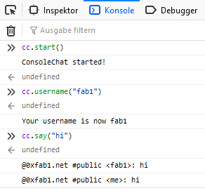

# About

This is a one-person operation.
Thanks for your interest!

Query a DNS for TXT records of [0xfab1.net](https://0xfab1.net) to get some contact details:

- Linux: ```curl -s -H 'accept: application/dns-json' 'https://cloudflare-dns.com/dns-query?name=0xfab1.net&type=TXT'  | jq -r .Answer[].data```
- Windows ```(Resolve-DnsName 0xfab1.net -Type TXT | Select-Object -ExcludeProperty Strings).Text | Format-Table```

and you will receive this result:

 ``` sh
"v=me; github=https://github.com/FullByte"
"v=me; twitter=https://twitter.com/ZeroGdoubleD"
"v=me; about=https://0xfab1.net/about/"
"v=me; gravatar=https://de.gravatar.com/0xfab1"
```

My Unicode Hexadecimal: 0xFAB1 is &#xFAB1;

## Avatar

I often use this avatar. More about how to create this with [Context Free Art is written here](https://0xfab1.net/tech/art/contextfreeart/).


## G33k C0d3

My geek codes:

```GEEKCODE
-----BEGIN GEEK CODE BLOCK-----
Geek Code 3.1: GCS d- s+ a C++$ L+++ P+ L++ E---- W+++$ N+++ o+ K++ w++$ O M V-- PS+++ PE Y+ PGP++ t+@ 5+@ X++ R+++>$ !tv b+>++ DI++ D++>+++ G- e+++ h++/h--- r+++ y?
Furry Code 1.3: 
Cat Code: 
Knitty Code 1.1: 
Ranger Code: 
AutCode 3.0: 
Goth Code 2.5A: GoCS7$ TYinYdmYyu cNRZ3 PPeSlG M3p1wD ZMehMezTeiTezPutGoi C9o a30- b65T H183 g6T w6AT r3s s10 k5 Rm SmNn Lde
------END GEEK CODE BLOCK------
```

## Badges

### TryHackMe

Overall TryHackMe stats


### Github

Public repositories


Languages used


Stargazers

[](https://starchart.cc/FullByte/FullByte.github.io)

More stats

           

### Reddit

   

### Twitter


### Docker

 

## $upport

Thanks for all the fish.

### W1k1

You can support the wiki by [reporting an issue](https://github.com/FullByte/FullByte.github.io/issues/new/choose).

Let me know if something is wrong, could be improved, is a problem in any way (please explain why).

I'm am happy for any input/feedback but may take a while to respond.

Thanks to these contributors:


### M€

You can support me by transferring money here:

Crypto currencies:

- Bitcoin: ```1DGPKnZ6VuHD4R93dL96QpvpuTvttandpW```
- Ethereum: ```0x11b8881E57EA61810b44053Fc70fc3B6658A84dB```
- zcash: ```t1StvTKicuaTshVTkyxqS6tN7CsD9fU39uo```
- Stellar: ```GDQP2KPQGKIHYJGXNUIYOMHARUARCA7DJT5FO2FFOOKY3B2WSQHG4W37``` (Memo: ```3593387952```)
- Litecoin: ```LMfELCzKSvpUVgq5hGzV3p8h9Hz3DXR2eV```
- Filecoin: ```f12zguoe44sdjov5lfkrgulpd75zruvp5zclmx4cq```

Other support channels:

- [liberapay](https://liberapay.com/Fullbyte)   
- [Patreon](https://www.patreon.com/0xfab1/creators)

### Other$

You can support others that I support by transferring money here:

- Correctiv <https://correctiv.org/unterstuetzen/>
- Wauland <https://www.wauland.de/de/donate/>
- WWF <https://www.wwf.de/spenden-helfen/allgemeine-spende>
- UNICEF <https://www.unicef.de/spenden/jetzt-spenden>
- Wikimedia <https://spenden.wikimedia.de/>
- EFF <https://supporters.eff.org/donate>
- Tor <https://donate.torproject.org/>
- Ocean Cleanup <https://www.theoceancleanup.com/>

You can support those organizations in other ways too - they will have details on this on their website.

## Cont@ct

### M@il

Send a mail, use [PGP](https://de.wikipedia.org/wiki/Pretty_Good_Privacy) - here is my public key:

```PGP
-----BEGIN PGP PUBLIC KEY BLOCK-----
xsFNBGG7vEcBEAC3ZLLZdoz0ZfbwSYEnkhacOaZihxp8Ta6MkBof9qU1/HRX
Tvv2xjDTp4x7w+rMWSHT/pMtTT6OqR0FCRPPZhF5z/iC8PwK0rNiPdSaSCJT
WD16jgrOsDv60vj+f9A68+noUd0/FoLV/pYzDorC1tuQ2tG5/6JHCQKtGjNq
F9Q/NPROdgV5fDQk7nMc5ITWwN0yRF+YrxO5OAXsM6KRv8PBIpK+M617yaDp
8CcPSRlOYMPAuYtX/wsNkLaJa2/5ImpklIr1H6NNS95zsHusaQNTzMkDGifL
c+aJiUUsKMOO/gJsSdUh53loqiLlGHaZ+RwyZ/1M4kausfva+xqZhk1iRcCa
sFr5DJxel6+U2N65Qhlf0qzwYUxN20xFH/TPCV0y7X95n4eE1DYLsHG9nJRn
skiUpqPzmwAloHh9cgrEMFV+fdWDyBYnBIEHi7dp+8RWjOFCYC/vTPDJ4XiZ
akoLspY/MInXFhYkzEjkCqMy0H4vGKC7nUHz6S07v7wi66B3kXuGi0TYuYNx
INiXAPMlL7/MYgzoyvMrSW8jLTZevS7JajpTPyt8TqZD1DRWQPlgkwlAc4mt
/eRK7ZVpZUKq3VG29AzPvVIzmsnI4Gst+pzR7/12+OpzwuYIohi5jJrUXaHd
7XqiNF6Ng4OVjam2adU5QZfGU0oB3kc7Y5fmEQARAQABzSIweGZhYjEubmV0
IDx0ZW4uMWJhZngwQDB4ZmFiMS5uZXQ+wsF1BBABCAAfBQJhu7xHBgsJBwgD
AgQVCAoCAxYCAQIZAQIbAwIeAQAKCRA+3j5K3XVjAKGZD/907/itn+kmqswb
x0j7IgHJW6UhnTAr9f5uRusGCjHtLT1qMkXZG2v9gd6RO59OdQB9SO8LSgx2
SYGfyX2q5ojU/aFtYRyJEhElQlbeFdg1qFXoJOWyoImG0QoF6SEX9bzwJOty
SLYQDE8SmRmjGWH7iYfkY/nAm7xzfk2PYIkOZD0bvbZI6w4jr8MZYzWTcc+E
uOolynOtfrtSKAociEiJxLBXbxgIOKTmuQolNovY1NWhVZU4Q3XcFdfNNFVc
kaOvpUP2S8iSaEmR20Sv4W1Zv/Z4P+gFhS2A9sSGHn6ZD+4jMl4NsqsVHMrt
ATzAgH783575hxdFep4M9X1x53i3yb/Ns5hj9DK4StkBFvtZ9PsGkftMfpiR
NSARbZtN9mfxB6+zV6+fJJU85ZMaEKLxhIei8kZC/eUO7owsNcxjL9M740m4
xKyHZgpaxV/3TUpLIh2cRzfIB6Crq6ygdGLBhq4SiXhsryjPyPO/5pnj7dok
mmvxRpXjMHZXiIMv/kE7w3gi+b4RTKGOtNgjrjhftYAnD7qqwm5T81y4G0VI
8seRyuyg0GQ4ifMlulLD/m/gXa2jHlRzjpfBFk2KZtHNxulxs42lY7B/h6eU
knfjwN52qu+bD/2hE9H1Q9ylMmpEPJf6JyD56z7ZfrjMfYoce9Ii5JVJjiuR
sQERvnVPP87BTQRhu7xHARAAzII9K3gA9/jJ6ymyJ6E/rEaSk0BWDEdgFmLt
tahitc8KBDDO0UJpJXK0yoYhpT8JAmaRcDPgUuTonx/Pl4/TM3913NTqq/6o
h5R3ds5zkCZ6RE1tpKFTfHzhpRnzzIyr35K1267wk5FCvoxyDC1oEakp5+xJ
I26ef9Q5p2A4UW1ID3YqHOLOooFg6jtsJfKjuD2vq3YoQUXcgbKFgc+XD5LV
5ossds8VwpRQS3w/BEgkJ7dIrCngTDPZ7YCgorDlemDYZsp+/unXZ28qYSJo
EoO7qPeKjDQfqf4TvxvzOAwK5E4x4rPQSz84deYbdFRgj/DsfUEsY2uG9v98
MUeE0KpJwklBP2oeCznKYqnvIJ6mBfuBufeiY1uremdW9jpyATlLIfFhMsAI
rJ2mkRgla9SGe1T+D4toTHculFSEvQs+0mLZmBkuINy4P4IRBMBOW5/1g7GV
W9pPuhXF2jyjAY1Cf8qTkTbGtfVF6Eg22iAu8UbqAnyKYz4oKTRT+mK+a3R8
oz1Bf9acraDwHzJQbdfw5REAREwD3wPCpRe6r6p4taliSJt4nYCYjc3l5r7R
5rZDT32TuXbpTEI7QMRp2pBvKhAmI1cn1IUZKEGvcLh/fyISrqtcymxKIlcc
1Dqy8HsJ2o7AjUR4Ci6OR4eZ/ruxnDZYo6Lrq4lCdfyJodkAEQEAAcLBXwQY
AQgACQUCYbu8RwIbDAAKCRA+3j5K3XVjAAH/D/0RHr3V16Js1LWLg/V91yOV
BasB6cRZH7zhwr37+znN8F3YqsjO8PP2Aqa0TleYSkJO+nFtMGtfcXQD960g
aVTxYeRAcKVIUIefS3u6JRj3QnZNP9PFWNb4UHRY/AH9eW08VpIl6x/0Mu7O
Z4rdqJytihdpT67GisQKCpz/woTxDvbTbCePV0wVzOv0jrewozkXzOn5kihp
tGKSLuIPWxQRg+ubGRcrj3kM9riuQSQkjV2gSO/Lbk6CtGNBrP0HSIbXoq8b
xiJL/g9v1t7vS9/MU4thPVcKbpMyvJTcahaIuBaivfKaTkmk38P9YF1FHqYz
Og0qmvuGYiYRpUpwik0iLN6SY6yqeB6qMu3Dn7LL32OczvRdMuuEPKDD4oRA
O9MgF3M8zthFS58jf2yNmVmKBnoj1bzIqFsBT821iC6N9gA0pAY+jQSaXn80
k2UaTLIgnDmtRC4Ns5R3esCDAsl7aclF+Po7yXhLnf2Sbs4V5+j268CQJ74w
5SmhHk//+rQGhGIHLDaQesUNjp5eKeg2w+FiHJgDcmldNqf2CNWTD5gGWhht
TEUPW8bwDwECqiC8Apafc0qMKTnLI/OvlCdqzxLuFtJy6h/ISfnsDRBlkPe7
A4I5ZxSf9grbEvGhSuBMJvHRMn3dMsX7DdnNEYm+jRIVsvF8kWsR8KTf5otu
zQ==
=dFbQ
-----END PGP PUBLIC KEY BLOCK-----
```

### Ch@t

Use [ConsoleChat.io](https://www.consolechat.io/) with the functions below in your browser's console for chatting:

- Launch the chat `cc.start()`
- Set your username `cc.username('Your username')`
- Say something `cc.say('Hi!')`
- Talk only to the users on the site you are currently browsing (current tab) `cc.onsite()`
- Go back to public channel `cc.public()`
- Send a private message to a user `cc.msg('username', 'Your hush hush message')`
- List all available public channels `cc.list()`
- Join a channel. Or create one of the channel does not exist yet. `cc.join('channel name')`
- Create/Join a private channel that will not be visible. `consolechat.list()`
- Join a secret channel `cc.join('channel name', 'private')`
- List all users currently online on the channel `cc.who()`
- Leave a channel `cc.leave()`
- Get insturctions `cc.help()`
- Close ConsoleChat.io `cc.close()`

Example:



<script src="https://cdn.consolechat.io/console-chat-min.js"></script>
