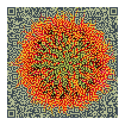
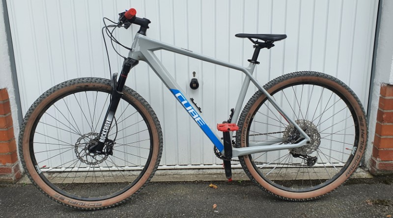
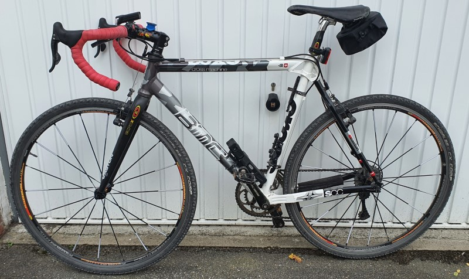
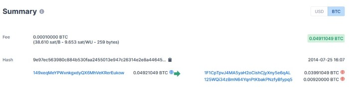
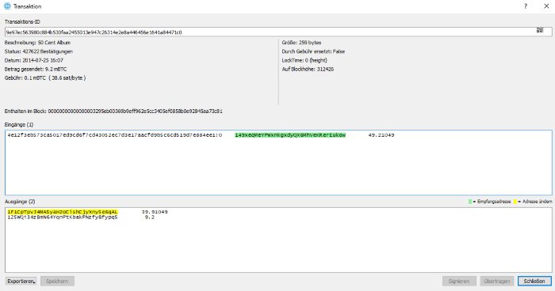

# Me

This is a one-person operation.

Thanks for your interest!

Query a DNS for TXT records of [0xfab1.net](https://0xfab1.net) to get some contact details:

- Linux: ```curl -s -H 'accept: application/dns-json' 'https://cloudflare-dns.com/dns-query?name=0xfab1.net&type=TXT'  | jq -r .Answer[].data```
- Windows: ```(Resolve-DnsName 0xfab1.net -Type TXT | Select-Object -ExcludeProperty Strings).Text | Format-Table```

and you will receive this result:

``` sh
"v=me; github=https://github.com/FullByte"
"v=me; twitter=https://twitter.com/ZeroGdoubleD"
"v=me; about=https://0xfab1.net/about/"
"v=me; gravatar=https://de.gravatar.com/0xfab1"
```

My Unicode Hexadecimal (0xFAB1) is &#xFAB1;

I like to interprete this as beeing a terminal and GUI user :D I use the tool that works best for me and gets the job done. I have not subscribed to any IT religion, do not simp any technology evangelist and try to be as open as possible about knowledge and sharing information.

## Avatar

I often use this avatar online. More about how to create this with [Context Free Art is written here](https://0xfab1.net/tech/art/random/contextfreeart/).


Use [this](_about-0xfab1-qrcode.png) QR-Code if you want to use a QR-Code to link to this site:



## G33k C0d3

My geek codes:

```GEEKCODE
-----BEGIN GEEK CODE BLOCK-----
AutCode 3.0: TODO
Cat Code: TODO
Furry Code 1.3: TODO
Geek Code 3.1: GCS d- s+ a C++$ L+++ P+ L++ E---- W+++$ N+++ o+ K++ w++$ O M V-- PS+++ PE Y+ PGP++ t+@ 5+@ X++ R+++>$ !tv b+>++ DI++ D++>+++ G- e+++ h++/h--- r+++ y?
Goth Code 2.5A: GoCS7$ TYinYdmYyu cNRZ3 PPeSlG M3p1wD ZMehMezTeiTezPutGoi C9o a30- b65T H183 g6T w6AT r3s s10 k5 Rm SmNn Lde
Knitty Code 1.1: TODO
Ranger Code: TODO
------END GEEK CODE BLOCK------
```

## Links

- [twitter](https://twitter.0xfab1.net)
- [twitch](https://twitch.0xfab1.net)
- [youtube](https://youtube.0xfab1.net)
- [github](https://github.0xfab1.net)

## Sport

### Climbing

Personal Best Speed Climbing Times

| Date       | Best Time |
|------------|-----------|
| 08.10.2021 | 38,2      |
| 15.10.2021 | 27,9      |

### Cycling

#### Cube Reaction C:62 Pro (2021)



??? info "Components"
    The Reaction C:62 Pro's (Art. No 416110) low weight, razor-sharp handling and surprising on-trail comfort give you the edge you need to get ahead. We selected Shimano's ultra-reliable 12 speed components for their smooth shifting and incredible range, and added powerful Shimano XT hydraulic disc brakes - with a bigger rotor up front - to make sure you're always in full control. And, with its easy adjustability and smooth performance, the RockShox Judy Gold air suspension fork helps keep the front wheel planted and pointing in the right direction.

    | Component       | Details                                                                                                                                         |
    |-----------------|-------------------------------------------------------------------------------------------------------------------------------------------------|
    | Frame           | C:62 Monocoque Advanced Twin Mold Technology, ARG2, Tapered Headtube, PressFit BB, Boost 12x148mm, Integrated Cable Routing, Dropper Post Ready |
    | Fork            | RockShox Judy Gold RL Air, 15x110mm, Tapered, OneLoc, 100mm                                                                                     |
    | Brake system    | Shimano XT BR-M8100, Hydr. Disc Brake (180/160)                                                                                                 |
    | Rear derailleur | Shimano XT RD-M8100-SGS, ShadowPlus, 12-Speed                                                                                                   |
    | Shifters        | Shimano Deore SL-M6100-IR, Direct Attach, Rapidfire-Plus                                                                                        |
    | Crankset        | Shimano FC-MT511, 32T, Boost                                                                                                                    |
    | Cassette        | Shimano Deore CS-M6100, 10-51T                                                                                                                  |
    | Chain           | Shimano CN-M6100                                                                                                                                |
    | Front hub       | Shimano HB-MT400-B, 15mm, Boost, Centerlock                                                                                                     |
    | Rear hub        | Shimano FH-MT410-B, 12mm, Boost, Centerlock                                                                                                     |
    | Rims            | CUBE EX21, 32H, Disc, Tubeless Ready                                                                                                            |
    | Front tire      | Schwalbe Racing Ray, Addix Performance, Kevlar, 2.25                                                                                            |
    | Rear tire       | Schwalbe Racing Ralph, Addix Performance, Kevlar, 2.25                                                                                          |
    | Stem            | CUBE Performance Stem SL, 31.8mm                                                                                                                |
    | Handlebar       | CUBE Flat Race Bar, 720mm                                                                                                                       |
    | Grips           | CUBE Performance Grip                                                                                                                           |
    | Seat            | post CUBE Performance Post, 27.2mm                                                                                                              |
    | Seatclamp       | CUBE Varioclose, 31.8mm                                                                                                                         |
    | Saddle          | Natural Fit Venec Lite                                                                                                                          |
    | Headset         | VP Integrated, Top 1 1/8", Bottom 1 1/2"                                                                                                        |
    | Weight          | 11,6 kg                                                                                                                                         |
    | Colour          | grey´n´blue´n´red                                                                                                                               |

#### BMC CROSS MACHINE CX02 (2010)



??? info "Components"
    Die komplette 105-Gruppe mit Kompaktkurbel und Shimanos günstige, aber stabile RS10-Räder sind an dem brettsteifen Rahmen mit seinem eigenständigen Design montiert. Bei der Geometrie tanzt das BMC aber aus der Reihe: Im Verhältnis zum 56,5 Zentimeter langen Oberrohr gerät das Sitzrohr mit 59,6 Zentimetern sehr lang. Im Geländeeinsatz wirkt der Rahmen durch das hohe Oberrohr etwas unhandlich, zudem eignet sich die kantige Unterseite mit unten verlegten Zügen nicht zum Schultern. Wer mit dem BMC dennoch ins Gelände will, sollte den Rahmen eine Nummer kleiner kaufen und sitzt dann sportlich-gedrungen. Das schwerste Rahmen-Set und das höchste Gesamtgewicht kosten einige Punkte und etwas Spritzigkeit.

    - Total Wight: 9830g
    - Frame: SCC (weight 1950g)
    - Frame size: 52
    - Tubing: BMC Custom Alloy
    - Fork: BMC carbon w/alloy steer tube
    - Gears: 20
    - Chainwheel: Shimano 105, 50-34
    - Cassette: Shimano 105, 12-27
    - Front Derailleur: Shimano 105, Band Type
    - Shifters: Shimano 105
    - Brakes: Shimano 105
    - Handlebar: Scor Race
    - Stem: Scor Race
    - Seatpost: Scor Race
    - Saddle: Scor Race
    - Hubs: Shimano, RS10
    - Rims: Shimano, RS10
    - Tires: Continental, Twister Pro

Modifications:

- Replaced bottom bracket with Campagnolo Record Pista BSA
- Added Red Cube Bike Ribbon Carbon Tape

## Q&A

??? question "What was your most interesting online purchase?"
    In 2014 [I spent](https://www.blockchain.com/btc/tx/9e97ec563980c884b530faa2455013e947c26314e2e8a446456e1641a84471c0) [0.04911049 BTC](https://duckduckgo.com/?q=0.04911049+btc+in+euro&ia=cryptocurrency) for digital copy of the [50 Cent](https://de.wikipedia.org/wiki/50_Cent) Album [Animal Ambition](https://de.wikipedia.org/wiki/Animal_Ambition). Curtis and I both forgot about it until suddenly BTC was worth a lot of money. As of today, this is my most expensive album purchase yet. No Ragrets :)

    

    

     
