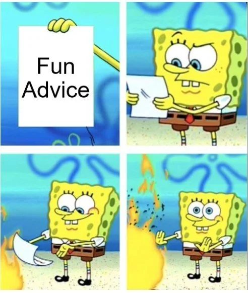

# Fun Advice



## Be like nature

Why fight the rules of nature?

1. Dislike squander: dW = 0 (Action W=∫L dt is minimized in every motion. Locally, L = Ekin-Epot)
2. Dislike hurrying: v ≤ c (Energy speed v is limited by the speed of light c.)
3. Dislike excessive force: F ≤ c^4/4G (Force F is limited by c and the gravitational constant G.)
4. Dislike sloth: W ≥ ℏ (action W is never smaller than the quantum of action ℏ.)
5. Dislike perfect order: S ≥ k (Entropy S is never smaller than the Boltzmann constant k.)

Source: [All of physics in 9 lines](https://www.motionmountain.net/9lines.html)

## The theory of the first chick

It all start with the first chick

- Transcript: ```It's like: We need to get a cool looking chick; maybe then people will start to respect us and stuff. It's like then we'll start getting respect, and then we'll get more chicks and then like: with more chicks I go get more respect and after that we'll get like more money. It'll be like more money, more chicks, more respect... and just like keep on going. It all takes is getting that first chick.```
- Listen to the [audio version](_chicks-respect-money.mp3) (Source: [Beavis and Butthead](https://en.wikipedia.org/wiki/Beavis_and_Butt-Head))

This process diagram visualizes the steps involved:


## Protest

It is not easy to protest in a smart and effective way. In my opinion strikes, demonstrations, letter-writing campaigns, petitions, sit-ins and occupation are not very effective nor creative. Of course one can passively boycott whatever thing to not support and tell friends about what and why not to support but this is boring and small minded as well. Here are some examples and ideas how to protest on a given matter in an interesting, not annoying and creative way while being effective and successful:

- [Ugly Gerry](https://fontsarena.com/ugly-gerry/) is a [free font](_gerry.otf.zip) created with real US congressional districts. The name comes from gerrymandering, the process that made possible such weird shapes.

- [Volkswagen](https://github.com/auchenberg/volkswagen) can be integrated in your CI process. It detects when your tests are being run in a CI server, and makes them pass. Volkswagen uses a defeat device to detect when it's being tested in a CI server and will automatically reduce errors to an acceptable level for the tests to pass. This will allow you to spend less time worrying about testing and more time enjoying the good life as a trustful software developer.

- The creative ways the [DeCSS](https://en.wikipedia.org/wiki/DeCSS) crack was distributed (e.g. [t-shirt](_decss_tshirt.webp), [haiku](_decss-haiku.txt) or [midi](_decss-auth.mid), [audio](_decss_descramble.mp3), [html dvd logo](_decss-dvdlogo.html.txt) and [many more](https://www.cs.cmu.edu/~dst/DeCSS/Gallery/)...). Later works by "removing all the white space, then transforming each ASCII character into a single 32nd note of its midi equivalent (midi notes, like ASCII characters, are coded into values ranging from 1 to 127.)".

- Address your issues to the correct people. If you work in a social or public based service make sure to create awareness but don't let uninvolved suffer from your problems. For example if you drive a bus, let passengers ride for free and let them know you are protesting instead of not driving and letting people down.

- Make art (music, pictures, games) that help people understand the problem. Make things that are understandable as well as entertaining, interesting, provocative and/or beautiful. This will address the problem in an entertaining but critical way that is not annoying and will be much more likely be shared, discussed and addressed.

- Find ways to educate the public about the core issue of your protest and what needs to be done. Reflect on your issue and make sure this is not just an opinion but actual facts that can be educated.

- Never interrupt your enemy when he/she is making a mistake.
