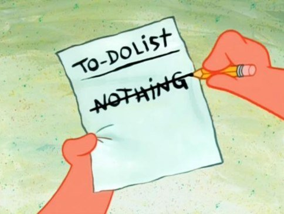

# Goals

## Set Goals

Define SMART goals (Specific, Measurable, Attainable, Rewarding, Timely).

## Get stuff done

- It's better to finish something than to start something
- Make goals that you have control over. Accept what you can not control or choose to be unhappy.
- Practice "Shoshikantetsu", japanese for "Complete what was originally intended."
- Practice "Ichigoichie", japanese for "Treasure every encounter, for it will never reoccur."

Follow this to get stuff done:

- Identify the problem
- Generate a list of potential solutions
- Evaluate the strengths and weaknesses of each potential solution
- Choose a solution to implement
- Implement the solution

### 110%

Never give 110%, that's just selling out... just divide your 100% in:

- 50% pain
- 20% skill
- 15% concentrated power of will
- 10% luck
- 5% pleasure

### Hard problems

Hard problems are hard - here is some advice:

- Say: "I can do hard things". Doing hard things has intrinsic value, and they will make me a better person, even if I end up failing.
- The key is recognizing that the urge to avoid hard things is human, and should be expected. It’s part of the process. Figure out what combination of motivation, and circumstances, and accountability work best for your particular personality.
- Break large goals down into manageable pieces. Creating an accurate road maps toward this goal. Find out what is important. Differentiate between activities you want to be important and what actually makes a difference.

### Productivity, purpose and passion

- You need to be efficient to have money and time to enjoy life.
- The parts of life that bring joy are often things we do for their own sake without caring about efficiency.
- The fear of the irrelevancy and losing out in the endless treadmill race impacts universally.
- To escape the productivity treadmill is to actively choose what matters to you.
- There are infinite things to do in your finite life so life is a set of choices.
- If you’re constantly craving more, you wont appreciate what you already have.
- If we believe the future will be better we devalue the present moment.
- Liberation of this burden happens when you are at peace with and bask at merely existing.

### Luck and Success

To be successful is to some extent luck. You can not control luck, but you can increase your chances by enlarging your success surface.

Enlarging the success surface with work:

- Level 1 - Do Nothing: You did nothing and just won randomly
- Level 2 - Hard work: Eventually there will be a payoff because you’ve hustled your way to it.
- Level 3 - Master: Discover things others don't see through work and knowledge.
- Level 4 - Attract: Others want to work with you; you can choose and select best opportunities.

Enlarging the success surface through networking:

- Level 1 - Do & Tell: Make something and tell others (Making and Marketing).
- Level 2 - Curiosity: Stay curious and try out new stuff.
- Level 3 - Talk to new people: Each new person you meet expands your surface area.
- Level 4 - Be known: Create value for people. Become known with something. Build a reputation.

Reflect what topics are important to you, what level you are on at this moment and what you can do to Enlarging the success surface with work and networking.

## Review Goals

=== "EN"

    Answer the following questions about the ideal near future:

    - What of type of Person am I? Who do I want to become?
    - What do I value the most? What are my top priorities?
    - What drives me? What gets me motivated?
    - What is my area of highest contribution?
    - What do I say no to? What is essential to me? How can I stay focused on that?
    - What do I spend the most time with? Who/what will I avoid from now?
    - What is the one big thing I will achieve?

    Based on what you answered in the questions above, break down your big goal:

    - To what goal you want to achieve in the next three months.
    - Define habits and actions to achieve that goal in three months.

    Every three months, reflect on your goals:

    - What was I most proud of? / What action am I least proud of? Why?
    - When was I most happy? Why? / What was my biggest loss?
    - What was my biggest win? / What made me miserable? How?  What makes me most anxious? How?
    - What went better than expected? / What are the three worst things that happened?
    - What did I spend the most time on? / What went worse than expected?
    - How did I spend my time best? / What held me back from doing what I want?
    - What was my area of highest contribution?
    - Who impacted me the most? Thank them.

    Then set a new goal for the next three months.

=== "DE"

    Beantworte die folgenden Fragen über deine ideale Zukunft:

    - Was für ein Mensch bin ich? Wer möchte ich werden?
    - Worauf lege ich am meisten Wert? Was sind meine obersten Prioritäten?
    - Was treibt mich an? Wodurch werde ich motiviert?
    - Was ist der Bereich, in dem ich den größten Beitrag leiste?
    - Wozu sage ich Nein? Was ist für mich wesentlich? Wie kann ich mich darauf konzentrieren?
    - Womit verbringe ich die meiste Zeit? Wen/was werde ich von nun an meiden?
    - Was ist die eine große Sache, die ich erreichen will?

    Basierend auf den Antworten der obigen Fragen, formuliere ein großes Ziel bzw. das wichtigste Ziel:

    - Welches Ziel willst du in den nächsten drei Monaten erreichen?
    - Definiere Gewohnheiten und Maßnahmen, um dieses Ziel in drei Monaten zu erreichen.

    Reflektiere alle drei Monate über deine Ziele:

    - Worauf war ich am meisten stolz? / Auf welche Aktion bin ich am wenigsten stolz? Und warum?
    - Wann war ich am glücklichsten? Und warum? / Was war mein größter Verlust?
    - Was war mein größter Gewinn? / Was hat mich unglücklich gemacht? Wie?  Was macht mich am meisten ängstlich? Inwiefern?
    - Was lief besser als erwartet? / Was sind die drei schlimmsten Dinge, die passiert sind?
    - Wofür habe ich die meiste Zeit aufgewendet? / Was lief schlechter als erwartet?
    - Wie habe ich meine Zeit am besten verbracht? / Was hat mich davon abgehalten, das zu tun, was ich wollte?
    - Was war der Bereich, in dem ich den größten Beitrag geleistet habe?
    - Wer hat mich am meisten beeinflusst? Bedanke dich bei dieser Person.

    Dann stecke dir ein neues Ziel für die nächsten drei Monate.
