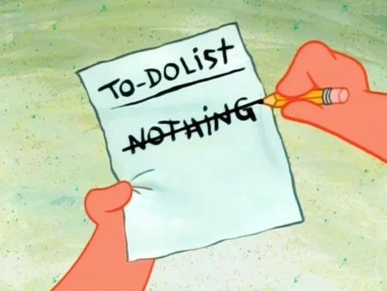
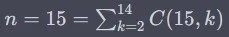

# Projects

What ever you do, what ever you want to achieve, approach it as a project- If you're constantly craving more, you won't appreciate what you already have.

Most of the time, the project you are doing either mainly needs to be done by a due-date or done according to specs/requirements.
Figure out what project you are working on (what is the main focus?).
Choose two of the three constraints shown below and choose the best framework that seems to fit best:

Choosing the correct project management process depends on the specific requirements of your project, team, and organization. To make the best decision, consider the following factors:

- Project complexity and scope: Assess the overall complexity and scope of your project. Waterfall works well for simpler projects with well-defined requirements, while Scrum and Kanban are better suited for more complex projects with changing requirements.
- Flexibility: Determine how flexible your project needs to be. Scrum and Kanban allow for adaptability and continuous improvement, while Waterfall follows a more rigid structure.
- Team size and skill-set: Consider the size of your team and their individual skills. Scrum works well for small to medium-sized teams with cross-functional skill-sets, while Kanban can be more suitable for larger teams or those with specialized roles.
- Time constraints: Evaluate the timeline of your project. If you have tight deadlines or need a faster time to market, Scrum or Kanban might be more suitable due to their iterative nature. Waterfall can take longer to complete due to its sequential structure.
- Stakeholder involvement: Determine the level of stakeholder involvement required for your project. Scrum encourages frequent communication and collaboration between team members and stakeholders, while Waterfall and Kanban can be more focused on individual tasks and progress.
- Communication and collaboration: Assess your team's communication and collaboration capabilities. Scrum and Kanban emphasize frequent communication, while Waterfall relies more on documentation.
- Risk management: Consider the level of risk associated with your project. Agile methods like Scrum and Kanban allow for better risk management due to their iterative approach, while Waterfall may not handle unexpected changes as effectively.
- Organizational culture: Analyze your organization's culture and its openness to change. Agile methodologies like Scrum and Kanban require a collaborative and adaptive mindset, while Waterfall might be more suitable for traditional, hierarchical organizations.

By weighing these factors, you can make a more informed decision on which project management process to adopt for your project. Keep in mind that you can also customize or combine methodologies to create a hybrid approach that best suits your needs.

## Goals and Focus

You can't have it all. Know what to focus on and be aware what you decide to make less important.

### Set Goals

Define SMART goals:

- Specific
- Measurable
- Attainable
- Rewarding
- Timely

### Get stuff done

- It's better to finish something than to start something
- Make goals that you have control over. Accept what you can not control or choose to be unhappy.
- Practice "Shoshikantetsu", japanese for "Complete what was originally intended."
- Practice "Ichigoichie", japanese for "Treasure every encounter, for it will never reoccur."

Follow this to get stuff done:

- Identify the problem
- Generate a list of potential solutions
- Evaluate the strengths and weaknesses of each potential solution
- Choose a solution to implement
- Implement the solution

### Give 100%

Never give 110%, that's just selling out... just divide your 100% in:

- 50% pain
- 20% skill
- 15% concentrated power of will
- 10% luck
- 5% pleasure

### Hard problems

Hard problems are hard - here is some advice:

- Say: "I can do hard things". Doing hard things has intrinsic value, and they will make me a better person, even if I end up failing.
- The key is recognizing that the urge to avoid hard things is human, and should be expected. It’s part of the process. Figure out what combination of motivation, and circumstances, and accountability work best for your particular personality.
- Break large goals down into manageable pieces. Creating an accurate road maps toward this goal. Find out what is important. Differentiate between activities you want to be important and what actually makes a difference.

### Productivity, purpose and passion

- You need to be efficient to have money and time to enjoy life.
- The parts of life that bring joy are often things we do for their own sake without caring about efficiency.
- The fear of the irrelevancy and losing out in the endless treadmill race impacts universally.
- To escape the productivity treadmill is to actively choose what matters to you.
- There are infinite things to do in your finite life so life is a set of choices.
- If you’re constantly craving more, you wont appreciate what you already have.
- If we believe the future will be better we devalue the present moment.
- Liberation of this burden happens when you are at peace with and bask at merely existing.

### Luck and Success

To be successful is to some extent luck. You can not control luck, but you can increase your chances by enlarging your success surface.

Enlarging the success surface with work:

- Level 1 - Do Nothing: You did nothing and just won randomly
- Level 2 - Hard work: Eventually there will be a payoff because you’ve hustled your way to it.
- Level 3 - Master: Discover things others don't see through work and knowledge.
- Level 4 - Attract: Others want to work with you; you can choose and select best opportunities.

Enlarging the success surface through networking:

- Level 1 - Do & Tell: Make something and tell others (Making and Marketing).
- Level 2 - Curiosity: Stay curious and try out new stuff.
- Level 3 - Talk to new people: Each new person you meet expands your surface area.
- Level 4 - Be known: Create value for people. Become known with something. Build a reputation.

Reflect what topics are important to you, what level you are on at this moment and what you can do to Enlarging the success surface with work and networking.

## Oranize

### Scrum

Scrum is an agile project management and product development framework that aims to improve collaboration, flexibility, and iterative progress in software development and other complex projects. Scrum provides a flexible, adaptive approach to project management and product development, allowing teams to respond to changing requirements, deliver value continuously, and improve their processes over time.

Scrum is based on key principles (Empiricism, Self-organization and Iterative as well as incremental progress), roles (Product Owner, Scrum Master, Development Team), artifacts (Product Backlog, Sprint Backlog, Increment) and events (Sprint Planning, Daily Scrum, Sprint Review, Sprint Retrospective). I created this overview of relevant scrum terminology to prepare for the PSM and PSPO certifications.

### OKR Model

The OKR (Objectives and Key Results) model is a goal-setting and performance-tracking framework that helps organizations and individuals align their efforts, improve communication, and focus on achieving meaningful outcomes. The OKR model consists of two main components:

- Objectives: These are high-level, qualitative statements that outline the desired outcome or vision. Objectives should be ambitious, inspiring, and clear, serving as a guide for what the organization or individual is trying to achieve.
- Key Results: Key results are specific, measurable, and time-bound indicators that help track progress towards achieving the objective. These are usually quantitative in nature, allowing for easy assessment of whether they have been met or not. Key results should be realistic, achievable, and directly linked to the objective they support.

The OKR model encourages regular check-ins and updates to ensure that teams and individuals are focused on the right priorities and making progress towards their objectives. It promotes transparency, collaboration, and agility, enabling organizations to adapt and respond quickly to changes in their environment.

## Team communication

As team size increases, so does the frequency of communication, which is essential for information exchange. However, if information can be accessed without direct interaction, this method may be favored for its simplicity over engaging in conversations, phone calls, or organizing meetings.

Not every exchange of information can or should be circumvented. Effective teamwork hinges on the ability to deliberate on views, issues, objectives, and tactics. Moreover, communication fosters team cohesion and collaborative efficiency. On the flip side, superfluous communication can overshadow necessary interactions, rendering all forms of communication monotonous and uninteresting, leading team members to view meetings as unproductive.

The challenge of managing communication becomes increasingly complex as team sizes expand and the number of communication avenues grows. To address this, the adoption of control measures, the strategic use of tools and workflows, and a focus on maintaining clear and thorough documentation can serve as effective methods to alleviate these issues. Moreover, this topic is pertinent to project organization, where the formation of smaller groups, the establishment of hierarchies, and the assignment of specific roles can contribute to efficiency. While hierarchies and defined roles can make communication more direct, they also carry the risk of obstructing essential dialogue. Effective project management, clarity in roles and responsibilities, and the appropriate use of tools can assist, though no system is flawless. It is crucial to regularly evaluate communication practices and tailor solutions to the unique needs of the team, the nature of the problem, and the context of the situation.

### Possible communication connections

This formula can be used to count the number of possible communication connections among a group of people in a team:

- C(n,k) is the number of combinations,
- n is the total number of items,
- k is the number of items to choose,
- n! denotes the factorial of n, which is the product of all positive integers up to n.

For single communications (pairs of people) k=2 because each connection involves two people. For group communications, k can range from 2 to n−1 (since a group can range from a pair to all but one of the people, with the last person being the one they are communicating with).

To calculate the sum of all possible group communications for n=15, we would sum the combinations for k from 2 to 14:

The number of all possible group sizes, from pairs to groups of 14 results in n = 15 = 2^15 − 2 = 32768−2 = 32766

Here's the completed table with the actual calculations for single communications and the formula for all possible group communications in a group of 3 to 15 people:

| People | Single Communications | All Possible Group Communications |
|--------|-----------------------|-----------------------------------|
| 3      | C(3, 2) = 3           | 2^3 - 2 = 6                       |
| 4      | C(4, 2) = 6           | 2^4 - 2 = 14                      |
| 5      | C(5, 2) = 10          | 2^5 - 2 = 30                      |
| 6      | C(6, 2) = 15          | 2^6 - 2 = 62                      |
| 7      | C(7, 2) = 21          | 2^7 - 2 = 126                     |
| 8      | C(8, 2) = 28          | 2^8 - 2 = 254                     |
| 9      | C(9, 2) = 36          | 2^9 - 2 = 510                     |
| 10     | C(10, 2) = 45         | 2^10 - 2 = 1022                   |
| 11     | C(11, 2) = 55         | 2^11 - 2 = 2046                   |
| 12     | C(12, 2) = 66         | 2^12 - 2 = 4094                   |
| 13     | C(13, 2) = 78         | 2^13 - 2 = 8190                   |
| 14     | C(14, 2) = 91         | 2^14 - 2 = 16382                  |
| 15     | C(15, 2) = 105        | 2^15 - 2 = 32766                  |

## Reflect

Reflecting regularly on your goals and life choices is essential for personal and professional growth. It helps ensure that your actions align with your values, adapt to changing circumstances, and stay motivated. This practice not only fosters accountability and enhances decision-making but also identifies obstacles and promotes continuous learning. In essence, taking time to examine your progress and decisions is vital for thriving in an ever-evolving world.

### Review Goals

=== "EN"

    Answer the following questions about the ideal near future:

    - What of type of Person am I? Who do I want to become?
    - What do I value the most? What are my top priorities?
    - What drives me? What gets me motivated?
    - What is my area of highest contribution?
    - What do I say no to? What is essential to me? How can I stay focused on that?
    - What do I spend the most time with? Who/what will I avoid from now?
    - What is the one big thing I will achieve?

    Based on what you answered in the questions above, break down your big goal:

    - To what goal you want to achieve in the next three months.
    - Define habits and actions to achieve that goal in three months.

    Every three months, reflect on your goals:

    - What was I most proud of? / What action am I least proud of? Why?
    - When was I most happy? Why? / What was my biggest loss?
    - What was my biggest win? / What made me miserable? How?  What makes me most anxious? How?
    - What went better than expected? / What are the three worst things that happened?
    - What did I spend the most time on? / What went worse than expected?
    - How did I spend my time best? / What held me back from doing what I want?
    - What was my area of highest contribution?
    - Who impacted me the most? Thank them.

    Then set a new goal for the next three months.

=== "DE"

    Beantworte die folgenden Fragen über deine ideale Zukunft:

    - Was für ein Mensch bin ich? Wer möchte ich werden?
    - Worauf lege ich am meisten Wert? Was sind meine obersten Prioritäten?
    - Was treibt mich an? Wodurch werde ich motiviert?
    - Was ist der Bereich, in dem ich den größten Beitrag leiste?
    - Wozu sage ich Nein? Was ist für mich wesentlich? Wie kann ich mich darauf konzentrieren?
    - Womit verbringe ich die meiste Zeit? Wen/was werde ich von nun an meiden?
    - Was ist die eine große Sache, die ich erreichen will?

    Basierend auf den Antworten der obigen Fragen, formuliere ein großes Ziel bzw. das wichtigste Ziel:

    - Welches Ziel willst du in den nächsten drei Monaten erreichen?
    - Definiere Gewohnheiten und Maßnahmen, um dieses Ziel in drei Monaten zu erreichen.

    Reflektiere alle drei Monate über deine Ziele:

    - Worauf war ich am meisten stolz? / Auf welche Aktion bin ich am wenigsten stolz? Und warum?
    - Wann war ich am glücklichsten? Und warum? / Was war mein größter Verlust?
    - Was war mein größter Gewinn? / Was hat mich unglücklich gemacht? Wie?  Was macht mich am meisten ängstlich? Inwiefern?
    - Was lief besser als erwartet? / Was sind die drei schlimmsten Dinge, die passiert sind?
    - Wofür habe ich die meiste Zeit aufgewendet? / Was lief schlechter als erwartet?
    - Wie habe ich meine Zeit am besten verbracht? / Was hat mich davon abgehalten, das zu tun, was ich wollte?
    - Was war der Bereich, in dem ich den größten Beitrag geleistet habe?
    - Wer hat mich am meisten beeinflusst? Bedanke dich bei dieser Person.

    Dann stecke dir ein neues Ziel für die nächsten drei Monate.

### Daily Review

=== "EN"

    - What am I doing today that energizes me or propels me forward?

=== "DE"

    - Was mache ich heute, dass mich begeistert oder voranbringt?

### Quarter Review

=== "EN"

    - Am I on track with goals I have set for myself this year?
    - What goals do I no longer want to pursue?
    - Review your budget, spending habits, and savings to ensure they align with your financial goals.
    - Reflect on job satisfaction and consider changes if necessary.
    - Reflect on educational pursuits or professional training.
    - Reflect on the quality of your key relationships with family, friends, and colleagues.
    - Review the progress of your short-term and long-term goals.
    - Set new objectives for the next quarter.

=== "DE"

    - Bin ich auf dem richtigen Weg, die Ziele zu erreichen, die ich mir für dieses Jahr gesetzt habe?
    - Welche Ziele möchte ich nicht mehr verfolgen?
    - Überprüfe dein Budget, deine Ausgabegewohnheiten und deine Ersparnisse, um sicherzustellen, dass sie mit deinen finanziellen Zielen übereinstimmen.
    - Reflektiere über deine Arbeitszufriedenheit und erwäge Änderungen, falls nötig.
    - Reflektiere über deine Bildungsbestrebungen oder berufliche Weiterbildung.
    - Reflektiere über die Qualität deiner wichtigen Beziehungen zu Familie, Freunden und Kollegen.
    - Überprüfe den Fortschritt deiner kurz- und langfristigen Ziele.
    - Setze neue Ziele für das nächste Quartal.

### Yearly Review

Questions are from [40-questions by kepano](https://github.com/kepano/40-questions)

=== "EN"

    - What did you do this year that you’d never done before?
    - Did you keep your new year’s resolutions?
    - Did anyone close to you give birth?
    - Did anyone close to you die?
    - What cities/states/countries did you visit?
    - What would you like to have next year that you lacked this year?
    - What date(s) from this year will remain etched upon your memory, and why?
    - What was your biggest achievement of the year?
    - What was your biggest failure?
    - What other hardships did you face?
    - Did you suffer illness or injury?
    - What was the best thing you bought?
    - Whose behavior merited celebration?
    - Whose behavior made you appalled?
    - Where did most of your money go?
    - What did you get really, really, really excited about?
    - What song will always remind you of this year?
    - Compared to this time last year, are you: happier or sadder? Thinner or fatter? Richer or poorer?
    - What do you wish you’d done more of?
    - What do you wish you’d done less of?
    - How are you spending the holidays?
    - Did you fall in love this year?
    - Do you hate anyone now that you didn’t hate this time last year?
    - What was your favorite show?
    - What was the best book you read?
    - What was your greatest musical discovery of the year?
    - What was your favorite film?
    - What was your favorite meal?
    - What did you want and get?
    - What did you want and not get?
    - What did you do on your birthday?
    - What one thing would have made your year immeasurably more satisfying?
    - How would you describe your personal fashion this year?
    - What kept you sane?
    - Which celebrity/public figure did you admire the most?
    - What political issue stirred you the most?
    - Who did you miss?
    - Who was the best new person you met?
    - What valuable life lesson did you learn this year?
    - What is a quote that sums up your year?

=== "DE"

    - Was hast du dieses Jahr gemacht was du noch nie zuvor gemacht hast?
    - Hast du deine Neujahrsvorsätze eingehalten?
    - Hat jemand aus deinem Umfeld ein Kind geboren?
    - Ist jemand aus deinem Umfeld verstorben?
    - Welche Städte, Orte oder Länder hast du besucht?
    - Was hättest du gerne nächstes Jahr, was du dieses Jahr nicht hattest?
    - Welche Momente von diesem Jahr bleiben dir im Gedächtnis und warum?
    - Was war deine größte Errungenschaft dieses Jahr?
    - Was war dein größter Rückschlag?
    - Welche anderen harten Situationen hast du überwunden?
    - Warst du verletzt oder krank?
    - Was war das beste, was du gekauft hast?
    - Wessen Verhalten hast du bewundert?
    - Wessen Verhalten hat dich gestört?
    - In was hast du am meisten Geld gesteckt?
    - Worauf hast du besonders hingefiebert?
    - Welcher Song wird dich immer an dieses Jahr erinnern?
    - Im Vergleich zur selben Zeit letztes Jahr bist du: Glücklicher oder trauriger? Dünner oder dicker? Reicher oder ärmer?
    - Was hättest du gerne mehr/häufiger gemacht?
    - Was hättest du weniger/seltener gemacht?
    - Wie verbringst du Weihnachten?
    - Hast du dich dieses Jahr verliebt?
    - Welche Person magst du weniger als letztes Jahr?
    - Was war deine Lieblingsserie?
    - Was war das beste Buch, welches du gelesen hast?
    - Was war die beste musikalische Entdeckung, die du dieses Jahr gemacht hast?
    - Was war der beste Film, den du gesehen hast?
    - Was war das beste Essen, welches du gegessen hast?
    - Was wolltest du haben und hast es bekommen?
    - Was wolltest du haben, aber hast es nicht bekommen?
    - Was hast du an deinem Geburtstag gemacht?
    - Was hätte dein Jahr unfassbar besser gemacht?
    - Wie würdest du dein persönliches Aussehen beschreiben?
    - Was hat dich gesund gehalten?
    - Welche berühmte/öffentliche Person hast du am meisten bewundert?
    - Welches politische Problem hat dich am meisten gestört?
    - Wen hast du vermisst?
    - Wer war die beste Person, die du dieses Jahr kennen gelernt hast?
    - Welche neue Lektion fürs Leben hast du dieses Jahr gelernt?
    - Welches Zitat fasst dein Jahr zusammen?

### Decade Review

=== "EN"

    - What would you do if you had 6 months to live?
    - What would you do if you had a billion dollars?
    - What advice would you give yourself 10 years ago?
    - What do you hope will be the same 10 years from now?
    - What do you hope will be different 10 years from now?
    - What is your idea of perfect happiness?
    - When and where were you happiest?
    - Why do you get out of bed in the morning?
    - What do you consider the lowest depth of misery?
    - What is your most marked characteristic?
    - What is your greatest fear?
    - What is the trait you most deplore in yourself?
    - What is the trait you most deplore in others?
    - On what occasion do you lie?
    - What is your greatest extravagance?
    - What do you consider the most overrated virtue?
    - What do you most dislike about your appearance?
    - If you could change one thing about yourself, what would it be?
    - Which talent would you most like to have?
    - What do people frequently misunderstand about you?
    - What is the quality you most like in a man?
    - What is the quality you most like in a woman?
    - What do you most value in your friends?
    - What do you consider your greatest achievement?
    - If you could give everyone in the world one gift, what would it be?
    - What was your greatest waste of time?
    - What do you find painful but worth doing?
    - Where would you most like to live?
    - What is your most treasured possession?
    - Who is your best friend?
    - Who or what is the greatest love of your life?
    - Which living person do you most admire?
    - Who is your hero of fiction?
    - Which historical figure do you most identify with?
    - What is your greatest regret?
    - How would you like to die?
    - What is your motto?
    - What is the best compliment you ever received?
    - What is the luckiest thing that happened to you?
    - What makes you hopeful?

=== "DE"

    - Was würdest du tun, wenn du noch 6 Monate zu leben hättest?
    - Was würdest du tun, wenn du eine Milliarde Euro hättest?
    - Welchen Rat hättest du dir selbst vor 10 Jahren gegeben?
    - Was hoffst du, was in 10 Jahren noch so sein wird wie heute?
    - Was wird hoffentlich in 10 Jahren anders sein?
    - Was ist deine Vorstellung von vollkommenem Glück?
    - Wann und wo warst du am glücklichsten?
    - Wofür stehst du morgens aus dem Bett?
    - Was war für dich der tiefste Punkt in deinem Leben?
    - Was ist deine ausgeprägteste Eigenschaft?
    - Was ist deine größte Angst?
    - Welche Eigenschaft beklagst du an dir am meisten?
    - Welche Eigenschaft beklagst du bei anderen am meisten?
    - Bei welcher Gelegenheit lügst du?
    - Was war deine größte Ausgabe?
    - Was ist für dich die am meisten überbewertete Tugend?
    - Was stört dich am meisten an deinem Auftreten?
    - Wenn du eine Sache an dir ändern könntest, was wäre das?
    - Welches Talent würdest du am liebsten haben?
    - Was verstehen die Leute oft falsch an dir?
    - Welche Eigenschaft magst du an Männern am meisten?
    - Welche Eigenschaft magst du an Frauen am meisten?
    - Was schätzt du an deinen Freunden am meisten?
    - Was ist für dich dein größter Erfolg?
    - Wenn du allen Menschen auf der Welt ein Geschenk geben könntest, welches wäre das?
    - Was war für dich die größte Zeitverschwendung?
    - Was findest du schmerzhaft, aber es lohnt sich, es zu tun?
    - Wo würdest du am liebsten leben?
    - Was ist dein wertvollster Besitz?
    - Wer ist dein bester Freund?
    - Wer oder was ist deine größte Liebe in deinem Leben?
    - Welche lebende Person bewunderst du am meisten?
    - Wer ist dein Held der Literatur?
    - Mit welcher historischen Figur identifizierst du dich am meisten?
    - Was ist dein größtes Bedauern?
    - Wie würdest du gerne sterben?
    - Was ist dein Lebensmotto?
    - Was ist das beste Kompliment, das du jemals bekommen hast?
    - Was war das größte Glück, das dir widerfahren ist?
    - Was macht dir Hoffnung?
