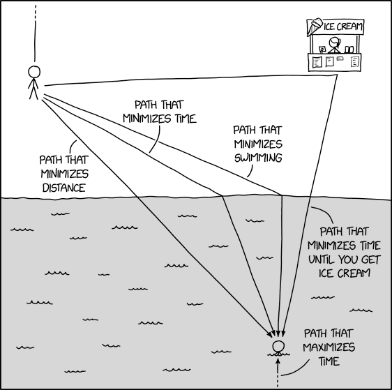

# Rules

Rules can be broken.

## Do it anyway

If friends alter their plans or back out at the last moment, don't be deterred. Continue with your plans, and you might encounter new faces along the journey. Reconnect with the initial reason you wanted to participate and go for it. If socializing was the primary goal, communicate your feelings to those who cancelled. It's smart to plan events that aren't overly dependent on others, guaranteeing you can see them through. This strategy not only simplifies the planning process but also reduces the risk of letdowns. Additionally, embarking on a journey alone or with a different group frequently leads to unexpected experiences and the formation of new friendships.

## No free shower

Before stepping into the shower, ensure you've worked up a sweat. If your day mainly involves desk work, engage in activities like running to break a sweat before you bathe. Commit to exercising first so every shower feels truly deserved.

## Buy Twice

Obviously it is not a good idea to buy things you don't need with money you don't have to impress people that don't care. Buy things that spark joy and you are willing to actually use and make you happy/life better. Get rid of those things that don't. Know when to gift friends, sell, through away or store it for later.

Remember that you always pay twice for every purchase:

- First you pay money have it
- Then you pay time to use it

Don't pay the first price if you won't pay the second price. This cycle leads to a feeling of insufficiency and self-defeat, as you accumulate an "unpaid" debt of second prices and end up feeling overwhelmed and time-poor.

Eventually you pay with more money and time to fix it, have it fixed or buy it again. This is the part where quality and repair friendliness maters. As the saying goes: "You get what you pay for", "Buy cheap, buy twice", "It's only cheap on paper"...

Not only usage leads to maintenance, repairs and placement: Your purchase will also age and become useless, old and broken over time. Find ways to re-purpose it or fix it and sell it. It may make sense to buy cheap first to learn what you actually need and appreciate the nice things.

## File over app

The principle of valuing files above applications underscores the importance of producing lasting digital assets. These assets should be both manipulatable and stored in universally readable formats. Opt for tools that provide such adaptability.

To guarantee that your documents remain legible for generations to come, even on computers from the years 2050 or 2525, they should also be understandable on a system from the 1960s. The lasting impact of your digital work depends more on the files themselves than on the software tools with which they were made. While applications might become obsolete, files have the potential to persist. Consider the ancient hieroglyphs in the Egyptian pyramids - the messages they convey are more significant than the instruments used to etch them.

## Understand your incentive

If you set goals be clear on why you want to achieve this goal. Usually this comes with downsides and setting the right priorities is essential for choosing the right path. However, be clear that the path usually is unknown to some extent and things will change. This is where your incentive kicks in and make a logical re-evaluation of the path chosen possible. Be true to yourself and understand your incentive when pursuing goals. Are you doing it for the right reasons? Is the reason you are doing something even achievable/still worth it or just a motivation to continue?

