# Games

A list of games I have, like and played.

## Board Games

### 2 Player Board Games

- Onitama
- Tides of Madness
- Patchwork
- Hanamikoji
- Royal Visit
- Tatsu
- Back Gammon

## Digital Games

### PlayStation Games

A list of PlayStation games I own:

| Game                               | Local Players | Comment |
|------------------------------------|---------------|---------|
| ABZU                               | 1             |         |
| Brawlhalla                         | 4             |         |
| Crash Bandicoot 4: It's About Time |               |         |
| Crypt of the Necrodancer           | 1             |         |
| Demon's Souls                      | 1             |         |
| Destruction AllStars               | 1             |         |
| DIRT 5                             |               |         |
| Enter the Gungeon                  | 2             |         |
| Genshin Impact                     | 1             |         |
| Ghost of Tsushima                  | 1             |         |
| God of War                         | 1             |         |
| Horizon Zero Dawn                  | 1             |         |
| HOT WHEELS UNLEASHED               | 2             |         |
| Injustice 2: Legendary Edition     | 2             |         |
| Life is Strange Remastered         | 1             |         |
| Life is Strange: True Colors       | 1             |         |
| Mortal Kombat 11                   | 2             |         |
| Moss                               |               |         |
| Oddworld: Soulstorm                | 1             |         |
| Paper Beast                        |               |         |
| Path of Exile                      |               |         |
| Ratchet & Clank                    | 1             |         |
| Rez Infinite                       |               |         |
| RIDERS REPUBLIC                    | 1             |         |
| Road 96                            | 1             |         |
| Rocket League                      | 4             |         |
| Sackboy: A Big Adventure           | 2             |         |
| Sherlock Holmes Chapter One        | 1             |         |
| STAR WARS Jedi: Fallen Order       | 1             |         |
| Subnautica                         | 1             |         |
| The Pedestrian                     | 1             |         |
| THE PLANE EFFECT                   | 1             |         |
| The Witness                        | 1             |         |
| Thumper                            | 1             |         |
| Tony Hawk's Pro Skater 1 + 2       |               |         |
| Trackmania Turbo                   |               |         |
| Wreckfest                          | 1             |         |

### Switch Games

A list of my Nintendo Switch games:

| Game                                             | Local Players | Comment         |
|--------------------------------------------------|--------------|-----------------|
| 10 Second Run RETURNS                            | 4            | zocki?          |
| 20XX                                             | 2            |                 |
| 9 Monkeys of Shaolin                             | 2            |                 |
| Akuto: Showdown                                  | 4            |                 |
| Almost There: The Platformer                     | 1            |                 |
| Alteric                                          | 1            |                 |
| Ape Out                                          | 1            |                 |
| Assault Android Cactus+                          | 4            |                 |
| Astro Bears                                      | 4            | 10 Fight Game   |
| Axiom Verge                                      | 1            |                 |
| Bad North                                        | 1            |                 |
| Battle Planet - Judgement Day                    | 2            |                 |
| Bite the Bullet                                  | 2            | coop            |
| Black Future '88                                 | 2            |                 |
| Black Paradox                                    | 2            |                 |
| Blasphemous                                      | 1            |                 |
| Blazing Chrome                                   | 2            |                 |
| Bomb Chicken                                     | 1            |                 |
| Boomerang Fu                                     | 4            |                 |
| Brick Breaker                                    | 4            | zocki?          |
| Broforce                                         | 4            | best alone      |
| BurgerTime Party!                                | 4            |                 |
| CARRION                                          | 1            |                 |
| Caveblazers                                      | 2            |                 |
| Celeste                                          | 1            |                 |
| Coffee Crisis                                    | 2            |                 |
| Crash Bandicoot N. Sane Trilogy                  | 1            |                 |
| Crawl                                            | 4            | coop            |
| Creature in the Well                             | 1            |                 |
| Crypt of the NecroDancer                         | 1            |                 |
| Cuphead                                          | 2            |                 |
| Cyber Protocol                                   | 4            | coop            |
| Dead Cells                                       | 1            |                 |
| Death Road to Canada                             | 4            | coop            |
| Death Squared                                    | 4            | coop            |
| Defenders of Ekron                               | 1            |                 |
| Destropolis                                      | 3            |                 |
| Diablo III: Eternal Collection                   | 4            | coop            |
| Ding Dong XL                                     | 1            |                 |
| Disc Room                                        | 1            |                 |
| Disney Illusion Island                           | 4            |                 |
| DOOM 64                                          | 1            |                 |
| Double Kick Heroes                               | 1            |                 |
| Down to Hell                                     | 1            |                 |
| Dream Alone                                      | 1            |                 |
| Duke Nukem 3D                                    | 1            |                 |
| Edna & Harvey: Harveys neue Augen                |              |                 |
| Electronic Super Joy                             | 1            |                 |
| Enter Digiton                                    | 1            |                 |
| Enter the Gungeon                                | 2            |                 |
| Exception                                        | 1            |                 |
| Exit the Gungeon                                 | 1            |                 |
| Fall Guys                                        | 1            |                 |
| FAST RMX                                         | 4            | 10 Fight Game   |
| Fe                                               | 1            |                 |
| Feudal Alloy                                     | 1            |                 |
| Flat Heroes                                      | 4            | 10 Fight Game   |
| FLATLAND Vol. 2                                  | 1            |                 |
| Freedom Finger                                   | 1            |                 |
| Gang Beasts                                      |              |                 |
| Giana Sisters: Twisted Dreams                    | 1            |                 |
| Golf Peaks                                       | 1            |                 |
| GoNNER                                           | 1            |                 |
| GONNER2                                          | 1            |                 |
| GRIS                                             | 1            |                 |
| Guacamelee!                                      | 1            |                 |
| Guacamelee! 2                                    | 1            |                 |
| Gunbrick: Reloaded                               | 1            | puzzle          |
| Gunman Clive HD Collection                       | 1            |                 |
| Heave Ho                                         | 4            | coop            |
| Hive Jump                                        | 4            | coop            |
| Hole io                                          | 4            |                 |
| Hollow Knight                                    | 1            |                 |
| Horizon Chase Turbo - Summer Vibes               | 4            |                 |
| Huntdown                                         | 2            |                 |
| Hyper Light Drifter – Special Edition            | 2            |                 |
| HyperBrawl Tournament                            | 4            |                 |
| INMOST                                           | 1            |                 |
| INSIDE                                           | 1            |                 |
| Into the Breach                                  | 1            |                 |
| INVERSUS Deluxe                                  | 4            |                 |
| Jet Lancer                                       | 1            |                 |
| Just Dance 2020                                  | 4            | dance           |
| Just Shapes & Beats                              | 4            | coop            |
| Katana ZERO                                      | 1            |                 |
| Killer Queen Black                               | 4            |                 |
| Kirby Star Allies                                | 4            | coop            |
| Leisure Suit Larry - Wet Dreams Saga             | 1            |                 |
| Lichtspeer: Double Speer Edition                 | 2            |                 |
| Light Fall                                       | 1            |                 |
| LIMBO                                            | 1            |                 |
| Little Nightmares                                | 1            |                 |
| Little Racer                                     | 4            | zocki?          |
| Lost in Play                                     | 1            |                 |
| LOVE                                             | 1            |                 |
| Lovers in a Dangerous Spacetime                  | 4            | coop            |
| LUMINES REMASTERED                               | 2            |                 |
| Mario + Rabbids Kingdom Battle                   | 2            |                 |
| Mario Kart 8 Deluxe                              | 4            | 10 Fight Game   |
| Mario Party Superstars                           | 4            |                 |
| Mark of the Ninja: Remastered                    | 1            |                 |
| Max: The Curse of Brotherhood                    | 1            |                 |
| Mechstermination Force                           | 2            | Epic Bossfights |
| Mighty Goose                                     | 4            |                 |
| Mo:Astray                                        | 1            |                 |
| Monaco                                           | 4            |                 |
| Mortal Kombat 11                                 | 2            |                 |
| Mother Russia Bleeds                             | 2            |                 |
| Mugsters                                         | 2            |                 |
| Munchkin: Quacked Quest                          | 4            |                 |
| My Friend Pedro                                  | 1            |                 |
| N++ (NPLUSPLUS)                                  | 4            |                 |
| Never Give Up                                    | 1            |                 |
| New Super Mario Bros. U Deluxe                   | 4            | coop            |
| Nidhogg 2                                        | 2            |                 |
| Nintendo Switch Sports                           |              |                 |
| Not Not - A Brain Buster                         | 2            |                 |
| Oddworld: New 'n' Tasty                          | 1            |                 |
| Odium to the Core                                | 1            |                 |
| Olija                                            | 1            |                 |
| OlliOlli: Switch Stance                          | 4            | zocki?          |
| One Person Story                                 | 1            |                 |
| Ori and the Blind Forest                         | 1            |                 |
| Overcooked Special Edition                       | 4            | coop            |
| Overcooked! 2                                    | 4            | coop            |
| OVIVO                                            | 1            |                 |
| Owlboy                                           | 1            |                 |
| PAC-MAN 99                                       |              |                 |
| PAC-MAN Championship Edition 2 PLUS              | 2            |                 |
| Pikuniku                                         | 1            |                 |
| Pinball FX3                                      | 1            |                 |
| Pinkman+                                         | 1            |                 |
| Pixel Cup Soccer                                 | 4            |                 |
| Pixel Gladiator                                  | 1            |                 |
| Puyo Puyo Tetris                                 | 4            | 10 Fight Game   |
| Q-YO Blaster                                     | 2            |                 |
| Qbik                                             | 1            |                 |
| Raiden V: Director's Cut                         | 2            |                 |
| Rain World                                       | 1            |                 |
| RAYMAN LEGENDS                                   | 4            | zocki?          |
| Robonauts                                        | 2            | coop            |
| Roof Rage                                        | 4            | 10 Fight Game   |
| Rubber Bandits                                   | 4            |                 |
| RunGunJumpGun                                    | 1            |                 |
| Runner3                                          | 1            |                 |
| Samba de Amigo: Party Central                    | 2            |                 |
| Sayonara Wild Hearts                             | 1            |                 |
| ScourgeBringer                                   | 1            |                 |
| Semblance                                        | 1            |                 |
| Shovel Knight Showdown                           | 4            |                 |
| Shovel Knight: Specter of Torment                | 1            |                 |
| Shovel Knight: Treasure Trove                    | 4            | zocki?          |
| Sine Mora EX                                     | 2            |                 |
| Skul: The Hero Slayer                            | 1            |                 |
| Slain: Back From Hell                            | 1            |                 |
| Slay the Spire                                   | 1            |                 |
| Snipperclips                                     | 4            |                 |
| SOL CRESTA                                       |              |                 |
| Space Pioneer                                    | 4            | coop            |
| SpeedRunners                                     | 4            | 10 Fight Game   |
| Spinch                                           | 1            |                 |
| Splasher                                         | 1            |                 |
| STANDBY                                          | 1            |                 |
| SteamWorld Dig 2                                 | 1            |                 |
| Stellar Interface                                | 1            |                 |
| Steredenn: Binary Stars                          | 2            | coop            |
| Stick Fight: The Game                            | 4            |                 |
| Streets of Rage 4                                | 4            | coop            |
| Sundered: Eldritch Edition                       | 4            | zocki?          |
| Super Blood Hockey                               | 4            | 2 Teams         |
| Super Bomberman R                                | 4            |                 |
| Super Mario 3D World + Bowser's Fury             | 4            |                 |
| Super Mario Bros. Wonder                         | 4            |                 |
| Super Mario Maker 2                              | 4            |                 |
| Super Mario Odyssey                              | 2            |                 |
| Super Mario Party                                | 4            |                 |
| Super Meat Boy                                   | 2            |                 |
| Super Meat Boy Forever                           | 1            |                 |
| Super One More Jump                              | 4            | zocki?          |
| Super Smash Bros. Ultimate                       | 4            |                 |
| Taiko no Tatsujin: Drum'n'Fun!                   | 1            |                 |
| Teenage Mutant Ninja Turtles: Shredder's Revenge | 6            |                 |
| TETRIS 99                                        | 1            |                 |
| The Bug Butcher                                  | 2            |                 |
| The Deer God                                     | 1            |                 |
| The End Is Nigh                                  | 1            |                 |
| The First Tree                                   | 1            |                 |
| The Legend of Zelda: Link's Awakening            | 1            |                 |
| The Lost Light of Sisu                           | 1            |                 |
| The Messenger                                    | 1            |                 |
| The Stretchers                                   | 2            | coop            |
| The Way Remastered                               | 1            |                 |
| Thumper                                          | 1            |                 |
| Toby: The Secret Mine                            | 1            |                 |
| Toki Tori                                        | 1            |                 |
| Toki Tori 2+:  Edition                           | 1            |                 |
| TowerFall                                        | 4            |                 |
| Transistor                                       | 1            |                 |
| Tricky Towers                                    | 4            | 10 Fight Game   |
| Trine 1: Enchanted Edition                       | 3            | coop            |
| Trine 2: Complete Story                          | 3            | coop            |
| Trine 3: Artifacts of Power                      | 3            | coop            |
| Trine 4: The Nightmare Prince                    | 4            | coop            |
| Trombone Champ                                   |              |                 |
| Ultra Space Battle Brawl                         | 4            |                 |
| Unit 4                                           | 4            | coop            |
| Unravel Two                                      | 2            | coop            |
| Unruly Heroes                                    | 4            |                 |
| Untitled Goose Game                              | 1            |                 |
| Unto The End                                     | 1            |                 |
| Urban Trial Playground                           | 2            |                 |
| Valfaris                                         | 1            |                 |
| Völgarr the Viking                               | 1            |                 |
| Voodoo Detective                                 |              |                 |
| VVVVVV                                           | 1            |                 |
| Wand Wars                                        | 4            |                 |
| Warp Shift                                       | 1            |                 |
| When Ski Lifts Go Wrong                          | 1            |                 |
| Will You Snail                                   | 1            |                 |
| Worms W.M.D                                      | 4            |                 |
| X-Morph: Defense                                 | 1            |                 |
| Xeodrifter                                       | 1            |                 |
| Yoku's Island Express                            | 1            |                 |
| Yoshi's Crafted World                            | 2            |                 |
| Zen Pinball                                      | 1            |                 |

## Game Sessions

### VR Team

- After the Fall
- Arizona Sunshine
- Audica
- Audio Trip
- Beat Saber
- Breachers
- Half Life Alyx
- Hyper Dash
- Karnage Chronicles
- Paradiddle
- Pavlov VR
- QuiVr
- Racket: Nx
- Ragnarock
- Rush
- Sprint Vector
- Star Wars Squadrons
- Superhot VR
- Synth Riders
- To the Top
- Ultimechs
- Virtual Fighting Championship
- VRNOID
- Walkabout Mini Golf VR

### Point-And-Click Dates

#### Currently playing

- Sherlock Holmes Chapter One (Playstation)

#### Played

- Tales of Monkey Island: Complete Season (Switch)
- Life is Strange: True Colors (Playstation)
- Runaway, The Dream of The Turtle (PC)
- Runaway: A Twist of Fate (PC)
- Unforeseen Incidents (PC)
- Erica (PC)
- Runaway: A Twist of Fate (PC)
- Runaway: The Dream of the Turtle (PC)
- Tales of Monkey Island: Chapter 1 - Launch of the Screaming Narwhal (PC)
- Unforeseen Incidents (PC)
- Road 96 (Playstation)

#### Possible next games

- Broken Sword
- Silence
- Tales of Monkey Island
- The Night of the Rabbit
- The Wolf among us

#### Other Point and Click Adventures I have

- 1954 Alcatraz
- A New Beginning - Final Cut
- Alum
- Anna's Quest
- Botanicula
- Broken Sword 1 - Shadow of the Templars: Director's Cut
- Broken Sword 2 - the Smoking Mirror: Remastered
- Broken Sword 3 - the Sleeping Dragon
- Broken Sword 4 - the Angel of Death
- Broken Sword 5 - the Serpent's Curse
- Chaos on Deponia
- Day of the Tentacle Remastered
- Delores: A Thimbleweed Park mini-adventure
- Deponia Doomsday
- Deponia The Complete Journey
- Dropsy
- Edna & Harvey: Harvey's New Eyes
- Goodbye Deponia
- Grim Fandango Remastered
- Ken Follett's The Pillars of the Earth
- Kentucky Route Zero
- Little Misfortune
- Machinarium
- Mitoza
- Monkey Island 2: Special Edition
- Paradigm
- Runaway: A Road Adventure
- Sam & Max Save the World
- Sam & Max: Beyond Time and Space
- Samorost 1
- Samorost 2
- Samorost 3
- Silence
- Still There
- Superbrothers: Sword & Sworcery EP
- Tales of Monkey Island: Chapter 2 - The Siege of Spinner Cay
- Tales of Monkey Island: Chapter 3 - Lair of the Leviathan
- Tales of Monkey Island: Chapter 5 - Rise of the Pirate God
- Tales of the Neon Sea
- The Lion's Song
- The Next BIG Thing
- The Night of the Rabbit
- The Secret of Monkey Island: Special Edition
- The Supper
- The Uncertain: Last Quiet Day
- The Whispered World Special Edition
- The Wolf Among Us
- TSIOQUE
- Yesterday
- Yesterday Origins

#### Interesting but not yet owned

- Indiana Jones
- Lake
- LEAVES - The journey
- LEAVES - The Return
- Life is Strange 2
- Life is Strange Remastered
- Syberia 2

### Zocki

First recorded Zocki event happened in 9.9.2019.

The **Zocki-Ten-Fight** is an epic battle over 10 games in local mulitplayer mode.

To determin the winner we use the following scoring per game:

| Place | Score |
|-------|-------|
| 1     | 4     |
| 2     | 2     |
| 3     | 1     |
| 4     | 0     |

Should there be a tie for first place between:

- 2 players after all 10 games one match of "Not Not - A Brain Buster", "Super Bloody Hockey" or "Nidhogg2" will determine the winner.
- 3 players after all 10 games one match of "Wand Wars" or "Astro Bears" will determine the winner.
- 4 players after all 10 games one match of "Wand Wars" or "Astro Bears" will determine the winner.

#### Ten-Fight-Table

This is the currently offical 10 fight game list and settings/modes:

| Game             | Settings                                                                                                                                             |
|------------------|------------------------------------------------------------------------------------------------------------------------------------------------------|
| Akuto Showdown   | Multiplayer → Survival, 3 Rounds, 5 Lives, Start Weapon = Staff, No Ranged Weapon → no bots → All Random Maps                                        |
| Boomerang fu     | Free for all → Modifiers: Match length=standard, victory=kills, auto balance=off, powerups=no bombs, fire, multi boomerang, telekinese and bamboozle |
| Flat Heros       | Versus → 2x3 games: zones, battle, runner                                                                                                            |
| SpeedRunners     | Versus → Offline → Create Game → normal random Map (3 games, count wins)                                                                             |
| Roof Rage        | Local Rooftops → Stock Match → Stock: 5 → HP: 200                                                                                                    |
| Brawlhalla       | Custum → Create Room → Private Room → Custom Online: Stock: Teams=off, Lives=6, Match=10, Damage=100%                                                |
| Astro Bears      | Party → 4 Player → 40 Points → Big Planet → Finite Ribbon                                                                                            |
| Puyo Puyo Tetris | Muliplayer Arcade → Single Screen → Versus → 4 Player → Win Count = 2, Harddrop = ON, Hold = ON                                                      |
| Mario Kart 8     | 4P → vs race → 150cc → No Teams, Normal Items, No CPU, all Verhicles, Random -> random map, 4 Races                                                  |
| Fast RMX         | Multiplayer → Splitscreen → CPU Drivers disabled, League: Subsonic, Mode: Cup, Laps: 3                                                               |

#### Five-Fight-Table

This is the currently offical 5 fight game list and settings/modes:

| Game             | Settings                                                                                                                                             |
|------------------|------------------------------------------------------------------------------------------------------------------------------------------------------|
| Boomerang fu     | Free for all → Modifiers: Match length=standard, victory=kills, auto balance=off, powerups=no bombs, fire, multi boomerang, telekinese and bamboozle |
| SpeedRunners     | Versus → Offline → Create Game → normal random Map (3 games, count wins)                                                                             |
| Roof Rage        | Local Rooftops → Stock Match → Stock: 5 → HP: 200                                                                                                    |
| Puyo Puyo Tetris | Muliplayer Arcade → Single Screen → Versus → 4 Player → Win Count = 2, Harddrop = ON, Hold = ON                                                      |
| Fast RMX         | Multiplayer → Splitscreen → CPU Drivers disabled, League: Subsonic, Mode: Cup, Laps: 3                                                               |

#### Other Games

These are the games currently not in the Ten-Fight-Table but are generally suitable:

| Game                           | Settings                                                                                                               | Reason why not in Top 10                                   |
|--------------------------------|------------------------------------------------------------------------------------------------------------------------|------------------------------------------------------------|
| Mario Party                    | 4 Player → Minigames → Square Off                                                                                      | Replaced in favor of Tricky Towers                         |
| Bomberman                      | Standard → Battle → Local Battle → Create Room → Battle Royal (4P, 3 Sets, 3min, Fixed Start, everything else on)      | Disliked by Team                                           |
| Worms Armageddon               | Multiplayer → local → Full Wormage Scheme                                                                              | Slow Pace                                                  |
| Worms W.M.D                    |                                                                                                                        | Disliked by Team                                           |
| Ultimate Chicken Horse         | N/A                                                                                                                    | Disliked by Team                                           |
| Nidhogg2                       | Local → Tournament → Double Elimination = Off → Time Limit 3min                                                        | Only 2 Players play at once and very long battles possible |
| Smash Bros                     | Smash → Smash → zocki10 (Stock 5, 6min, FS Meter = off, Spirits = on, Stage = random, Items = med, 2wins) → random map | Replaced by Brawlhalla and Roof Rage                       |
| Broforce                       | Versus                                                                                                                 | Mulitplayer to chaotic                                     |
| Wand Wars                      | Versus → hexout, 21 wins, merlins rules → Random map                                                                   | Replaced in favor of Fast RMX                              |
| Super Bloody Hockey            |                                                                                                                        | 4 players in 2 Teams                                       |
| Super Mario Party              |                                                                                                                        | Disliked by Team                                           |
| Stickfight the game            |                                                                                                                        | Disliked by Team yet                                       |
| Shovel Knight Showdown         |                                                                                                                        | Cool but too random for 10 fight                           |
| Duck Game                      |                                                                                                                        | not owned/tested                                           |
| Wrestledunk Sports             |                                                                                                                        | not owned/tested                                           |
| Retromania Wrestling           |                                                                                                                        | not owned/tested                                           |
| Super Monkey Ball Banana Mania |                                                                                                                        | not owned/tested                                           |
| Towerfall                      |                                                                                                                        | not owned/tested                                           |
| Gravity Heroes                 |                                                                                                                        | not owned/tested                                           |
| Mario Party Superstars         |                                                                                                                        | not owned/tested                                           |
| Diablo III                     |                                                                                                                        | 4-Player Couch Coop                                        |
| Unit 4                         |                                                                                                                        | 4-Player Couch Coop                                        |
| Monaco                         |                                                                                                                        | 4-Player Couch Coop                                        |
| Tricky Towers                  | Local Battle → random, normal, big cup                                                                                 | Replaced by Astro Bears                                    |

### ZoMo

First recorded ZoMo event happened in 30.11.2015.

#### ZoMo Games

Next Big Game

- Civilization (done)
- Stellaris
- Europa Universalis 4

If not everyone can make it

- Gloomhaven
- Northgard
- AoE II
- Asches
- Dungeons 3
- Terraforming Mars

Other games

- Alien Swarm - Reactive Drop
- Verdun
- Vermintide II
- Age of Empires II Definitive Edition
- Ashes of the Singularity: Escalation
- Dungeons 3
- Offworld Trading Company
- Planetary Annihilation: TITANS
- Europa Universalis IV
- Stellaris

#### To be played

- Galatic Civilizations III
- Total War: Warhammer

#### Played but currently not active

- Ancestors Legacy Free Peasant Edition
- ARK
- Battle for Wesnoth
- Civilization VI
- Crusader Kings II
- Factorio
- Hearts of Iron IV
- Lara Croft and the Temple of Osiris
- Path of Exile
- Starcraft 2
- StarWars BattleFront II
- Total War: SHOGUN 2
- Tropico 4
- Warhammer 40k Dawn of War II

## LAN Party

Playing games locally in a network requires some preparation and some tools help get organized. Here are some notes I made on the topic :)

Preparing:

- [ ] Make a list of all games that will be played and make sure all have downloaded, updated and started the game atleast once prior to the LAN party (see [games](#games) for example)
- [ ] Send a list of things to think about e.g. Equipment, Snaks, Sleeping bag
- [ ] Make sure everyone is clear on when it starts and ends and where to show up
- [ ] Make sure everyone helps setup and clean up

Gamers Equipment

- [ ] Power supply
- [ ] Headphones
- [ ] Mouse
- [ ] Keyboard
- [ ] Screen
- [ ] PC
- [ ] Cables for PC

Gamers Equipment

- [ ] Snacks and drinks
- [ ] Sleeping bag

On Site:

- [ ] Use power from different rooms and check for enough poweradapters
- [ ] Check for enough chairs and tables
- [ ] The LAN cables are long enough and you have enough free LAN ports

### Scan and Test Network

Have a look if you can see everyone in the LAN:

- You can scan the network to see who else is already visible: ```nmap -sC -sV 192.168.178.0/24```
- And/Or run a simple ARP command to see who you already see: ```arp -a```
- Test a connection to a given IP e.g.: ```Test-NetConnection -ComputerName 192.168.178.41 -InformationLevel "Detailed"``` (optionally add a port e.g. "-Port 3389")

### LAN Party Games

A list of games that are free and fun:

| Game                                                                            | Notes                                                   |
|---------------------------------------------------------------------------------|---------------------------------------------------------|
| [Trackmania](https://www.trackmania.com/)                                       | Host requires standard membership and maps              |
| [CS GO](https://store.steampowered.com/app/730/CounterStrike_Global_Offensive/) |                                                         |
| [Blobby Volleyball](http://blobbyvolley.de/)                                    | Setup a tournament and distribute the zipped game prior |
| [Rocket League](https://www.rocketleague.com/)                                  |                                                         |
| [StarCraft II](https://starcraft2.com)                                          |                                                         |
| [Warzone 2100](https://wz2100.net/)                                             |                                                         |
| [armagetronad](http://www.armagetronad.org)                                     |                                                         |
| [xonotic](https://xonotic.org/)                                                 |                                                         |
| [Minetest](https://www.minetest.net/)                                           |                                                         |
| [The Battle for Wesnoth](https://www.wesnoth.org)                               |                                                         |
| [SuperTuxKart](https://supertuxkart.net/)                                       | Racing game simular to Mario Cart                       |
| [Tee Worlds](https://www.teeworlds.com/)                                        | 2D Jump and Run Shooter                                 |

Modern games that work well in LAN

- Age of Empires II Definitive Edition

Nice old games

- Quake III Arena
- Counterstrike 1.6
- Unreal Tournament
- Warcraft III

### Share Files

Easiest way to share files ist by ziping whatever you want to share first.

You can run a simple webserver using python: ```python -m http.server 8080```

### Windows Firewall

Check your inbound rules and possibly add a rule/remove a restricition:

``` ps1
Get-NetFirewallRule | Where { $_.Enabled -eq 'True' -and $_.Direction -eq 'Inbound' } | Select-Object DisplayName, Direction, Action, Profile | FT
```

Alternativly, add firewall rules to allow all local traffic (same subnet):

``` ps1
New-NetFirewallRule -DisplayName "Allow LAN Party OUT" -Direction Outbound -LocalPort 1-10000 -Protocol TCP -RemoteAddress LocalSubnet -Action Allow
New-NetFirewallRule -DisplayName "Allow LAN Party IN" -Direction Inbound -LocalPort 1-10000 -Protocol TCP -RemoteAddress LocalSubnet -Action Allow
```

Remove the rules from above:

``` ps1
Remove-NetFirewallRule -DisplayName "Allow LAN Party OUT"
Remove-NetFirewallRule -DisplayName "Allow LAN Party IN"
```

Or, if nothing helps, disable the Firewall for your current profile during the LAN event: ```netsh advfirewall set currentprofile state off```

You can reset your firewall settings as follows. Windows will then ask you whenever you start an application what to do with this currently blocked application.

``` ps1
(New-Object -ComObject HNetCfg.FwPolicy2).RestoreLocalFirewallDefaults()
```

### Services

- Set up a tournament: <https://www.toornament.com>
- More counters: <https://scorecount.com/>

## Game Tips and Settings

### Age of Empires

#### Age of Empires 2 DE

Settings

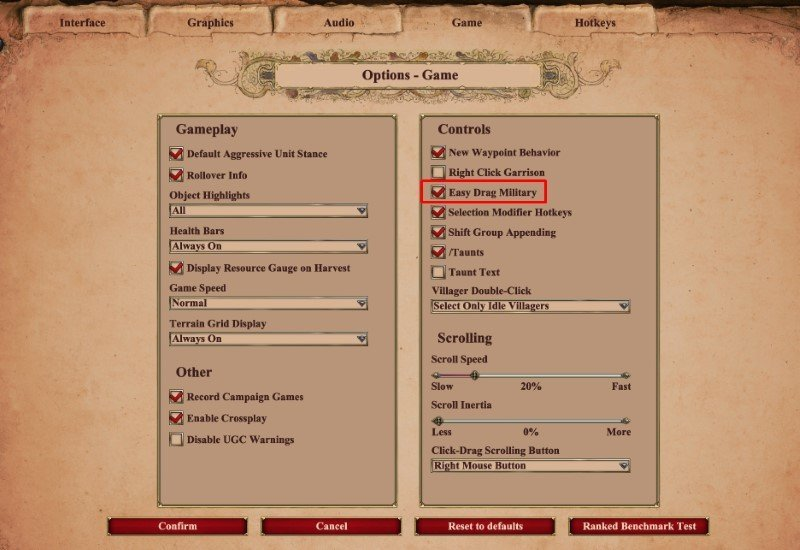

The mods I use:

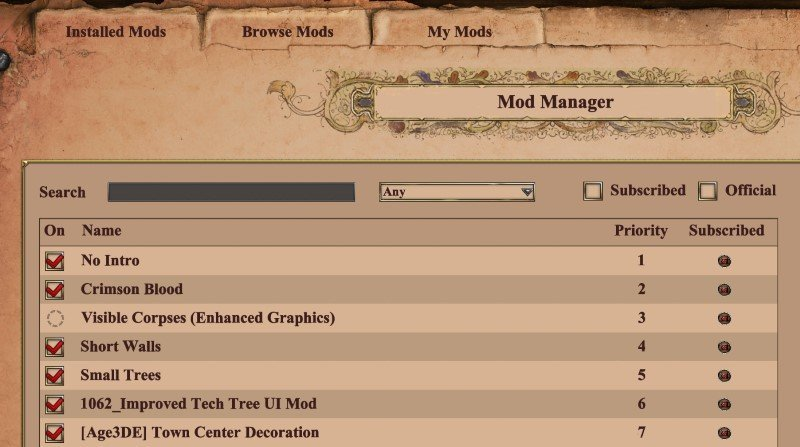

##### Notes

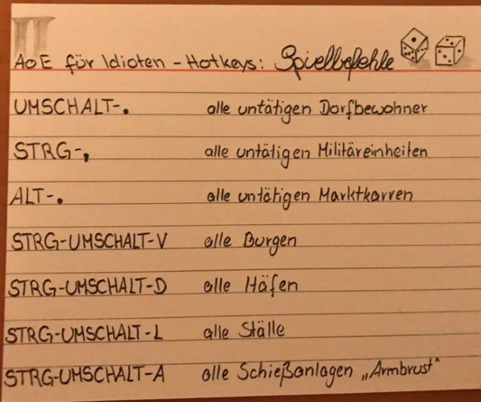

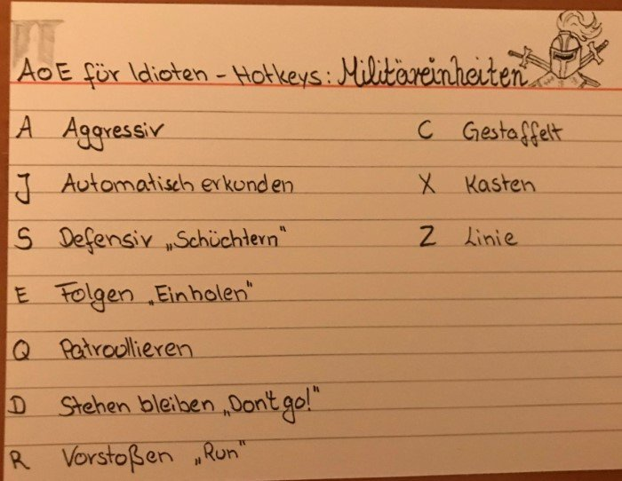

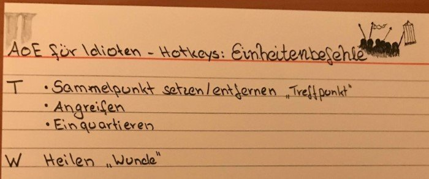

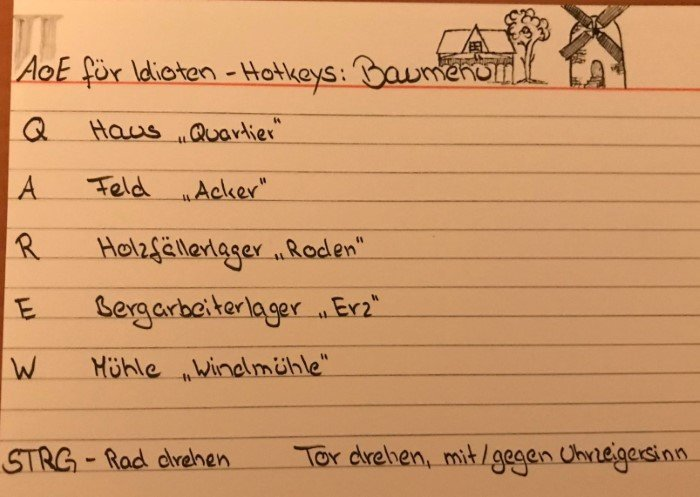

##### AoE Tetris

- Age of Empires II DE: Tetris: <https://www.ageofempires.com/mods/details/21466/>
- Age of Empires II DE: Tetris Visual Mod: <https://www.ageofempires.com/mods/details/21464/>

Watch:

- Video: <https://www.youtube.com/watch?v=9ZMobR31qdE>

##### Bloodpack example

| Before                                                | After                                                |
|-------------------------------------------------------|------------------------------------------------------|
| 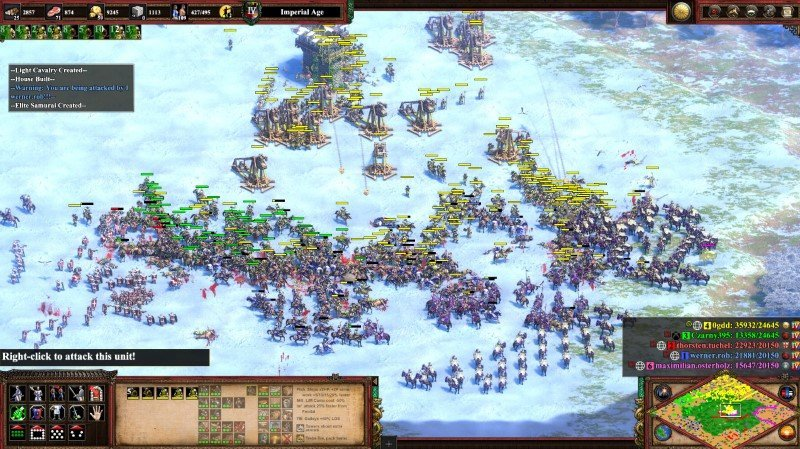 | 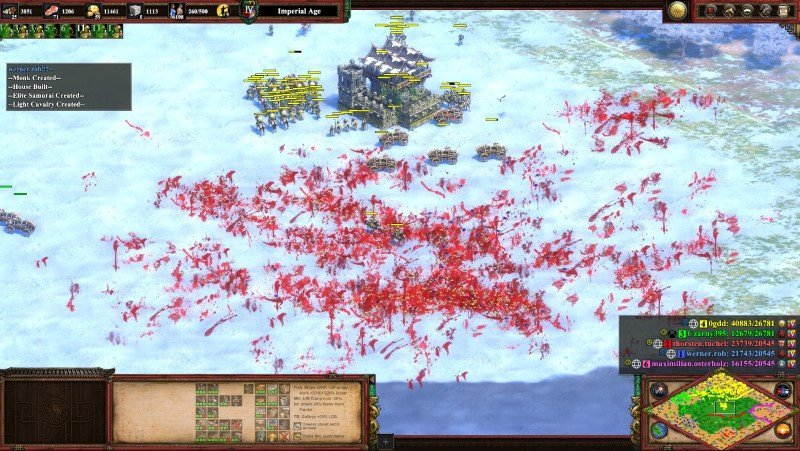 |

### Call of Duty

#### Warzone

Notes

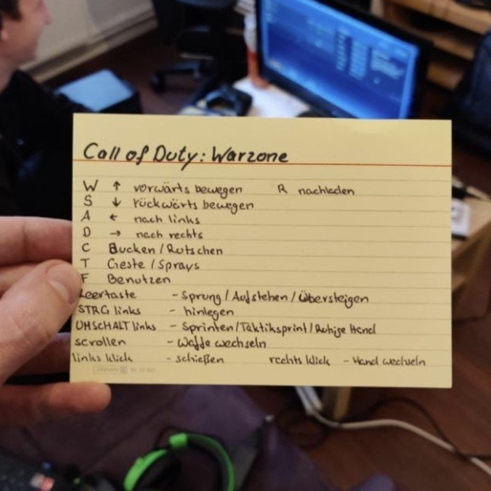

How to win

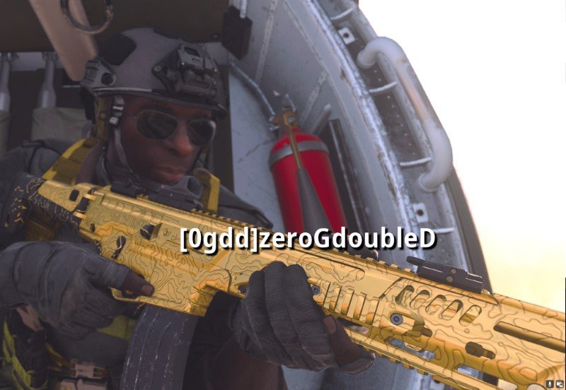

### Doom

#### Doom as Admin Tool

- Delete Azure Resources with Doom: <https://github.com/secureworks/chaosbernie>
- Kill Kubernetes pods by playing Doom: <https://github.com/storax/kubedoom>
- Kill Prozesses with Doom: <https://www.cs.unm.edu/~dlchao/flake/doom/chi/chi.html>

### Facturio

Online

- [Factory requirements calculator](https://factoriolab.github.io/list)
- [Factorio Blueprints](https://factorioprints.com)

Tools

- [Factorio Blueprint Visualizer](https://github.com/piebro/factorio-blueprint-visualizer)
- [Foreman2](https://github.com/DanielKote/Foreman2) (Visual planning tool for Factorio )
- [verilog2factorio](https://redcrafter.github.io/verilog2factorio/) is a Verilog to Factorio Blueprint compiler.

Mods

- [Rate Calculator](https://mods.factorio.com/mod/RateCalculator)
- [Factory planner](https://mods.factorio.com/mod/factoryplanner)
- [BlueprintLab design](https://mods.factorio.com/mod/BlueprintLab_design)

### Minecraft

#### Mods

Converters

- SimCity 2000 Minecraft: <https://github.com/jgosar/mine-city-2000>

Minecraft as Admin Tool

- Kubernetes administration through Minecraft: <https://github.com/erjadi/kubecraftadmin>

### Overwatch

- Tier list and most played heroes: <https://www.esportstales.com/overwatch/tier-list-and-most-played-heroes>

### Quake

#### Ports

- [Quake 1 port for Apple Watch](https://github.com/ByteOverlord/Watch_Quake)

### Rocket League

Settings

- FoV: 110
- Distance: 250
- Height: 100
- Angle: -4
- Stiffness: 0,65
- Swivel Speed: 5
- Transition Speed: 1

### Trackmania

- Maps: <https://trackmania.exchange/mapsearch2>

### Stupid Games

Cookie Clicker

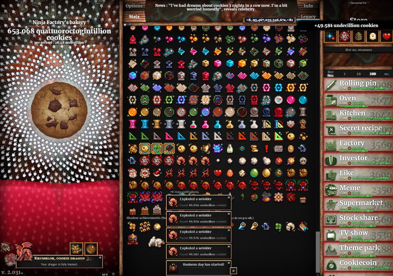

### Member Berries

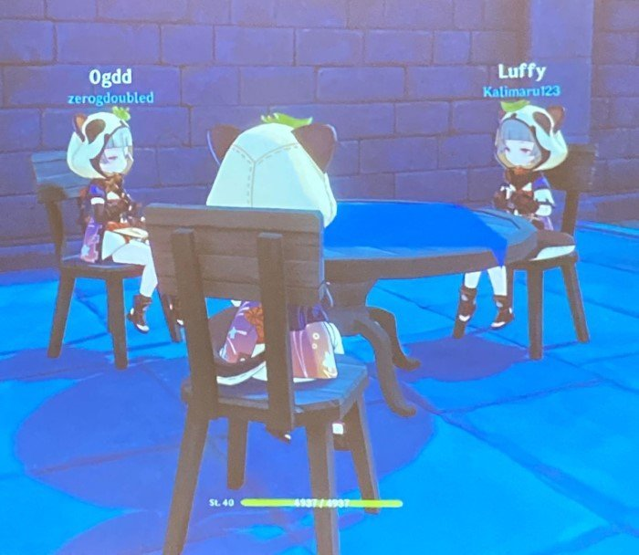
