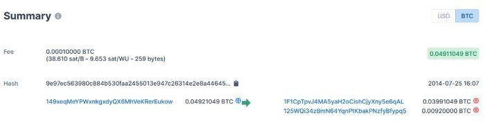
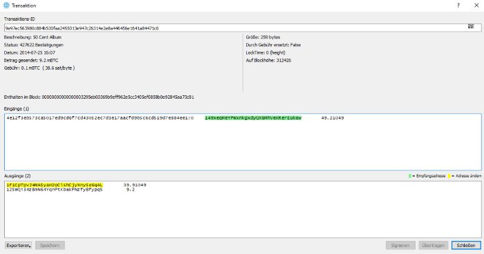
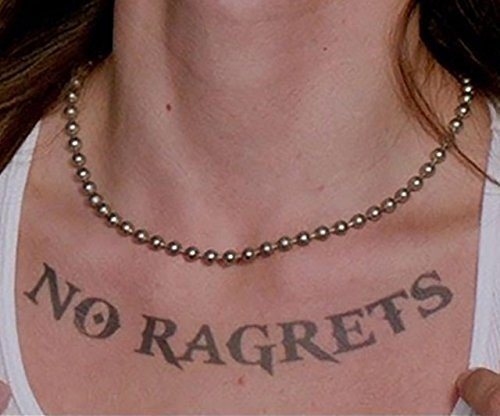
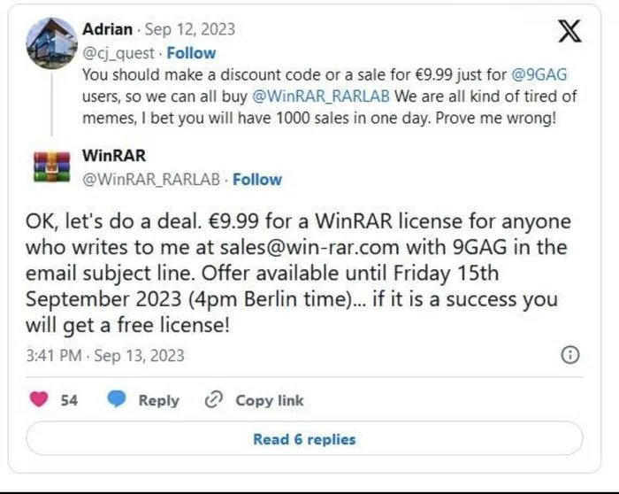
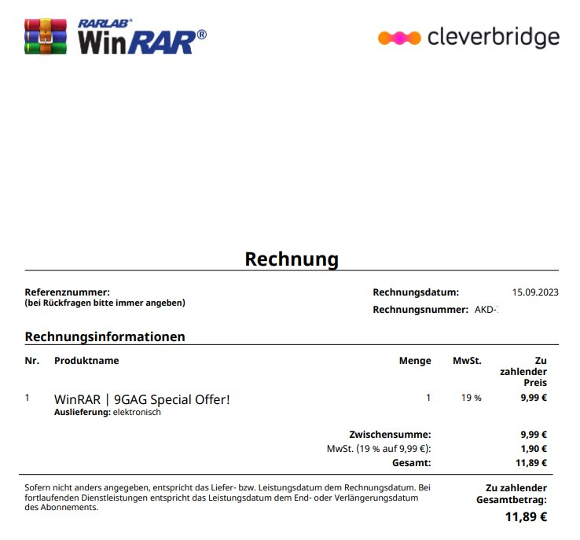
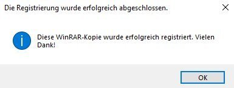
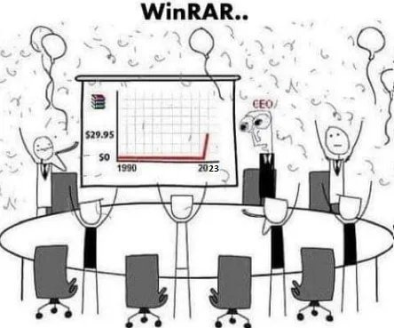

# Me

Some facts about me:

- I found my great white buffalo 🧡
- I climb, ski, ride and run with passion 🔥
- I spend most of my time with tech, games and music 🤖
- I make stuff (mainly board games and stuff with the laser cutter) 🎲
- I believe pineapple pizza is not a crime 🍕
- I think the best time of the day is 22:22 🕰
- I say "Entweder es klappt oder es klappt zusammen." 😤

Last link i visited which I would like to share:

## IT background

My first interaction with a PC was in 1991. At that time everything with a screen was interesting to me. I typed off my favorite dinosaur story from a book (on my dads work notebook) beacuse I thought it would be cool to have it digital.

I later wrote my first programm in basic and was amazed by loop functions. New shareware games came on floppy disks through friends and fleemarkets. I loved gaming on the PC.

I saved up money for a few years to buy my first own cheap pc which I built myself and got sick because my computer didn't work because of mismatching cheap "vendorless" RAM pieces. Eventually i fixed it, learned stuff on the way and gained freedom with my own pc and explored the internet and modded some games (nothign seriuos, just learning stuff).

I read the "[Bastard Operator From Hell](https://bofh.bjash.com/)" and "[Bastard Assistant from Hell](https://de.wikipedia.org/wiki/Bastard_Assistant_from_Hell)", watched [Hackers](https://en.wikipedia.org/wiki/Hackers_(film)) and was hooked by the connection between "[Dreiundzwanzig - 23 - Die Geschichte des Hackers Karl Koch](https://de.wikipedia.org/wiki/23_%E2%80%93_Nichts_ist_so_wie_es_scheint)" and "[Kuckucksei](https://de.wikipedia.org/wiki/Kuckucksei_(Clifford_Stoll))".

I drank Jolt Cola and even visited the german headquarters in Cologne. I did all kinds of experiments but mainly used the PC for gaming and internet in my teens. It was around that time that I knew I wanted to do stuff with computers my entire life.

## Q&A

??? question "What was your most interesting online purchase?"
    In 2014 [I spent](https://www.blockchain.com/btc/tx/9e97ec563980c884b530faa2455013e947c26314e2e8a446456e1641a84471c0) [0.04911049 BTC](https://duckduckgo.com/?q=0.04911049+btc+in+euro&ia=cryptocurrency) for digital copy of the [50 Cent](https://de.wikipedia.org/wiki/50_Cent) Album [Animal Ambition](https://en.wikipedia.org/wiki/Animal_Ambition). Curtis and I both forgot about it until suddenly BTC was worth a lot of money. As of today, this is my most expensive album purchase yet. No Ragrets :)

    

    

     

??? question "Do you have a WinRAR licence?"
    Yes

    

    

    

    

??? question "Do you have an avatar you use?"
    I often use this avatar online. More about how to create this with [Context Free Art is written here](https://0xfab1.net/tech/art/random/contextfreeart/).

    
