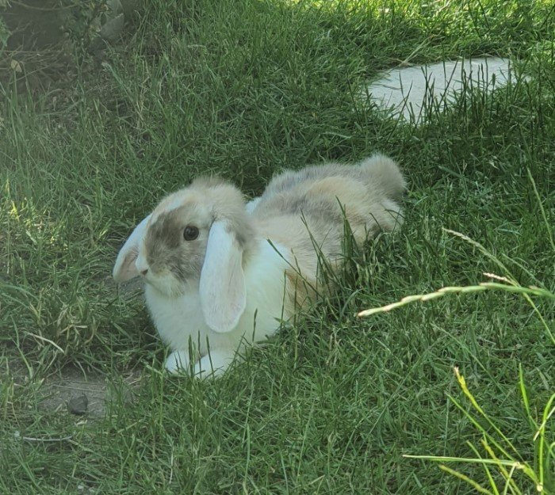
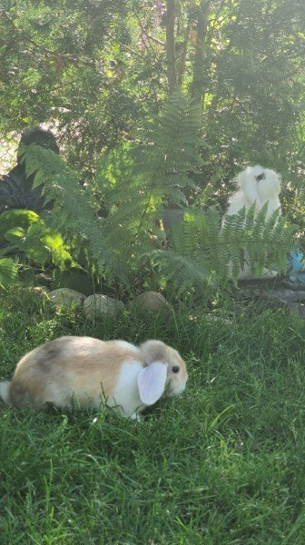
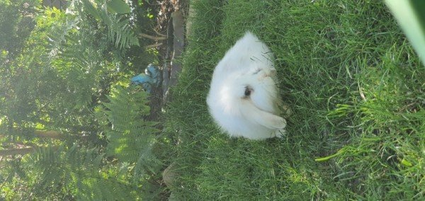
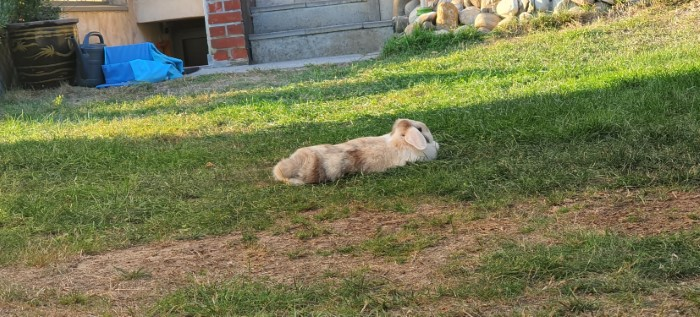

# Pets

## Turtle

Our turtle awakes out of hibernation roughly mid april. The following is a time lapse video of the final struggle to burry itself out of its hole. The turtle then proceeds to catch some sunlight. It won't eat any food though for another few days.

<iframe width="560" height="315" src="https://www.youtube.com/embed/u__G182Ewdg" title="YouTube video player" frameborder="0" allow="accelerometer; autoplay; clipboard-write; encrypted-media; gyroscope; picture-in-picture" allowfullscreen></iframe>

And here he is in autumn digging his hole for the winter, choosing the same spot :)

Here is a video of my turle eating a banana:

<iframe width="560" height="315" src="https://www.youtube.com/embed/Xm2B3SXAl1Q" title="YouTube video player" frameborder="0" allow="accelerometer; autoplay; clipboard-write; encrypted-media; gyroscope; picture-in-picture" allowfullscreen></iframe>

## Rabbits

The following pictures show my rabbits:

 

