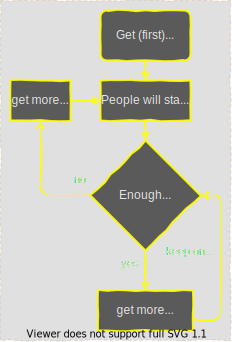

# Final wisdom

A collection of hand picked wisdom accumulated for the worthy.

Advice is difficult to take in properly... no idea how you should do it; but do something.

Never give 110%, that's just selling out... just divide your 100% in:

- 50% pain
- 20% skill
- 15% concentrated power of will
- 10% luck
- 5% pleasure

## Smart Stuff

- Say: "I can do hard things". Doing hard things has intrinsic value, and they will make me a better person, even if I end up failing.
- Make goals that you have control over. Accept what you can not control.
- The key is recognizing that the urge to avoid hard things is human, and should be expected. It’s part of the process. Figure out what combination of motivation, and circumstances, and accountability work best for your particular personality.
- Break large goals down into manageable pieces. Creating an accurate roadmaps toward this goal. Find out what is important. Differenciate between activities you want to be important and what actually makes a difference.
- In der Menge liegt das Gift.
- Alles was man besitzt muss man auch pflegen.
- It's better to finish something than to start something

## Fun Stuff

### The theory of the first chick

- Message: It all start with the first chick
- Source: Beavis and Butthead
- Transcript: ```It's like: We need to get a cool looking chick; maybe then people will start to respect us and stuff. It's like then we'll start getting respect, and then we'll get more chicks and then like: with more chicks I go get more respect and after that we'll get like more money. It'll be like more money, more chicks, more respect... and just like keep on going. It all takes is getting that first chick.```
- Listen to the [audio version](_chicks-respect-money.mp3)

This process diagram vizulizes the steps involved:


