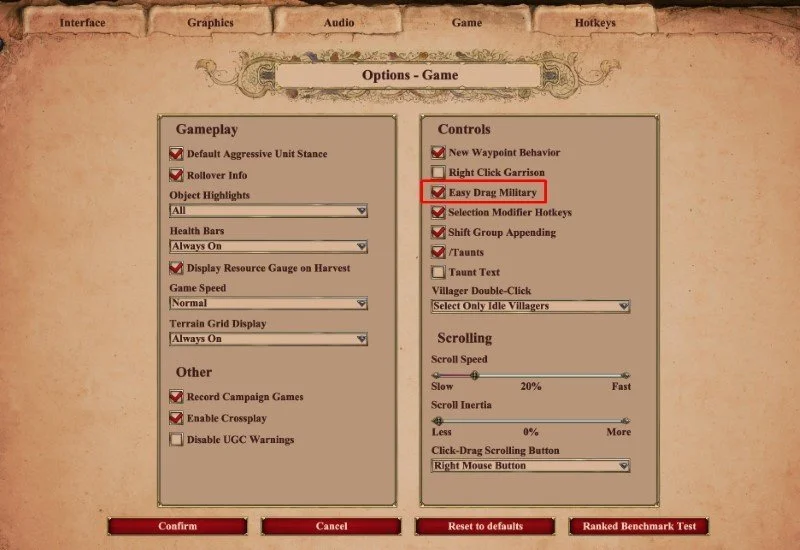
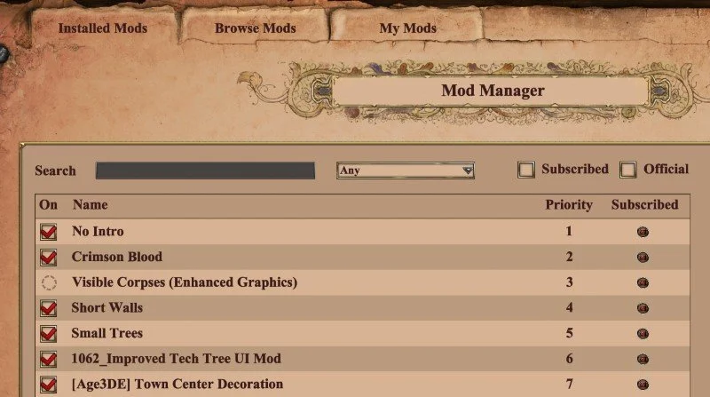
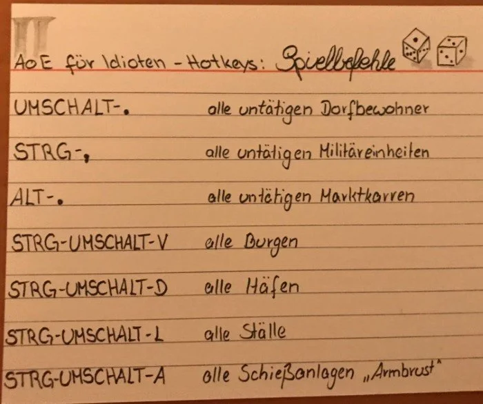
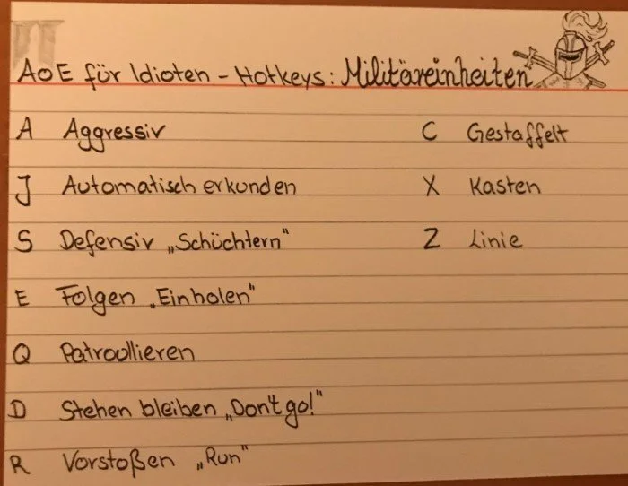
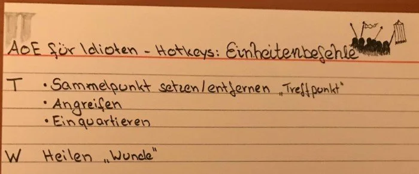
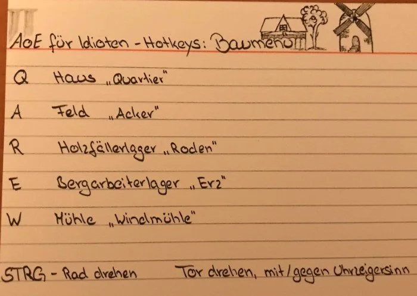
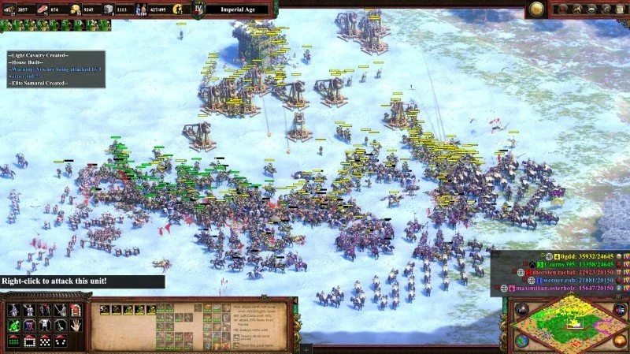
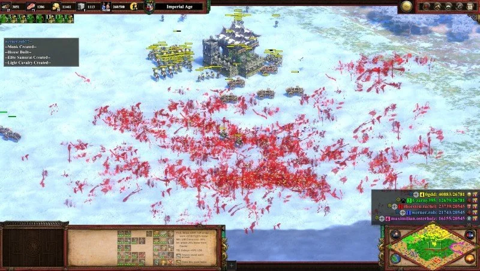
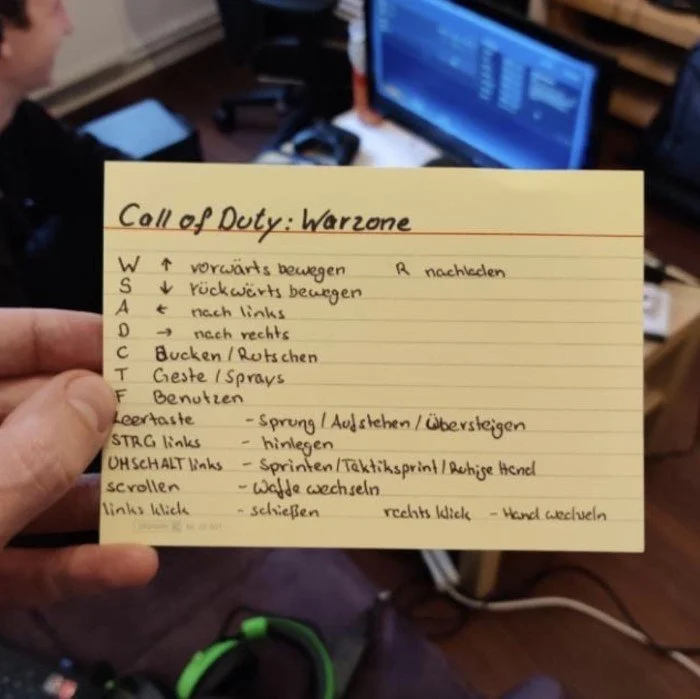
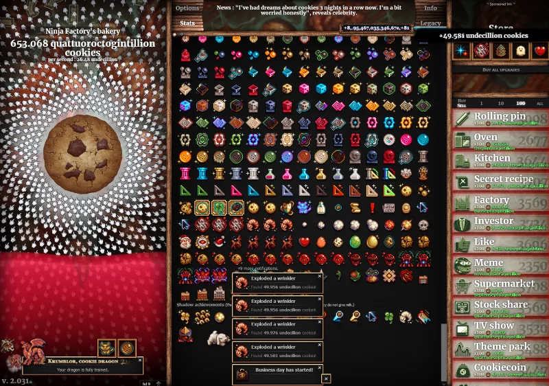

# Game Helper

## Age of Empires

### Age of Empires 2 DE

Settings

The mods I use:

#### Notes

#### AoE Tetris

- Age of Empires II DE: Tetris: <https://www.ageofempires.com/mods/details/21466/>
- Age of Empires II DE: Tetris Visual Mod: <https://www.ageofempires.com/mods/details/21464/>

Watch:

- Video: <https://www.youtube.com/watch?v=9ZMobR31qdE>

#### Bloodpack example

| Before                                                | After                                                |
|-------------------------------------------------------|------------------------------------------------------|
|  |  |

## Call of Duty

### Warzone

Notes

How to win

## Doom

### Doom as Admin Tool

- Delete Azure Resources with Doom: <https://github.com/secureworks/chaosbernie>
- Kill Kubernetes pods by playing Doom: <https://github.com/storax/kubedoom>
- Kill Prozesses with Doom: <https://www.cs.unm.edu/~dlchao/flake/doom/chi/chi.html>

## Facturio

Online

- [Factory requirements calculator](https://factoriolab.github.io/list)
- [Factorio Blueprints](https://factorioprints.com)

Tools

- [Factorio Blueprint Visualizer](https://github.com/piebro/factorio-blueprint-visualizer)
- [Foreman2](https://github.com/DanielKote/Foreman2) (Visual planning tool for Factorio )
- [verilog2factorio](https://redcrafter.github.io/verilog2factorio/) is a Verilog to Factorio Blueprint compiler.

Mods

- [Rate Calculator](https://mods.factorio.com/mod/RateCalculator)
- [Factory planner](https://mods.factorio.com/mod/factoryplanner)
- [BlueprintLab design](https://mods.factorio.com/mod/BlueprintLab_design)

## Minecraft

### Mods

Converters

- SimCity 2000 Minecraft: <https://github.com/jgosar/mine-city-2000>

Minecraft as Admin Tool

- Kubernetes administration through Minecraft: <https://github.com/erjadi/kubecraftadmin>

## Overwatch

- Tier list and most played heroes: <https://www.esportstales.com/overwatch/tier-list-and-most-played-heroes>

## Quake

### Ports

- [Quake 1 port for Apple Watch](https://github.com/ByteOverlord/Watch_Quake)

## Rocket League

Settings

- FoV: 110
- Distance: 250
- Height: 100
- Angle: -4
- Stiffness: 0,65
- Swivel Speed: 5
- Transition Speed: 1

## Trackmania

- Maps: <https://trackmania.exchange/mapsearch2>

## Stupid Games

Cookie Clicker

## Member Berries

