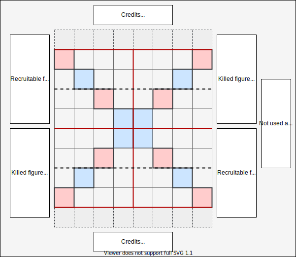

# Rules

Chessacre is a chess variant in which figures may gain abilities and new figures can be recruited for credits.
Credits are earned during the game for various actions. Each turn a player has 3 actions to recruit or move figures.
Roll three dice to determine which figures can be moved, select one and move this figure according to regluar chess rules.
Spend credits to recruit new figures and place them at the end of the board in the recruitment zone.
New figures can only move into their quarter.
Killing an enemy enables the protect ability.
The explosion and convert abilities are picked up on the marked places on the board.
Killing the enemy king ends the game.

## Chess board

This chess variant requires a 10x8 board and has special zones and fields as follows:

There are 4 states a figure can be in: active, recruited, recruitable or killed:

- **Active figures** can move freely across the board according to standard chess rules and their abilities.
- Figures in the **recruitment area** must move on the board within their spawn quarter.
- **Recruitable figures** can be recruited as an action if you have enough credits.
- **Killed figures** can be resurrected as an action. Otherwise these figures can no longer be used.

All figures start as recruitable figures. Separate killed figures and recruitable figures during the game as follows:

## Setup

To start the game, each player receives:

- 2x pawns
- 1x king
- 1x queen
- 9 credits

White starts the game and places a figure on the board in the setup zone.

Players then go turn by turn and can either place or purchase a figure.

- As an exception, during the setup phase, all figures are placed directly in the setup zone (first 2 lines of the playing field). Note: During the game, recruited figures are placed in the recruitment zone.
- Once the king is placed he receives the protect ability. Therewith the king withstands one attack.

The setup ends once both players have placed all figures and do not want recruit any further figures.
It not required to spend all credits.
If one player is done early the other player can finish all remaining actions at once.

Once the setup is done white starts with the first regular turn.

## Actions

On every turn a player has 3 actions.
There are 2 types of actions available:

- [Move](#move)
- [Recruit](#recruit)

Once all three actions are done the player earns credits from certain actions:

| Action                | credits | Comment                                                                                                                                                                            |
|-----------------------|---------|------------------------------------------------------------------------------------------------------------------------------------------------------------------------------------|
| Figure moved          | +1      | For each figure moved 1 credit is awarded. If a figure moves to attack another figure but this figure has a protection ability this counts as move (but not as kill).               |
| Converted figure      | +1      | A converted enemy is awarded with 1 credit. Credits are rewarded after the turn in which the enemy was converted; not in the turn the conversion started.                         |
| Conversion failed     | -1 / +1 | If the enemy successfully escapes from the conversion, he gains 1 credit and the player initiating the conversion looses 1 credit.                                            |
| Enemy killed          | +2      | Each enemy killed is rewarded with 2 credits. If a figure with a protect ability is successfully attacked this does not account for enemy killed and is not awarded with credits. |
| Reached enemy endzone | -1 / +1 | Steal 1 credit from your enemy. If your enemy has no credits left you get nothing. This is rewarded once; not every round a figure stands at the end zone |

The credits earned in this turn can be spent in the next turn.

### Move

Roll all 3 dice to determine which figures can be moved in this action.

- If you can move a figure you must move it.
- If non of the rolled dice show a figure you can move this action is over.

A figure can only move once per turn.

- Figures move just like in [regular chess](https://en.wikipedia.org/wiki/Chess#Movement) across the 8x8 board.
- If you move a figure that has an ability (explode or convert) you may use this ability within this action after moving.
- If you initially move a figure from the recruitment line the figure must stay within the red-lined spawn quarter.

Recruited figures must stay within their spawn quarter when initially moving.

- Figures in the recruitment zone may attack enemy figures as a first move if in range (spawn quarter).

A pawn that reaches the enemy line converts into any recruitable figure.

- If e.g. no queen is available resurrecting a queen is no longer an option at this time and another figure must be chosen.
- If no figures other than pawns are available the pawn dies with no replacement.

In case the king is in check you can optionally move the king as an action once.

- In this case there is no need to roll the dice.
- If you moved the king in a prior action through a dice roll you may move the king again.

The abilities explode and convert are gained when moving onto a marked field (not just passing it).

- Figures can only pick up abilities on the other half of the board (never on their side!).
- All figures, except pawns, may gain abilities to enhance their attack.
- Figures can only have one ability at a time.
- If a player already has an ability they may choose which one to keep.
- Each ability is available 3 times + 2 protect for each king. If there are no abilities left, the figure does not gain the ability.
- The ability is gained by equipping the figure with the ability marker.
- If the ability was gained in this move it can not directly be used.

Moving to a field on which the enemy stands attacks the enemy.

- If the enemy has an protect ability, the attacker stays where it started and the attacked figure looses the protect ability.
- If the enemy doesn't have the protect ability, the enemy is killed and the attacker gains an protect ability.
- Killing an enemy with explosion or convert the attacker does not recieve the protect ability, however this credits for the kill are still received.
- If the enemy has an explode or convert ability the enemy is killed and the attacker may choose to gain the protect ability or the explode or convert ability from the enemy.

The following abilities are available:

| Ability | Available | Comment                                                                                                                                                                 |
|---------|-----------|-------------------------------------------------------------------------------------------------------------------------------------------------------------------------|
| Protect | 5         | If a figure kills another figure it earns the protect ability. This figure now requires 2 hits to get killed. 2 protect abilities are assigned during setup to the kings of each side. Once the king is attacked and the protect ability is lost this protect ability can be re-used. |
| Explode | 3         | Once activated this will kill all figures (own and enemy) within the radius. Exception are figures with the protect ability. These figures will loose their protect ability.                                                                                                                                                                       |
| Convert | 3         | Once activated an enemy figure within the radius must be chosen. This figure will recieve the convert ability. If this figure does not move out of the radius in the next turn this figure is converted. The figure is then killed and replaced by the same typ of figure of the other color from the recruitment zone. In case this figure is not available the figure is killed without replacement. If the figure manages to escape it may keep the convert ability. Enemys with the protect ability can not be converted. If the king has no protection and is converted the game is over. If the king is attacked with conversion the king is in check and the special moving rules apply.                                                                                                                                                                       |

### Recruit

The king can not be recruited, nor resurrected.
Any other figure can be recruited as described below:

| Figure   | Symbol                      | Cost          | Available          | Comments                                                                                                                                                                                                                |
|----------|-----------------------------|---------------|--------------------|-------------------------------------------------------------------------------------------------------------------------------------------------------------------------------------------------------------------------|
| Queen    |   | 7 + sacrifice | 2                  | The queen can be purchased like any other figure but requires a sacrifice. The sacrifice can be any own figure already in the game, except the king (duh!) and the pawn.                                                |
| Rook     |    | 5             | 4                  |                                                                                                                                                                                                                         |
| Bishop   |  | 3             | 4                  |                                                                                                                                                                                                                         |
| Knight   |  | 3             | 4                  |                                                                                                                                                                                                                         |
| Pawn     |    | 1             | 16                 | Pawns can move 2 fields once when leaving the recruitment line.                                                                                                                                                         |
| Resurect |                             | 2             | All killed figures | Any figure killed can be resurrected. Once resurrected this figure moves from the killed figures to the recruitable figures. Recruiting a figure is an addtional action; so recruiting a killed figure requires 2 actions. |

Recruiting a figure as an action includes:

- Choose a figure
- Spend the credits
- Place the figure at any free space on the recruitment line

## Links

Chess piece symbols used are from [wikipedia](https://commons.wikimedia.org/wiki/Category:SVG_chess_pieces).
