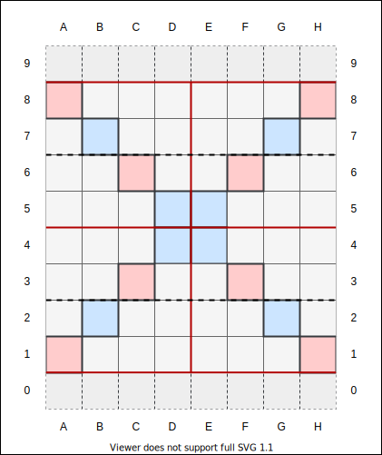

# Notation

The standard [algebraic notation for chess](https://en.wikipedia.org/wiki/Algebraic_notation_(chess)) also works for chessacre.

Addtional chessacre fields are referred to as line 0 and 9 as illustrated below:

