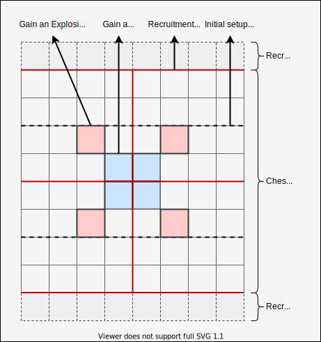
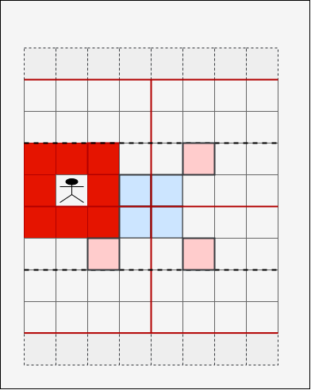
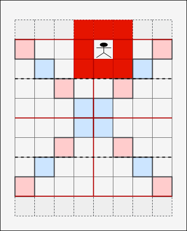

# Chessault Rules

Chessault is a chess variant in which figures can be purchased. Killing the enemy king ends the game. Points are earned for various actions that can be used to ourchase figures and actions. There are rings that enable special abilities for a given figure. Each player has 3 actions per turn and rolls dice to determine which figures can be moved.

## Game Setup

Both players recieve 2x pawns, 1x king, 1x qween and 9 points

- White starts the game.
- Players go turn by turn and can either place a figure or purchase a figure.
- In this phase all figures are placed directly in the first 2 lines of the playing field.
- Once placed, the king recieves a protect ring.
- At the end of the setup all figures are placed. It is however not required to spend all points.

## Actions

On every turn a player has 3 actions. There are 2 main types of actions possible:

- Move a figure
- Purchase a figure or action

Once all three actions are done the player earns points from allactions taken:

| Action                  | Points |
|-------------------------|--------|
| Move a figure           | 1      |
| Kill an enemy figure    | 2      |
| Reach end line of enemy | 2      |

These points can be spent in the next round.

If a figure with a protect ring is successfully atacked this does not account for "kill an enemy figure" and is not awareded with points.

### Move a Figure

Roll all your dice. The dice show which figures can be moved in this turn. If you can move a figure you must move it. If non of the rolled dice show a figure you can move this action is over.

A figure can only move once per turn. You can however move a figure and activate an ability (explosion, convert) in a second action (if the dice allow you to do so).

If you initally move a figure from the requitment line the figure must stay within the red-lined quarter.

In case your king is in check you can move the king as an action. There is no need to roll the dice. This is however optional. Moving any other figures requires rolling the dice.

TODO add example

### Purchase Figures

Purchasing a figure as an action includes choosing a figure, spending the points and playing it at any free space on the reqruitment line.

| Figure | Cost           |
|--------|----------------|
| Queen  | 7 + sacrifice* |
| Rook   | 5              |
| Bishop | 3              |
| Knight | 3              |
| Pawn   | 1              |

Addtional rules for each figure:

- **King**: The king can not be purchased.
- **Queen**: The queen can be purchased like any other figure but requires a sacrifice. The sacrifice can be any own figure already in the game, except the king (duh!) and the pawn. The queen can also be purchased by bringing a pawn to the enemy end line. The pawn then converts into a queen (if still available). A player can have a maximum of 2 qeens in the game. If a queen (or any other figure) is killed and is no longer available for purchase/reqruitment it can be resurected (see purchase actions).

### Purchase Actions

| Figure         | Cost |
|----------------|------|
| Resurect       | 2    |
| Extra Dice     | 10   |
| Rings of Power | 5    |

Addtional rules for each action:

- **Resurect**: Any figure killed can be resurected. Once resurected can be purchased again (addtional action).
- **Extra Dice:** The max. limit of dice a player may have is 5.
- **Rings of Power**: A purchased rings of power can only be assinged to a figure in the recuitment area.

## Rings of Power

Rings can be added to figures (except pawns) to enhance their abilities. There are three kinds of rings. Each figure may hold each ring once (so 3 max):

- **Protect**: If a figure kills another figure it earns a ring of protecting. This required the enemy to hit this figure 2x in order to kill it. Pawns can not earn a protection ring.
- **Explode**: Can be activated by roling a die with the figure equiped with this ring. Once activated this will kill all figures (own and enemy) within the radius. Exception are figures with a protect ring. These figures will simply loose their protect ring.
- **Convert**: Can be activated by roling a die with the figure equiped with this ring. Once activated an enemy figure within the radius must be chosen to be converted. If this figure does not move out of the radius in the next turn this figure is converted (changes color and now belongs to the player). Every figure can be converted. If the king is converted the game is over.

Addtional rules for the rings of power:

- The rings "Explode" and "Convert" are picked up when accessing a given field.
- If a player with an ability is killed the ability is passed on to the killer figure. This does not apply to protect as this ring is destroyed when attacked.

### Protect examples

TODO

### Explode examples

The player with the explosion ring can use the explosion instead of moving. In this case all figures are hit within the radius.

Although figures can not attack the recruitment area, and explosion would kill those figures in range.

### Convert examples

TODO
