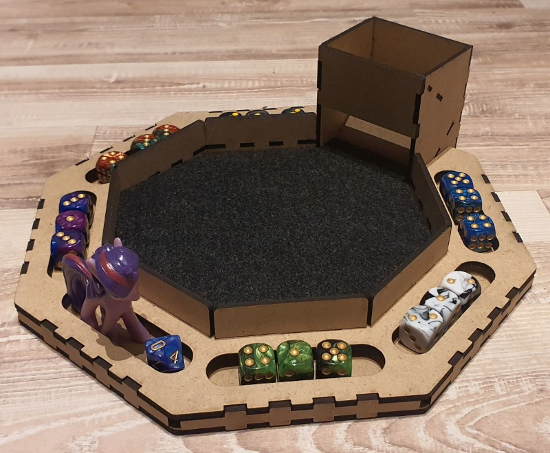
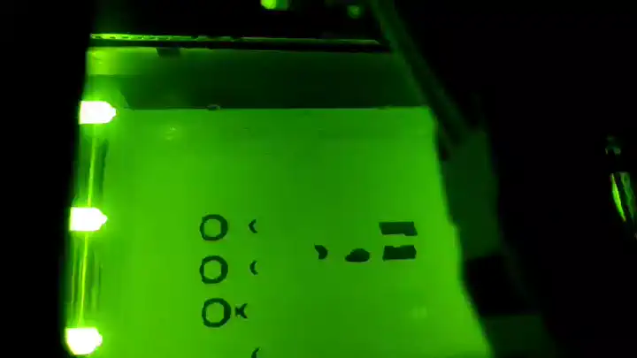

# Build

Building the game

## Self-made version

Required: 3D Printer, Laser Cutter, spray paint, acrylic paint

- **Dice tray**: Laser cut from thingiverse: I found a great design on [thingiverse](https://www.thingiverse.com) called [Octagonal Dice Tray, Laser Cut](https://www.thingiverse.com/thing:3694820) by [Patrik Grip-Jansson (kap42)](https://www.thingiverse.com/kap42/designs).
- **Dice**: 3D print [these dice](https://www.thingiverse.com/thing:2627417) by Udo alias "physudo from [thingiverse](https://www.thingiverse.com). Use different colored PLA for each player. You only need to print the D6 (3x 6 colors) and D10 (1x).
- **Stones**: Go outside and collect stones. Choose a size that works with the size of your dice tray. Stones should all roughly have the same size and form. Paint them with acrylic paint if you like.
- **Unicorn figure**: 3D print this [unicorn](https://www.thingiverse.com/thing:182335) by [Yahoo! JAPAN](https://www.thingiverse.com/yahoojapan/designs) from [thingiverse](https://www.thingiverse.com) and color it with spray paint and acrylic paint.

You can [download all required files here](_einhorn-game.7z).

 

Additionally you can create boxes to hold the game stones as well as boxes for each player for their stones stash. I thought about how to divide the octagon best to use up the space and also be able to easily create the required boxes.

 

I am using the [boxes.py TwoPiece](https://festi.info/boxes.py/TwoPiece) template to create all 4 boxes. The 3 stone stash boxes are all identical. The larger box for the game stones is reaches below the dice tray for better fixation.

This is the print process creating dice and unicorn figure using [PA 12 Smooth (SLS)](https://www.sinterit.com/pa12-smooth/) with a [Sinterit Lisa Rev.B printer](https://www.sinterit.com/sinterit-lisa/lisa-de/#):

And this is the result:

Next, I will paint the dice and figure.

## Buy version

Required: 30-100 Euro

- **Dice tray**: Try to find a dice tray with a top/lid. There are some nice but expensive octagonal shaped dice trays available. I even found one with a unicorn artwork :)
- Dice: You need 3 dice of the same color and 6 different colors so a total of 18x D6. 12mm is a good size for a dice. I prefer the numbers written on the sides instead of the dots but both is perfectly fine. Additionally, you need a D10 to count the games played. As always, it is cheaper to buy in bulk and dice packs are available in a 36x dice box as well as mixed color option for 50x dice and 100x dice. This way you should spend about 7 Euro for all dice.
- **Stones**: Drum stones feel and look great and this what i went with. You can save a lot of money when buying in bulk (e.g. 5kg), mixed stones and avoid terms like esoteric, etc. However, anything can be used as long as enough fit in the dice tray and are more or less the same size. I tried different stone sizes and 1-2cm work best in my opinion (depends on the size of your dice tray holding the stones). The stone costs vary a lot but I spent about 6 Euro for the stones needed for one game. Other options that could work are marbles (but round things may be annoying during play) or any small glass objects, coins, poker chips, ...    
- **Unicorn figure**: I found a set of 10 unicorns used to decorate cakes for 10 Euro. Search for "Unicorn Mini Figures Set" or "Unicorn Cake Decoration". Since I will be creating a few games I think I can use the extra unicorns (and they make a good small present as well) so I spent about 1 Euro on the unicorn.

## Lego version

