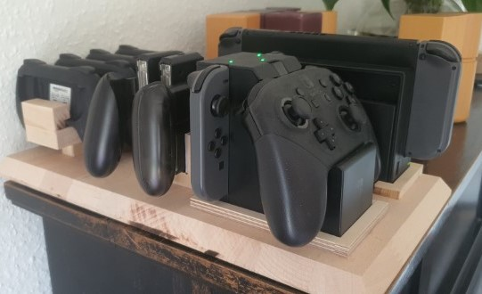
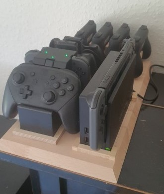
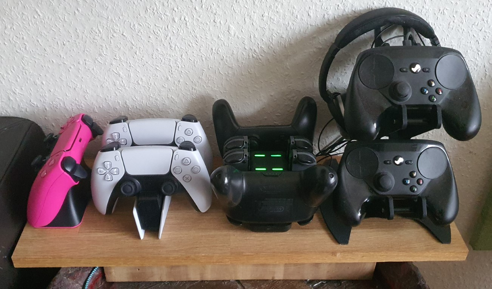

# Controller

## Switch Controller

I made a station for my switch and controllers so they are all sorted, charged and available anytime. I no longer use this as of now, since I prefer to have all controllers together near the sofa.

## Controller Station

My controller station in the living room:

