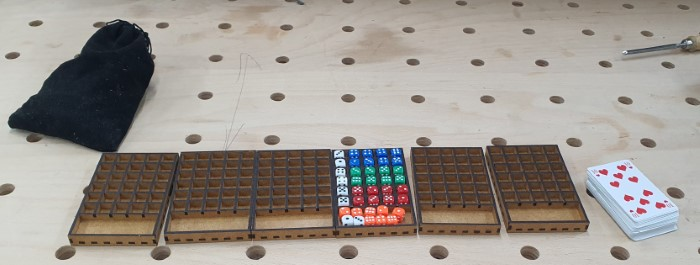

# Vegas Baby

originally "[Vegas](https://boardgamegeek.com/boardgame/117959/las-vegas)"

## First Version

## Additional Rules

### Poker Chips

Jeder kriegt 1 Pokerchip und dieser kann für einen re-roll einer Zahlengruppe genutzt werden. Pro Spiel wird bevor die Karten gelegt werden zufällig (durch würfeln) auf ein Casino ein Chip gesetzt. Nicht eingesetzte chips zählen am Ende 1 Punkt.
