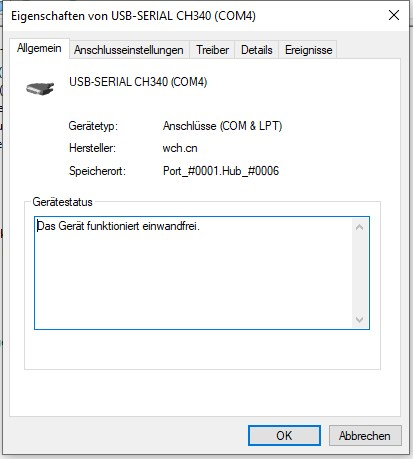
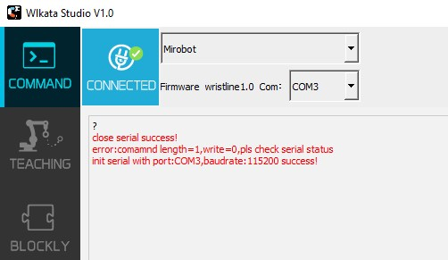

# WLKATA Mirobot

<https://www.wlkata.com/products/wlkata-mirobot-introduction>

## Commands

```shell
$$ (view Grbl settings)
$# (view # parameters)
$G (view parser state)
$I (view build info)
$N (view startup blocks)
$x=value (save Grbl setting)
$Nx=line (save startup block)
$C (check gcode mode)
$X (kill alarm lock)
$H (run homing cycle)
~ (cycle start)
! (feed hold)
? (current status)
ctrl-x (reset Grbl)
```

## Connect

Drivers successfully installed:



If this happens simply retry the connect:


