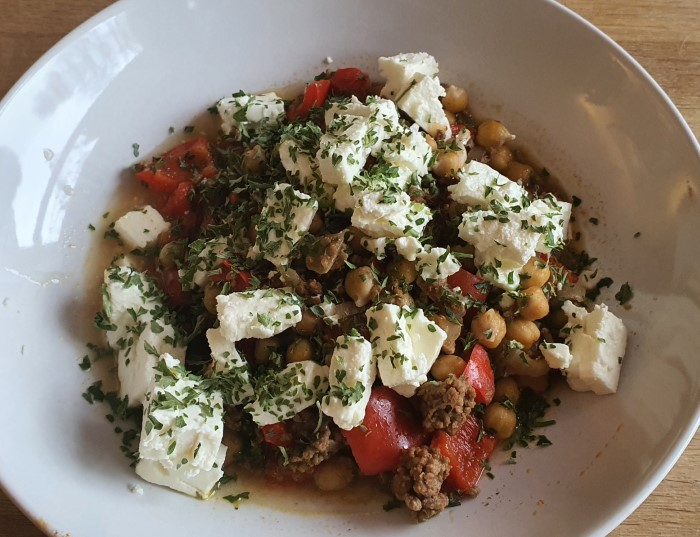

# Hackfleisch Kichererbsen Pfanne

Zutaten für 4 Personen:

| Menge | Inhalt             |
|-------|--------------------|
| 500g  | Rinder Hackfleisch |
| 400g  | Kichererbsen       |
| 200g  | Schafskäse         |
| 75g   | Tomatenmark        |
| 1     | Zwiebel            |
| 3     | Paprika            |
| 1     | Chilli             |
| 4     | Zehen Knoblauch    |
| 420ml | Wasser             |
| 25ml  | Olivenöl           |
| 80g   | Petersilie         |
|       | Salz               |
|       | Pfeffer            |
|       | Kreuzkümmel        |

Zubereitung:

- Zwiebeln, Chili,  und Knoblauch klein hacken.
- Paprika in Steifen schneiden.
- Zwibeln und Knoblauch in Pfanne mit Öl anbraten.
- Hackfleish in der Pfanne anbraten und Tomatenmark hinzugeben.
- Hackfleish mit Salz, Pfeffer und Kreuzkümmel würzen.
- Paprika dazugeben, deckel drauf.
- Mit Wasser ablöschen und 5min köcheln lassen
- Kichererbsen unterrühren und 5min erhitzen
- W#hrenddessen Schafskäse und Petersilie kleinhacken
- Essen Servieren, Schafskäse drauf und mit Petersilie bestreuen.
