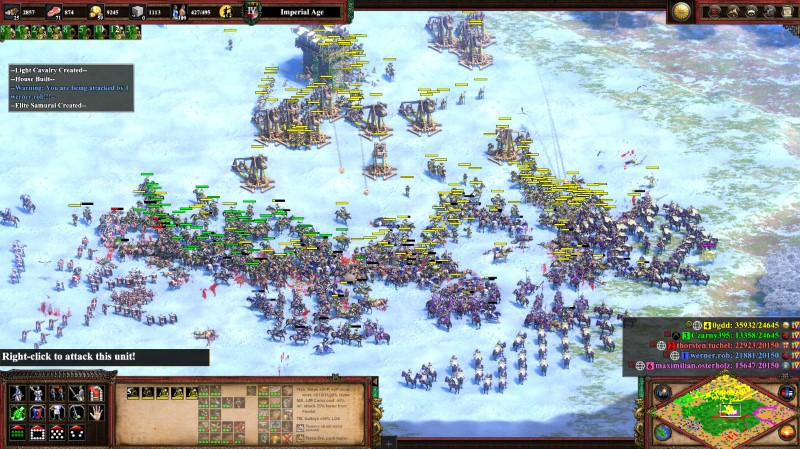
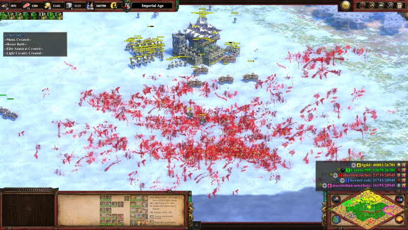

# PC Games

## Lists

<https://0xfab1.itch.io/>

### Games I play

This is a list of games I play(ed) and like. Any games played for a short time or disliked are not going to be listed.

#### Currently

- Overwatch
- CoD Warzone
- Trackmania
- ...

#### Play next

- TODO

#### Played

- TODO

### Free Games

Good free games that are free

- Armagetron <http://www.armagetronad.org/>
- Battle for Wesnoth <https://www.wesnoth.org/>
- Blobby volley <http://blobbyvolley.de/> ([source](https://github.com/danielknobe/blobbyvolley2))
- C&C Red Alert 2: Chrono Divide <https://game.chronodivide.com/>
- Cataclys <https://cataclysmdda.org/>
- Civilization <http://www.freeciv.org/>
- Cube 2: Sauerbraten <http://cubeengine.com/>
- Dungeon Crawl: Stone Soup <https://crawl.develz.org/>
- Endless Sky: <https://endless-sky.github.io/>
- Free orion: <https://www.freeorion.org/index.php/Main_Page>
- Mindustry <https://anuke.itch.io/mindustry>
- Minetest <https://www.minetest.net/>
- Nethack <https://www.nethack.org/>
- Open ra <https://www.openra.net/>
- Open Transport Tycoon Deluxe (OpenTTD) <https://www.openttd.org/>
- OpenClonk <https://www.openclonk.org/>
- Pixelwheels <https://agateau.com/projects/pixelwheels/>
- Quake <http://www.quakejs.com/>
- Seven Kingdoms <https://7kfans.com/downloads/>
- Shapez <https://github.com/tobspr/shapez.io>
- Soldat <https://soldat.pl/en/>
- spacestation13 <https://spacestation13.com/>
- Step mania <https://www.stepmania.com/>
- Stunt rally <https://stuntrally.tuxfamily.org/>
- Supertux <https://www.supertux.org/>
- supertuxkart <https://supertuxkart.net>
- teeworlds <https://www.teeworlds.com/>
- Thrive <https://revolutionarygamesstudio.com/>
- Unknown-horizons <https://unknown-horizons.org/>
- Unvanquished <https://unvanquished.net/>
- Veloren <https://veloren.net/>
- Viewizard <https://viewizard.com/>
- Warzone 2100 <https://wz2100.net/>
- Widelands: <https://github.com/widelands/widelands>
- Wolfenstein: Enemy Territory: <https://www.etlegacy.com/>
- Xonotic  <https://xonotic.org/>
- yorg <https://ya2.itch.io/yorg>
- YuGiOh (Project Ignis: EDOPro): <https://github.com/ProjectIgnis/EDOPro>
- Zero-k <https://zero-k.info/>

## Helper

### Trackmania

- Maps: <https://trackmania.exchange/mapsearch2>

### Age of Empires 2 DE

Settings

Mods

The mods i use:

Some other fun mods:

AoE Tetris

Download:

- Age of Empires II DE: Tetris: <https://www.ageofempires.com/mods/details/21466/>
- Age of Empires II DE: Tetris Visual Mod: <https://www.ageofempires.com/mods/details/21464/>

Watch:

- Video: <https://www.youtube.com/watch?v=9ZMobR31qdE>

Bloodpack example

| Before|After|
|---|---|
| | |

### YuGiOh (Project Ignis: EDOPro)

EDOPro Source: <https://github.com/ProjectIgnis/EDOPro>

[My Deck](_Fabi-Blue-Eyes-Ulti-Evo-x-pro.ydk) I am currently playing.

### Overwatch

- Tier list and most played heroes: <https://www.esportstales.com/overwatch/tier-list-and-most-played-heroes>

### RocketLeague

Settings

- FoV: 110
- Distance: 250
- Height: 100
- Angle: -4
- Stiffness: 0,65
- Swivel Speed: 5
- Transition Speed: 1

### Genshin Impact

Redeem Codes: <https://genshin.mihoyo.com/en/gift>

Maps

- <https://genshin-impact-map.appsample.com/#/>
- <https://mapgenie.io/genshin-impact/maps/teyvat>

Characters

- <https://genshin-helper.com/>
- <https://traveler.gg/community-character-builds/>
- <https://old.reddit.com/r/Genshin_Impact/comments/l41dgc/latest_community_character_builds_by_the_genshin/>
- <https://buildsim.netlify.app/>
- <https://genshinimpactcalculator.com/genshinCalc>
- <https://genshin.aspirine.su/>
- <https://www.iwintolose.com/>
- <https://genshin-center.com/calculator>

### Call of Duty

Settings

How to win

### Facturio

Online

- [Factory requirements calculator](https://factoriolab.github.io/list)
- [Factorio Blueprints](https://factorioprints.com)

Tools

- [Factorio Blueprint Visualizer](https://github.com/piebro/factorio-blueprint-visualizer)
- [Foreman2](https://github.com/DanielKote/Foreman2) (Visual planning tool for Factorio )
- [verilog2factorio](https://redcrafter.github.io/verilog2factorio/) is a Verilog to Factorio Blueprint compiler.

Mods

- [Rate Calculator](https://mods.factorio.com/mod/RateCalculator)
- [Factory planner](https://mods.factorio.com/mod/factoryplanner)
- [BlueprintLab design](https://mods.factorio.com/mod/BlueprintLab_design)
