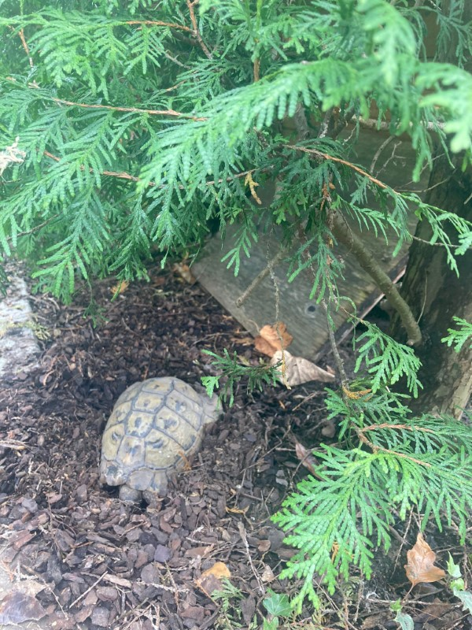

# Turtle

Our turtle awakes out of hibernation roughly mid april. The following is a time lapse video of the final struggle to burry itself out of its hole. The turtle then proceeds to catch some sunlight. It won't eat any food though for another few days.

And here he is in autumn digging his hole for the winter, choosing the same spot :)

