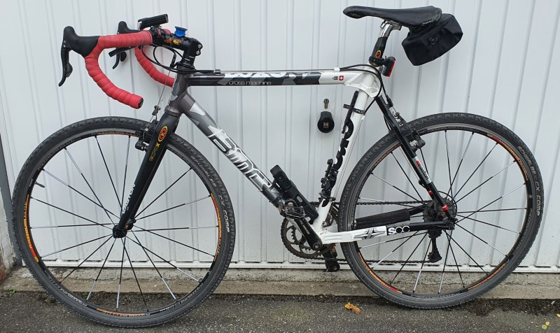

# Cycling

## BMC CROSS MACHINE CX02 (2010)

Die komplette 105-Gruppe mit Kompaktkurbel und Shimanos günstige, aber stabile RS10-Räder sind an dem brettsteifen Rahmen mit seinem eigenständigen Design montiert. Bei der Geometrie tanzt das BMC aber aus der Reihe: Im Verhältnis zum 56,5 Zentimeter langen Oberrohr gerät das Sitzrohr mit 59,6 Zentimetern sehr lang. Im Geländeeinsatz wirkt der Rahmen durch das hohe Oberrohr etwas unhandlich, zudem eignet sich die kantige Unterseite mit unten verlegten Zügen nicht zum Schultern. Wer mit dem BMC dennoch ins Gelände will, sollte den Rahmen eine Nummer kleiner kaufen und sitzt dann sportlich-gedrungen. Das schwerste Rahmen-Set und das höchste Gesamtgewicht kosten einige Punkte und etwas Spritzigkeit.

### Components

- Total Wight: 9830 g
- Frame: SCC (weight 1950g)
- Frame size: 52
- Tubing: BMC Custom Alloy
- Fork: BMC carbon w/alloy steer tube
- Gears: 20
- Chainwheel: Shimano 105, 50-34
- Cassette: Shimano 105, 12-27
- Front Derailleur: Shimano 105, Band Type
- Shifters: Shimano 105
- Brakes: Shimano 105
- Handlebar: Scor Race
- Stem: Scor Race
- Seatpost: Scor Race
- Saddle: Scor Race
- Hubs: Shimano, RS10
- Rims: Shimano, RS10
- Tires: Continental, Twister Pro

### Size

|        Size       |     50    |     52    |     54    |     56    |     58    |     61    |
|:-----------------:|:---------:|:---------:|:---------:|:---------:|:---------:|:---------:|
| Bar   Width MM    | 400       | 420       | 420       | 420       | 420       | 440       |
| BB Drop   MM      | 59        | 59        | 59        | 59        | 59        | 59        |
| Crank   Length MM | 170       | 172.5     | 172.5     | 172.5     | 172.5     | 175       |
| Head   Angle      | 70.5      | 71        | 71.5      | 71.5      | 71.5      | 71.5      |
| Head   Tube MM    | 105       | 125       | 140       | 160       | 180       | 210       |
| Reach MM          | 0         | 0         | 0         | 0         | 0         | 0         |
| Rider   Height CM | 160 - 170 | 170 - 175 | 175 - 180 | 180 - 185 | 185 - 190 | 190 - 200 |
| Seat   Angle      | 74.5      | 74        | 73        | 73        | 73        | 73        |
| Seat   Tube MM    | 535       | 555       | 575       | 600       | 615       | 645       |
| Stack MM          | 0         | 0         | 0         | 0         | 0         | 0         |
| Top Tube   MM     | 525       | 540       | 550       | 565       | 580       | 595       |
