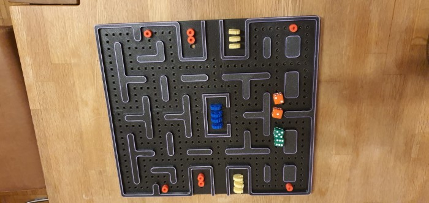
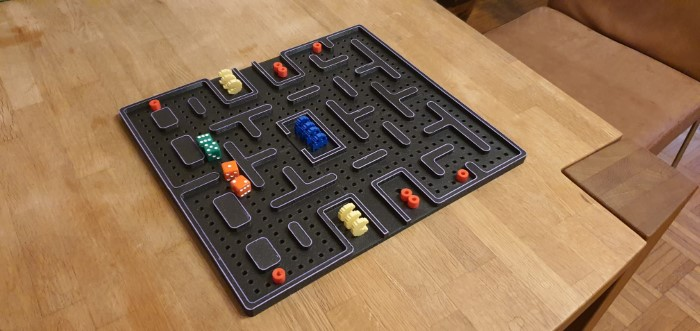
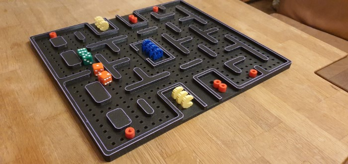

# Games

## Ultimate Tic-Tac-Toe

[Source](https://www.thingiverse.com/thing:5790641)

### Rules

- The game is played on a grid that's 3x3 Tic Tac Toe boards.
- The first player may start in any cell in any mini board.
- The board in which the next player must play is determined by the cell the previous player chose.
- If sent to a board that's already won, the player may choose any other free board.
- The game is won if a player manages to win 3 boards that add to a row on the big board.
- Else, if no further moves are possible the player with the most won mini boards wins the game.

## Pac Man

[Source](https://www.thingiverse.com/thing:5396911)

### Pac Man Game Rules

Players

- **Player 1:** PacMan
- **Player 2:** Ghosts

Starting the Game

- Player 1 (PacMan) initiates the game.

Objectives

- **PacMan's Goal:** Collect all four red pills.
- **Ghosts' Goal:** Catch and eat PacMan, preventing it from collecting the red pills.

Movement

- Each player rolls the dice and moves their character the number of dots indicated, in any direction.

Lives

- **PacMan:** Has four lives. Losing all lives results in game over.
- **Ghosts:** Each has one life, but there are four ghosts in total.

Board Presence

- Only one PacMan can be on the board at any time.
- All ghosts can be deployed on the board, but only one ghost can move at a time.

Respawning

- If PacMan is eaten by a ghost, it respawns at the starting point.

PacMan's Superpowers

- When PacMan collects a red pill, it gains superpowers for the current and next round, allowing it to eat a ghost.
- If PacMan scores double dice, it gains superpowers, doubling its movement and can eat any ghost in its path. Eaten ghosts do not respawn.
- Superpowers from a red pill continue to the next round if PacMan scores double dice while empowered.
- Ghosts cannot eat PacMan when it has superpowers.

Dice Rolls

- If PacMan (Player 1) rolls double dice, the effect includes superpowers and doubled movement.
- If Ghosts (Player 2) roll double dice, the roll counts normally without any special powers.

Winning the game

- PacMan wins by eating all four ghosts.
- Ghosts win by eating PacMan four times.
