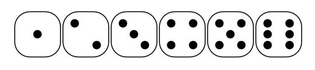

# Dice Mosaic

Creating a dice mosaic picture

## Preparation

- Add a picture and convert it to grayscale
- Increase local contrast if necessary/possible
- Crop picture and reduce resolution to reduce amount of required dices

## Choose a tool

We need to translate the chosen picture into a dice mosaic

**Option 1:** using metapixel

Use Metapixel and upload dice faces 1-6
<https://wiki.ubuntuusers.de/Metapixel/>

``` sh
sudo apt install metapixel
metapixel-prepare --width=15 --height=15 --recurse "dice directory" "library directory"
metapixel --library="library directory" --width=15 --height=15 --distance=0 --metric=wavelet --metapixel "infile" "outfile"
```



**Option 2:** Using an already created Dice Converter

- DiceMapGenerator by DarkTussin: <https://github.com/DarkTussin/DiceMapGenerator>
- DiceConverter by almaan: <https://github.com/almaan/diceconverter>

## Creating the Image with dices

Buy the cheapest and small dices you can find.
Lay out the picture line by line and frame it.
You can glue the dices in place but this leaves no option for error.
I built my own frame and used a plexiglas front to keep the dices in place.


