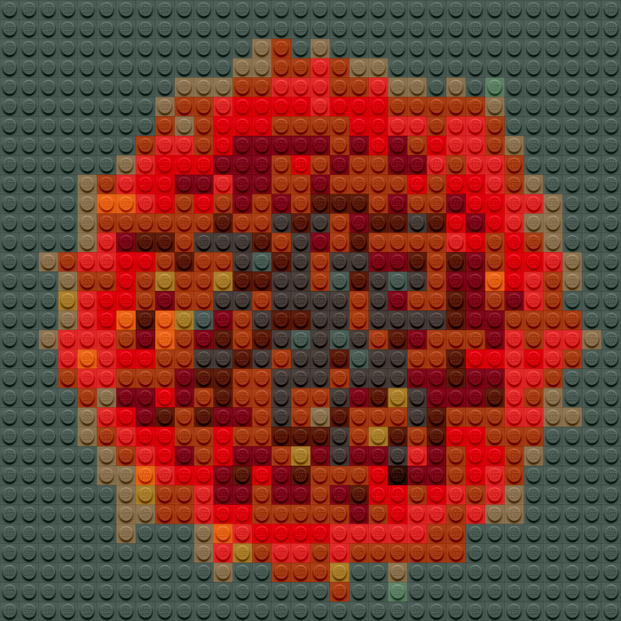
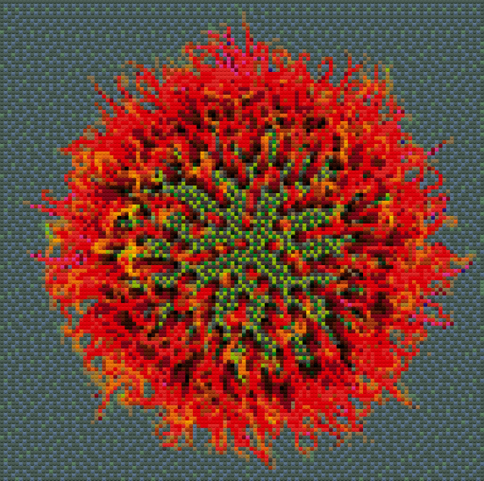

# Lego Pixel-Art

## Creating Pixel Art

[Legofy](https://github.com/JuanPotato/Legofy) makes images look as if they are made out of 1x1 LEGO blocks.

I tested some settings and after 128px the image looks better dither set to "on".

Install legofy with pip:

``` py
pip install legofy
```

I tried the following 4 options:

``` sh
legofy --size 32 --no-dither --palette all 0xfab1.png 0xfab1_lego32.png
legofy --size 64 --no-dither --palette all 0xfab1.png 0xfab1_lego64.png
legofy --size 128 --dither --palette all 0xfab1.png 0xfab1_lego128.png
legofy --size 256 --dither --palette all 0xfab1.png 0xfab1_lego256.png
```

This gets big and expensive quickly; so lets check when the chosen picture looks good enough:

32x32


64x64


128x128


256x256

