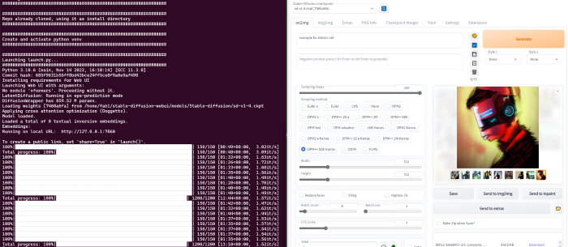
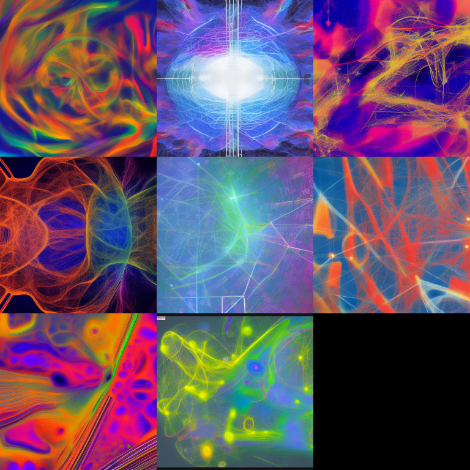

# Stable Diffusion

The Projekt [Stable Diffusion web UI](https://github.com/AUTOMATIC1111/stable-diffusion-webui) by [AUTOMATIC1111](https://github.com/AUTOMATIC1111) is a great way to start experimenting with stable diffusion. I run the following code on a Windows 10 notebook with nvidea 

## nvidia drivers

It is possible to install nvidia drivers in WSL 2 for Ubuntu  22.04

```sh
sudo apt install nvidia-cudnn libcudnn8 libcudnn8-dev
wget https://developer.download.nvidia.com/compute/cuda/repos/ubuntu2204/x86_64/cuda-ubuntu2204.pin 
sudo mv cuda-ubuntu2204.pin /etc/apt/preferences.d/cuda-repository-pin-600
sudo apt-key adv --fetch-keys https://developer.download.nvidia.com/compute/cuda/repos/ubuntu2204/x86_64/3bf863cc.pub
sudo add-apt-repository "deb https://developer.download.nvidia.com/compute/cuda/repos/ubuntu2204/x86_64/ /"
sudo apt-get update
```

My ```nvidia-smi``` output is as follows:

``` txt
+-----------------------------------------------------------------------------+
| NVIDIA-SMI 515.76.02    Driver Version: 517.48       CUDA Version: 11.7     |
|-------------------------------+----------------------+----------------------+
| GPU  Name        Persistence-M| Bus-Id        Disp.A | Volatile Uncorr. ECC |
| Fan  Temp  Perf  Pwr:Usage/Cap|         Memory-Usage | GPU-Util  Compute M. |
|                               |                      |               MIG M. |
|===============================+======================+======================|
|   0  NVIDIA GeForce ...  On   | 00000000:01:00.0  On |                  N/A |
| N/A   69C    P0    52W /  N/A |   3741MiB /  4096MiB |     97%      Default |
|                               |                      |                  N/A |
+-------------------------------+----------------------+----------------------+

+-----------------------------------------------------------------------------+
| Processes:                                                                  |
|  GPU   GI   CI        PID   Type   Process name                  GPU Memory |
|        ID   ID                                                   Usage      |
|=============================================================================|
|  No running processes found                                                 |
+-----------------------------------------------------------------------------+
```

This is my output for the cuda libs ```ldconfig -p | grep cuda```

``` txt
libicudata.so.70 (libc6,x86-64) => /lib/x86_64-linux-gnu/libicudata.so.70
libcuda.so.1 (libc6,x86-64) => /usr/lib/wsl/lib/libcuda.so.1
```

## Install Stable Diffusion web UI

It is important to export "LD_LIBRARY_PATH=/usr/lib/wsl/lib:$LD_LIBRARY_PATH" before running webui.sh.

Run the following once to get started:

``` sh
sudo apt update && sudo apt -y full-upgrade && sudo apt -y autoremove
sudo apt install wget git python3 python3-venv  zlib1g
cd ~
git clone https://github.com/AUTOMATIC1111/stable-diffusion-webui.git
wget -P "~/stable-diffusion-webui/models/Stable-diffusion" https://huggingface.co/CompVis/stable-diffusion-v-1-4-original/resolve/main/sd-v1-4.ckpt
export LD_LIBRARY_PATH=/usr/lib/wsl/lib:$LD_LIBRARY_PATH
bash <(wget -qO- https://raw.githubusercontent.com/AUTOMATIC1111/stable-diffusion-webui/master/webui.sh)
```

Once this works, run ```webui.sh``` for the next start.

Open [locahost port 7860](http://127.0.0.1:7860/) to get the web-ui.



## Example results




