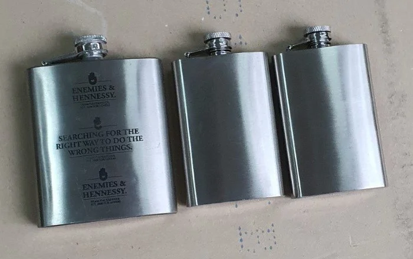
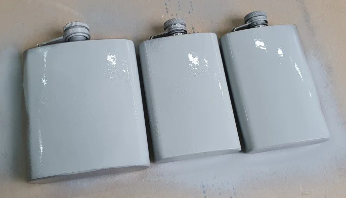
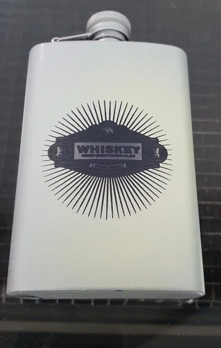
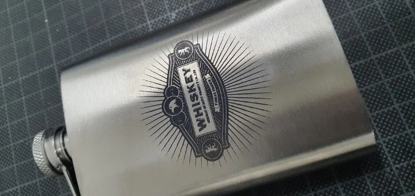

# Flask

I modified a whiskey logo i found online and created a black-and-white SVG file to engrave on a flask.

Luckily there was a demo flask I could use for a first test.

The metal engraving spray makes the result so much better!

At first it doesn't seem as if the result will look any good.

But after washing away the spray paint the engraving is a lot better than if this would have been done without it :)

Here is a video of the engraving process and how it looks while washing away the spray paint:

<iframe width="560" height="315" src="https://www.youtube.com/embed/lwrn3sYQYfk" title="YouTube video player" frameborder="0" allow="accelerometer; autoplay; clipboard-write; encrypted-media; gyroscope; picture-in-picture" allowfullscreen></iframe>
