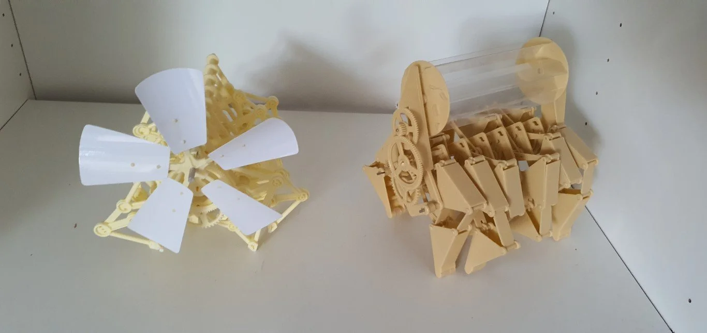

# Strandbeest

[Theo Jansen](https://en.wikipedia.org/wiki/Theo_Jansen) is the creator of [Strandbeest](https://www.strandbeest.com/). These Strandbeests are made from plastic and are able to walk and get their energy from the wind.

The following picture shows two Strandbeest designs as smaller reproduction to build at home.

