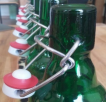
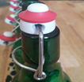
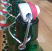
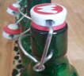
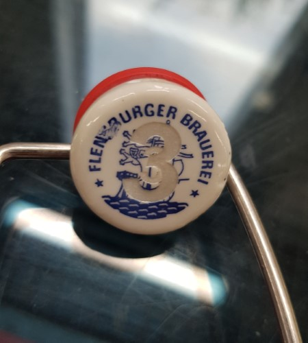

# Rules

Prömpeln

## Einleitung

Prömpeln wird mit 0,33l Bügelverschlussflaschen gespielt. Ursprünglich diente das Spiel zur Ermittlung des nächsten Regenten und Königs über die gegenwärtige Gesellschaft. Prömpeln kann allerdings auch als Zeitvertreib und frei von politisch motivierten Hintergründen gespielt werden.

## Grundregeln

Die sieben Bügelverschlussflaschen werden so aufgereiht, dass alle Prömpeln zu einer Seite zeigen. Die Prömpel zeigen mit dem Nippel nach unten und die große, flache Fläche des Prömpels waagerecht nach oben.
Gespielt werden sieben Runden. In jeder Runde prömpelt der Spieler alle Flaschen der Reihe nach durch. Dabei berührt der Spieler den Prömpel von unten mit nur einem Finger und bewegt diesem mit einer zugartigen Bewegung nach oben. Das schieben des Prömpels führt zu einem ungültigen Versuch. Die Flaschen selbst dürfen während des Spielzuges nicht berührt werden.

Vor den Runden 1-6 kann ein Spieler einen seiner drei einmalig ausführbaren Spezialzüge ankündigen. Nur wenn dieser Korrekt angekündigt wurde gelten die entsprechenden Spezialregeln. Das spielen Spezialzüge ist optional, allerdings muss in der siebten Runde ein Doppellörer gespielt werden. (Siehe Kapitel 5, Spezialzüge).

Gewinner und König ist der Spieler mit der höchsten Punktzahl. Kommt es zu einem Stechen, wird der endgültige Sieger mittels Schere-Stein-Papier ermittelt. Das Spiel ist sofort beendet sofern der Königszug (7x3 Punkte = Volle Punktzahl) gespielt wird (Erläuterung siehe Kapitel 5„Spezialzüge“).

## Punkte

Für jede Endposition eines gespielten Prömpels ist eine Punktzahl definiert:

| Punkte   | Prömpel | Beschreibung                                              |
|----------|---------|-----------------------------------------------------------|
| 0 Punkte || Prömpel liegt nicht auf                                   |
| 1 Punkt  || Prömpel liegt mit der flachen Seite nach unten auf        |
| 2 Punkte || Prömpel liegt schräg bzw. seitlich auf                    |
| 3 Punkte || Prömpel liegt mit der großen, flachen Seite nach oben auf |

Die Punkte werden erst ermittelt, nachdem alle Prömpel einer Runde gespielt wurden. Gleitet beispielsweise ein grenzwertiger 1-Punkt Prömpel unglücklicherweise vor Ende des Spielzugs ab, wird dieser als null Punkte vermerkt. Unklare Positionen zählen ebenfalls immer null Punkte. Die Punkte werden direkt nach dem Spielzug eines Spielers durch Addition der vorangegangenen Punkte notiert (inkl. Berücksichtigung möglicher Zusatzpunkte durch das Spielen von Spezialzügen).

## Spezialzüge

Aktive Spezialzüge müssen vor Rundenbeginn vom Spieler angekündigt und anschließend ausgeführt werden und sind ansonsten ungültig. Abgesehen vom Doppellörer in Runde 7 ist kein Spieler verpflichtet Spezialzüge zu spielen. Pro Spiel kann jeder Spezialzug nur ein Mal pro Spieler gespielt werden.

## Aktive Spezialzüge

|Spezialzug|Spielbar|Anküdigung|Ziel|Pro|Con|
|---|---|---|---|---|---|
|Lampenlörer|Runde 1-6, 1x Spielbar|„Ich mach jetzt nen Lampenlörer“, wobei die Spielhand in die Luft gehoben wird.|Keine null-Punkte Prömpel und alle drei Punkte Prömpel werden belohnt.|Alle 3er Prömpel zählen doppelt|Alle 0er Prömpel zählen minus 3|
|Kniffel|Runde 1-6, 1x Spielbar|„Ich Kniffel jetzt!“, gefolgt von breitem Grinsen.|Beim Kniffeln darf der Spieler nach der Runde zwei Mal beliebig viele Prömpel erneut spielen|Kommt es zu sieben 3ern gilt nicht der Königszug; allerdings werden anstelle von 21, 30 Punkte notiert|N/A, alle Punkte zählen|
|Pash-7|Runde 1-6, 1x Spielbar|„Jo, denn … Pash-7 Spezial“, in gleichgültiger Stimmlage|Es werden zwei Mal 1 Punkt, zwei Mal 2 Punkte und zwei Mal 3 Punkte|30 Punkte|N/A, alle Punkte zählen|
|Doppellörer|Nur in Runde 7|Es muss angesagt werden, ob die mittige (in diesem Fall siebte Flasche) mit links oder rechts gespielt wird: „Doppellorer links“ oder „Doppellörer rechts“|Gespielt wird mit beiden Händen parallel von außen nach innen. Der letzte, siebte und in der Mitte befindliche Prömpel bestimmt den Punktemultiplikator. Alle sieben Prömpel-Punkte werden addiert und mit den Punkten des mittigen Prömpels multipliziert (0-3).| Mulitplikator 2 bzw 3|Mulitplikator 1 bzw 0|

### Passive Spezialzüge

Passive Spezialzüge gelten ohne Ankündigen, müssen aber beim Notieren der Punkte erkannt und berücksichtigt werden.

|Spezialzug|Spielbar|Anküdigung|Ziel|Pro|
|---|---|---|---|---|
|Meier|Runde 1-6|Mit der Aussprache des Satzes „Es gibt immer noch Meier“ wird der Anspruch auf diese Kombination geltend gemacht.|Eine Mischung aus 1ern und 2ern (ohne Fehler) ist ein Meier und wird mit 21 Punkten bewertet. Es können beispielsweise auch nur eine 1 und sechs 2er sein.|21 Punkte anstelle der eigentlichen Gesamtzahl.|
|Königszug|Runde 1-6|„Ich bin König“ & Jubel|Das perfekte Spiel: Alle sieben Prömpel geben jeweils drei Punkte.|Sieg des Spiels und König|

## Making the game

### Tests

I tested to laser the points you get at a given position on the Prömpel itself.

This didn't turn our as expected:

I guess this is not necessary and players can identify the points per prömpel position without labeling numbers on them.
