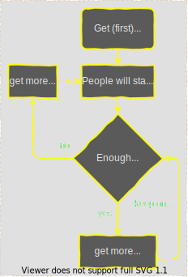

# Final wisdom

A collection of hand picked wisdom accumulated for the worthy.

Advice is difficult to take in properly... no idea how you should do it; but do something.

## Smart Stuff

### 110%

Never give 110%, that's just selling out... just divide your 100% in:

- 50% pain
- 20% skill
- 15% concentrated power of will
- 10% luck
- 5% pleasure

### One sentance

Hard problems

- Say: "I can do hard things". Doing hard things has intrinsic value, and they will make me a better person, even if I end up failing.
- The key is recognizing that the urge to avoid hard things is human, and should be expected. It’s part of the process. Figure out what combination of motivation, and circumstances, and accountability work best for your particular personality.
- Break large goals down into manageable pieces. Creating an accurate roadmaps toward this goal. Find out what is important. Differenciate between activities you want to be important and what actually makes a difference.

Goals

- It's better to finish something than to start something
- Make goals that you have control over. Accept what you can not control or choose to be unhappy.

Random

- In der Menge liegt das Gift.
- Alles was man besitzt muss man auch pflegen.

## Fun Stuff

### Be like nature

Why fight the rules of nature?

1. Dislike squander: dW = 0 (Action W=∫L dt is minimized in every motion. Locally, L = Ekin-Epot)
2. Dislike hurrying: v ≤ c (Energy speed v is limited by the speed of light c.)
3. Dislike excessive force: F ≤ c^4/4G (Force F is limited by c and the gravitational constant G.)
4. Dislike sloth: W ≥ ℏ (action W is never smaller than the quantum of action ℏ.)
5. Dislike perfect order: S ≥ k (Entropy S is never smaller than the Boltzmann constant k.)

Source: [All of physics in 9 lines](https://www.motionmountain.net/9lines.html)

### The theory of the first chick

It all start with the first chick

- Transcript: ```It's like: We need to get a cool looking chick; maybe then people will start to respect us and stuff. It's like then we'll start getting respect, and then we'll get more chicks and then like: with more chicks I go get more respect and after that we'll get like more money. It'll be like more money, more chicks, more respect... and just like keep on going. It all takes is getting that first chick.```
- Listen to the [audio version](_chicks-respect-money.mp3) (Source: [Beavis and Butthead](https://en.wikipedia.org/wiki/Beavis_and_Butt-Head))

This process diagram vizulizes the steps involved:


