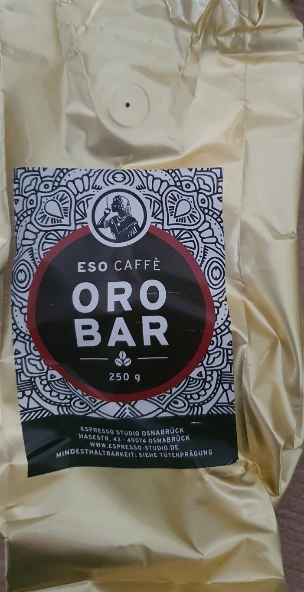
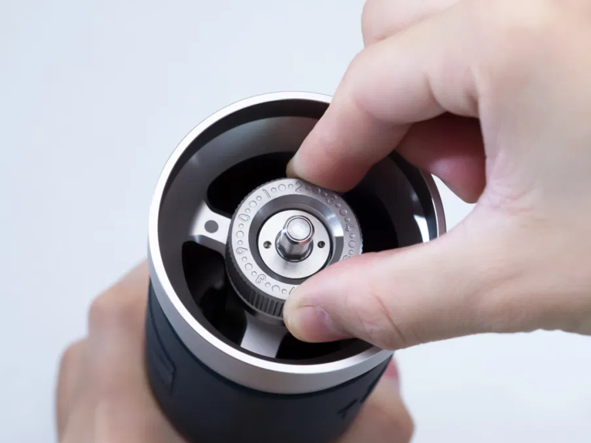
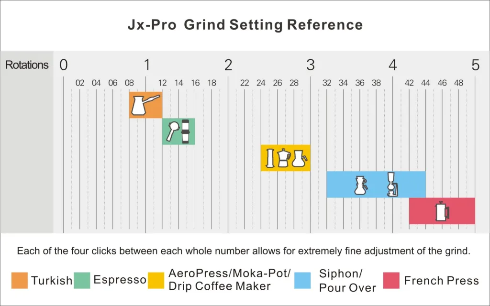
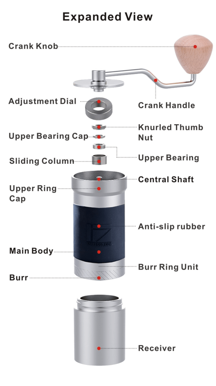
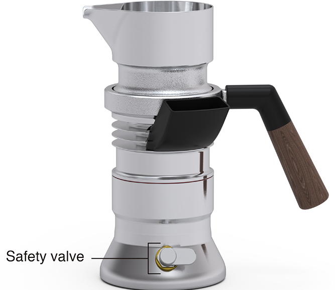
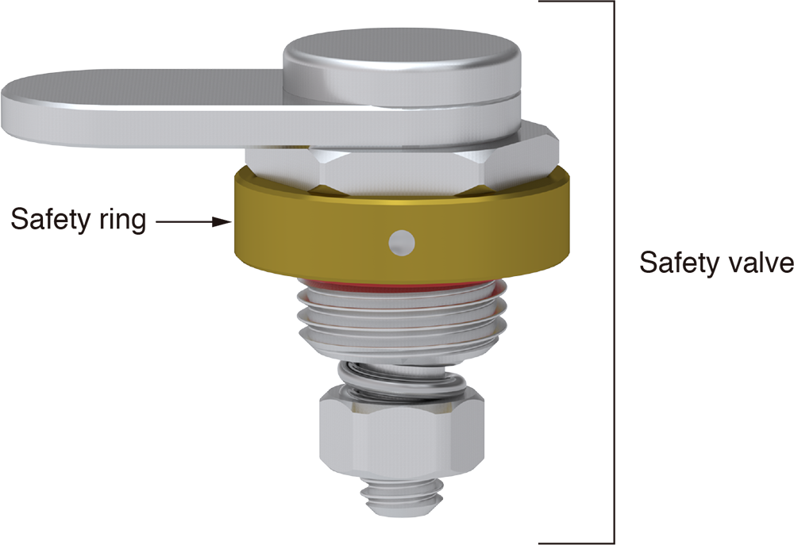

# Espresso

## Make Espresso

Currently I am using the 9barista with the JX Pro grinder and coffee from 

## Tips

## Good coffee beans

Coffee preference is subjective, so take the time to explore different beans, roasts, and origins to find the flavors that delight your taste buds the most. Generally, here a few things to consider:

- **Beans and packaging**: Whole coffee beans retain their freshness and flavor much longer than pre-ground coffee. Grinding the beans just before brewing ensures the best flavor. Good coffee roasters use airtight bags with one-way valves that release gases while preventing air from entering. Look for coffee beans with a recent roast date. Coffee is at its peak freshness within a few weeks of roasting. Avoid beans that are several months old or coffee without roast date. This type of packaging helps maintain freshness. Open the bag and take a whiff. Fresh beans should have a strong, pleasant aroma that matches the flavor notes described. Beans that appear overly oily or shiny might be over-roasted or old. A moderate sheen is acceptable, but excessive oiliness can indicate poor quality.

- **Buy from reputable roasters**: Local coffee shops often carry beans from local or regional roasters. You can ask baristas for recommendations based on your preferences. Purchase coffee beans from reputable specialty coffee roasters. They often source high-quality beans, roast them with care, and provide detailed information about the beans' origin and flavor profile. Roasters often provide tasting notes describing the coffee's flavor and aroma characteristics. Coffee beans are roasted to different levels, from light to dark. Experiment with various roast levels to find the one that suits your taste. Many specialty coffee roasters offer subscription services that deliver fresh beans to your doorstep regularly.

- **Coffee Origin**: Different coffee-growing regions produce beans with distinct flavors. Research the regions you enjoy and experiment with their offerings. Single-origin coffee beans come from a specific region or farm, allowing you to experience the unique flavors of that area. Blends are also popular and can offer a balanced taste.

I like these:

## Coffee bean storage

Behave correctly:

- No matter your storage solution, minimize the coffee beans exposure to air, light, moisture, and heat. Heat means nothing over room temperature. No need to freeze beans, in fact this is bad.
- Use the Beans within 2-4 weeks and use a package size accordingly. Coffee beans have a peak freshness period. While they can be good for a few months, their flavor will start to deteriorate over time.
- Avoid Constant Opening: Minimize the number of times you open the container. Each time you open the container, you introduce air and moisture that can contribute to flavor loss.
- Do Not Mix Old and New Beans: If you purchase new coffee beans, avoid mixing them with any leftover older beans. This can dilute the flavor and freshness of the newer batch.

Based on this i follow this setup:

- Use the original bag and keep it as airtight as possible. Refill every week or so into my daily use airtight container. Choose the bag size so that I can refill the airtight container up to 4 times. I store the bag in the kitchen drawer.
- Use an airtight container for daily use. Size is about the size needed for a week. Clean this once the bag is empty. I store the container next to my coffee equipment for easy use.

## Grind beans

Grinding coffee beans to the correct fineness is crucial for making a good espresso. The grind size directly affects how quickly water flows through the coffee grounds, which in turn impacts the flavor, aroma, and crema in your espresso shot.

### Setup grinder

Always use whole beans and grind them just before brewing. This helps to preserve the flavor compounds and aromatic oils within the beans.

Start by defining your starting point by turning the adjustment dial clockwise till the crank handle won’t spin freely without any resistance.

Then turn the adjustment dial anti-clockwise to your preferred grind size.

For my JX-Pro grinder the following settings are recommended by 1zpresso:

For Espresso this is about 1.5 rotation = turn counter-clockwise a round and 5 numbers. (60 clicks).

Start here and adjust according to your results. Here's how you can tell if your coffee beans have been ground properly for espresso:

- **Extraction Time**: Espresso extraction time is the time it takes for water to pass through the coffee grounds in your espresso machine. A properly ground espresso should take about 25 to 30 seconds to extract a shot. If it takes significantly less time, the coffee is likely ground too coarsely; if it takes significantly more time, the coffee is likely ground too fine.

- **Crema Formation**: The crema is the golden-brown layer of foam that forms on top of a well-pulled espresso shot. It contains the volatile compounds that contribute to the aroma and flavor of the espresso. If you notice that your crema is too dark and your espresso tastes bitter or overly strong, it's a good indication that your grind is too fine.

- **Taste and Flavor**: The taste of the espresso is a clear indicator of whether the beans have been ground properly. If the coffee tastes sour or weak, it might be under-extracted, which could be due to a too-coarse grind. If it tastes bitter or overly strong, it might be over-extracted, which could be due to a too-fine grind. A well-ground espresso should have a balanced and full flavor.

- **Visual Appearance**: After tamping the coffee grounds into the portafilter, the puck should have a smooth and even surface. If the puck is crumbly or falls apart easily, the grind might be too coarse. If the puck is too hard and difficult to extract, the grind might be too fine.

- **Flow Rate**: Watch the flow of espresso as it comes out of the portafilter. It should be a steady, even stream, resembling honey dripping. If the espresso is coming out too fast (like water), the grind might be too coarse. If it's coming out too slowly (like a drip), the grind might be too fine.

## Maintenance

### JX Pro

The JX Pro from [1zpresso](https://1zpresso.coffee/) is a great coffee grinder.

Here is a [tutorial](https://1zpresso.coffee/clean-tutorial-for-top-adjustment/) on how to clean and maintain the JX-Pro grinder.

### 9barista

#### Replace safety valve

The [9barista](https://9barista.com/) is a great stove top espresso machine.

The safety valve is the one thing that will damage first if the 9barista overheats. Avoid this by not only turing of the heat once done brewing coffee but actually removing the 9barista from the heat source.

Replacing the safety valve is a simple process. With the right tools it shouldn’t take more than a minute. Use a 13mm wrench to loosen the valve.

#### Descaling the 9Barista

Follow this detailed guide to effectively descale your 9Barista espresso machine and ensure it continues to perform at its best.

- Mix a descaler in a jug with cold water and ensure that the solution is completely dissolved. Do not heat the descaler and avoid citric acid or lactic acid descaler.
- Remove the O-ring from the boiler.
- Fill the boiler with the descaling solution up to the 120 gr line.
- Place the top on the boiler and screw both parts tightly together.
- Let the "9Barista" stand for 15 minutes at room temperature.
- Unscrew the top from the boiler and dispose of the descaling solution. Any lime residues can be removed by gently wiping with a non-abrasive cloth (do not scrub the "9Barista" after descaling, as this may damage the coating).
- If significant lime deposits remain, repeat steps 3 to 5 with fresh descaling solution.
- Thoroughly rinse the boiler and the top, reinstall the O-ring, fill the machine with clean water, and run a brewing cycle without coffee to flush the internal parts.
- Dispose of the water and allow the device to dry.
