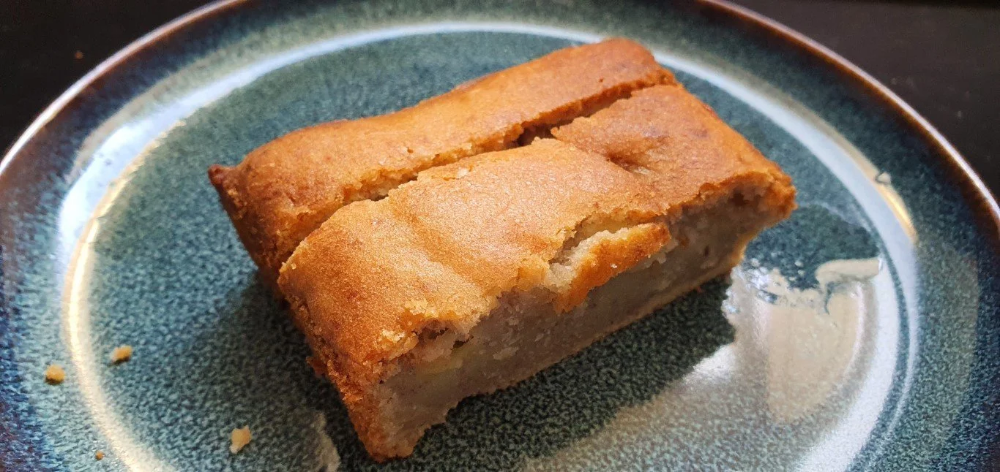

# Bananenbrot

## Stats

| Was   | Wert        |
|-------|-------------|
| Zeit  | 20 Min      |
| Menge | 4 Personen |

## Rezept

=== "Zutaten"

    - [ ] 3x Bananen
    - [ ] 80 ml Sonnenblumenöl
    - [ ] 110 g brauner Zucker
    - [ ] 2 Eier
    - [ ] 200 g Weizenmehl (Type 405)
    - [ ] 3 TL Backpulver
    - [ ] 1 Prise Salz
    - [ ] 1 Vanilleschote
    - [ ] 1 Prise Zimt
    - [ ] etwas Butter für die Form

=== "Zubereitung"

    - [ ] Ofen auf 160 Grad Umluft vorheizen.
    - [ ] Bananen mit einer Gabel in einer Schüssel zerdrücken.
    - [ ] Vanilleschote mit einem Messer der Länge nach einritzen und mit dem Messerrücken auskratzen. 
    - [ ] Öl mit braunem Zucker und Eier verquirlen.
    - [ ] Mehl, Backpulver, Salz, Zimt und Vanilleschote vermischen, mit der Öl-Eiermasse verrühren und Bananen-Püree einrühren.
    - [ ] Kastenform gut einfetten und Teig in die Form geben.
    - [ ] Backform in den vorgeheizten Ofen etwa 55 Minuten backen.
    - [ ] Das Bananenbrot nach dem Backen vollständig auskühlen lassen, erst dann aus der Form nehmen.

## Foto

