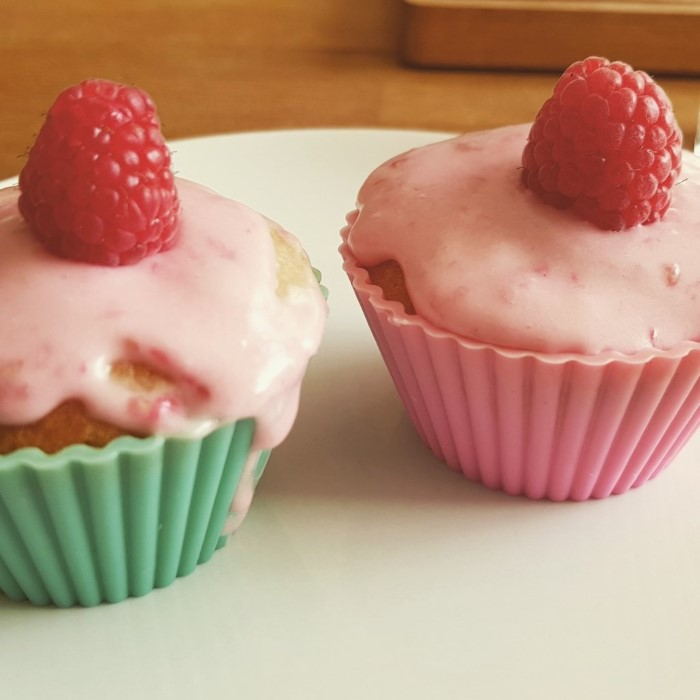

# Himbeer-Joghurt Cupcakes

## Stats

| Was   | Wert        |
|-------|-------------|
| Zeit  | 45 Min      |
| Menge | 12 Cupcakes |

## Rezept

=== "Zutaten"

    - [ ] 2x Eier
    - [ ] 150g Zucker
    - [ ] 1x Packung Vanillezucker
    - [ ] 100ml Pflanzenöl
    - [ ] 100g Naturjoghurt
    - [ ] 175g Mehl
    - [ ] 5g Backpulver
    - [ ] 150g Tiefkühl-Himbeeren

=== "Zubereitung"

    - [ ] Backofen auf 150 grad Umluft stellen.
    - [ ] Eier und (Vanille)Zucker verrühren, dann Öl und Joghurt dazugeben und wieder umrühren.
    - [ ] Dann den rest (außer die Himbeeren) dazugeben und gut verrühren.
    - [ ] Den Teig in die Förmchen füllen und pro Cupcake 3 gefrorene Himbeeren in die Mitte unter den Teig drücken.
    - [ ] Dann 20 Minuten backen lassen und währenddessen das Frosting machen.

## Frosting

=== "Zutaten"

    - [ ] 20g Butter
    - [ ] 20g Doppelrahmfrishkäse
    - [ ] 20g pürierte Himbeeren
    - [ ] 12 frische Himbeeren
    - [ ] 90g Puderzucker

=== "Zubereitung"

    - [ ] Alles bis auf die frischen Himbeeren zu einer cremigen Masse verrühren.
    - [ ] Das Frosting in den Kühlschrank stellen falls es nicht sofort benötigt wird.
    - [ ] Sobald die Cupcakes fertig sind das frosting auf die Cupcakes verteilen und eine frische Himbeere oben drauf setzen.

## Foto

