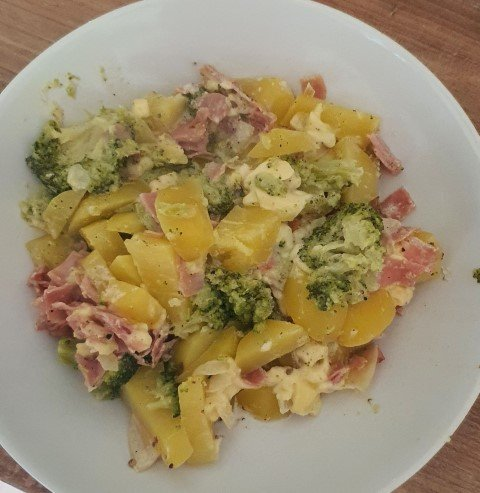
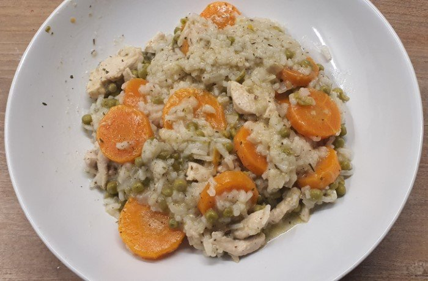
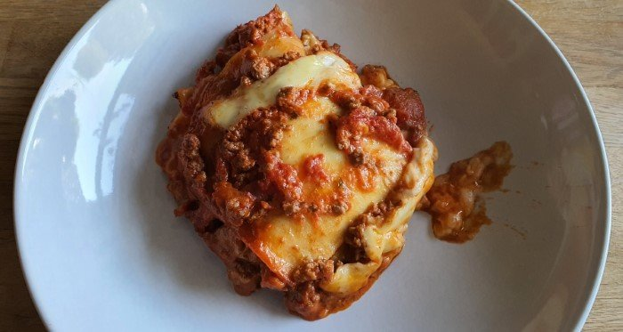
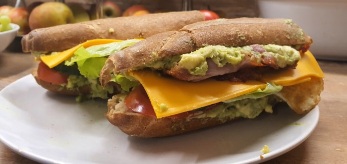
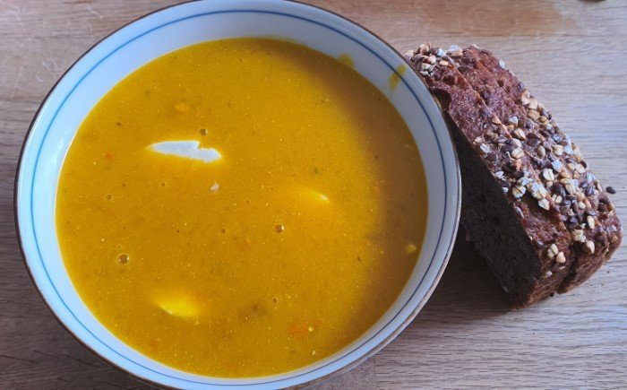
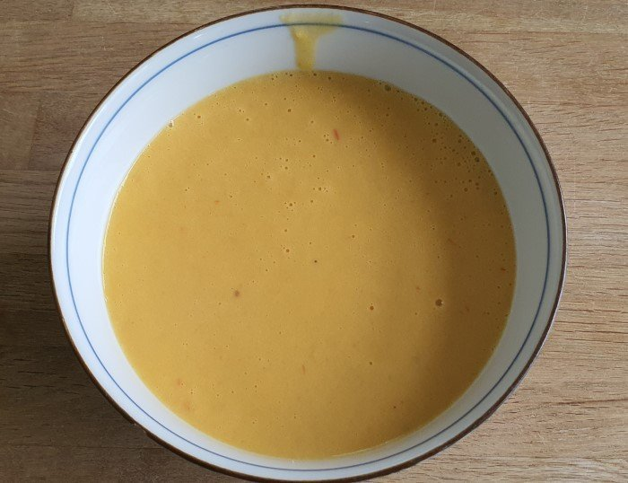

# Overview

Eat whatever you want... idk, lol.

## Gesunde Ernährung

- Essen Sie echtes Essen
- Machen Sie Pflanzen zu Ihrer Hauptspeise
- Lieber Fisch als Fleisch
- Joghurt: ja. Käse: auch okay. Milch: lala
- Zucker minimieren, industrielle Transfette meiden

## Links

- Food timeline: <https://foodtimeline.org/>
- Identifying Food by Qube Rule: <http://cuberule.com/>

## Recipies

### Meals

### Desert

### Salad

TODO

### Soup

### Other

TODO
