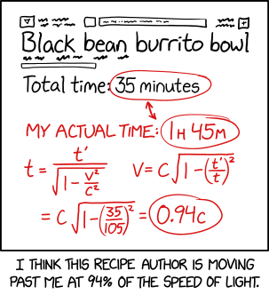

# Overview

Eat whatever you want... idk, lol... and take your time ;)

## Healthy eating

- Eat real food
- Make plants your main course
- Better fish than meat
- Yoghurt: yes. Cheese: okay too. Milk: lala
- Minimize sugar, avoid industrial trans fats

## Links

- Food timeline: <https://foodtimeline.org/>
- Identifying Food by Qube Rule: <http://cuberule.com/>

## Recipes

### Meals

### Desert

### Soup

