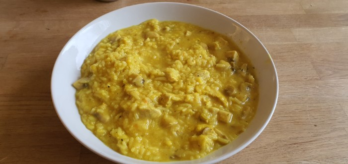

# Hühnchen Curry

=== "Zutaten"

    - [ ] 700 g Putenbrust (geschnetzeltes)
    - [ ] 300 g Champignons
    - [ ] 1,2 L Gemüsebrühe
    - [ ] 200 g geriebener Gouda
    - [ ] 100 g Reis
    - [ ] 2 Knoblauchzehen
    - [ ] Olivenöl
    - [ ] Rappsöl
    - [ ] Salz
    - [ ] Pfeffer
    - [ ] Curry
    - [ ] Zucker
    - [ ] Mehl

=== "Zubereitung"

    - [ ] Gemüsebrühe, Wasser und Reis in Topf geben und kochen.
    - [ ] Knoblauch fein hacken, Putenbrust in schmale Streifen schneiden und zusammen in Öl anbraten.
    - [ ] Champignons in feine Scheiben schneiden und in olivenöl anbraten (deckel drauf).
    - [ ] Putenbrust in den Topf mit der Gemüsebrühe geben und etwas Mehl, Zucken, Pfeffer, Curry und Salz hinzugeben.
    - [ ] Champignons ebenfalls dazugeben sodass nun alles in einem Topf ist. 
    - [ ] Geriebenen Gouda dazugeben und alles zusammen köcheln lassen.

=== "Foto"

    
