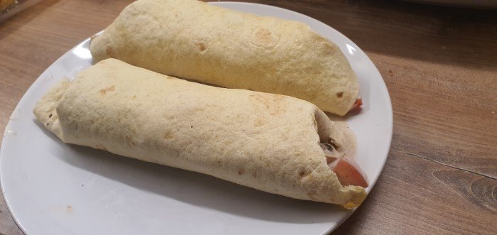

# Hühnchen Wrap

## Stats

| Was   | Wert        |
|-------|-------------|
| Zeit  | 30 Min      |
| Menge | 4 Personen |

## Rezept

=== "Zutaten"

    Einkaufen:

    - [ ] 500g Hühnerfleisch
    - [ ] 1x Eisbergsalat
    - [ ] 2x rote Paprika
    - [ ] 2x Tomate
    - [ ] 1x Gurke
    - [ ] 120g Joghurt/Sauerrahm/Crème fraîche

    Ggf. schon vorhanden:

    - [ ] 2x Rote Zwiebel
    - [ ] 2x Knoblauchzehe

    Gewürze:

    - [ ] 12g Salz
    - [ ] 12g Pfeffer

=== "Zubereitung"

    - [ ] `Zwiebel` schneiden und leicht anrösten.
    - [ ] `Hühnerfleisch` in Streifen schneiden und in der Pfanne anbraten.
    - [ ] Die `Wraps` leicht in einer extra Pfanne beidseitig anbraten.
    - [ ] `Eisbergsalat` und `Gurke` waschen und in Scheiben schneiden.
    - [ ] `Hühnerstreifen` mit `Salz` und `Pfeffer` würzen
    - [ ] `Knoblauchzehen` zerdrücken und mit `Sauerrahm`/`Joghurt`/`Crème fraîche`, `Salz` und `Pfeffer` zu einer Sauce rühren.
    - [ ] Die warmen Wraps mit `Hühnerstreifen`, `Salat`, `Paprika`, `Tomaten` und Souce füllen.

## Foto

