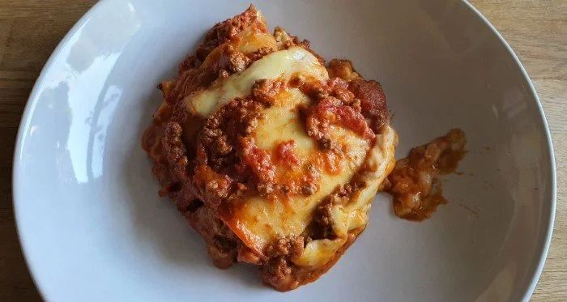

# Lasagne

## Stats

| Was   | Wert        |
|-------|-------------|
| Zeit  | 70 Min      |
| Menge | 4 Personen |

## Rezept

=== "Zutaten"

    Einkaufen:

    - [ ] 800g geschälte Tomaten
    - [ ] 500g gemischtes Hackfleisch
    - [ ] 1 Bund Petersilie
    - [ ] 300 g Lasagneplatten
    - [ ] 100g Käse
    - [ ] Butterflöckchen

    Ggf. schon vorhanden:

    - [ ] 8g Zitronensaft
    - [ ] 1x Zwiebel
    - [ ] 2x Knoblauchzehen
    - [ ] 10g Olivenöl
    - [ ] 10g Tomatenmark
    - [ ] 500ml Milch
    - [ ] 30g Butter
    - [ ] 40g Mehl

    Gewürze:

    - [ ] 8g Salz
    - [ ] 8g Pfeffer
    - [ ] 8g Muskat

=== "Zubereitung"

    Bolognese

    - [ ] In einem Topf Olivenöl erhitzen, Hackfleisch anbraten und gehackte Zwiebeln, Knoblauch und Petersilie dazugeben.
    - [ ] Tomatenmark und Dosentomaten hinzugeben und mit Salz und Pfeffer würzen.salzen und pfeffern.
    - [ ] 30min bei geöffnetem Topf einkochen lassen.

    Sauce

    - [ ] Butter in einem kleinen Topf schmelzen und das Mehl mit dem Schneebesen unterrühren und hellgelb anschwitzen. (schnell rühren, keine klumpen bilden lassen)
    - [ ] Milch dazugießen und die Sauce glatt rühren. 
    - [ ] Die Sauce sollte 30min auf kleiner Flamme köcheln, damit sie den Mehlgeschmack verliert.
    - [ ] Mit Salz, Pfeffer und Zitronensaft sowie etwas Muskatnuss würzen.

    Lasagne

    - [ ] Backofen auf 180 °C Umluft vorhezien.
    - [ ] In einer gebutterten Form etwas Bolognese verteilen, dann Schicht für Schicht Lasagneplatten + Bolognese + Sauce legen. (Die letzte Schicht sollte die Sauce bilden)
    - [ ] Dick mit geriebenem Käse bestreuen und Butterflöckchen darauf setzen.
    - [ ] Lasagne im Backofen 30-40 Min backen, bis die Kruste goldbraun ist.

## Foto

