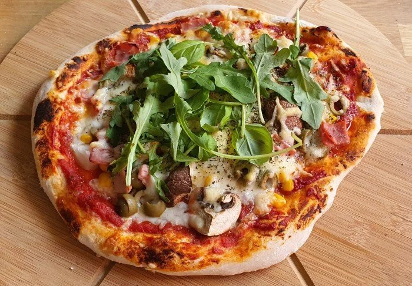

# Pizza

Pizza stammt vermutlich aus Neapel, ist weiblich und steht seit 1967 im Rechtschreibduden. Im Duden kommt gleich nach der Pizza der Pizzabäcker. Das bist heute du!

## Stats

| Was   | Wert        |
|-------|-------------|
| Zeit  | 60 Min      |
| Menge | 4 Personen |

## Rezept

??? output "Soße"
    === "Zutaten"

        Einkaufen:

        - [ ] 200g Tomaten
        - [ ] 1x Schalotte

        Ggf. schon vorhanden:

        - [ ] 50ml Trockener Rotwein
        - [ ] 1x Knoblauchzehe
        - [ ] 8g Olivenöl
        - [ ] 10g Tomatenmark

        Gewürze:

        - [ ] Oregano
        - [ ] Salz
        - [ ] feffer
        - [ ] Zucker

    === "Zubereitung"

        - [ ] Schalotten und Knoblauch schälen und fein hacken.
        - [ ] Olivenöl erhitzen und darin Schalotten und Knoblauch dünsten.
        - [ ] Anschließend Wein hinzugegen und dann die restlichen zutaten.
        - [ ] Bei leichter Hitze 30min köcheln lassen.

??? output "Teig"
    === "Zutaten (Normal)"

        Einkaufen:

        - [ ] 20g frische Hefe (oder 10g Hefepulver) 
        - [ ] 500g „Tipo 00" [Mehl]("Es ist wichtig das richtige Mehl zu wählen: Ideal ist es ein Mehl nach Tipo 00, bzw. speziell gekennzeichnetes Pizzamehl zu verwenden. Type 405 wird häufig mit Stärkemehl gestreckt und ist damit zu meiden.")

        Ggf. schon vorhanden:

        - [ ] 230g Wasser
        
        Gewürze:

        - [ ] 10g Zucker
        - [ ] 20g [Olivenöl]("Um den Teig geschmeidig zu machen, kommt kaltgepresstes und Extra Vergine (in Deutschland bekannt als „Natives Olivenöl Extra) Olivenöl dazu. Das entspricht der Güteklasse A für Olivenöl und besagt, dass das Öl direkt aus Oliven ausschließlich mit mechanischen Verfahren ohne Wärmeeinwirkung (40°C) gewonnen wurde.")
        - [ ] 5g Salz

    === "Zutaten (Glutenfrei)"

        Einkaufen:

        - [ ] 20g frische Hefe (oder 10g Hefepulver) 
        - [ ] 600g „Schär Mix Brot" Mehl (+ca 20g extra Mehl für Schale und drum herum)

        Ggf. schon vorhanden:

        - [ ] 450g Wasser
        
        Gewürze:

        - [ ] 10g Zucker
        - [ ] 30g [Olivenöl]("Um den Teig geschmeidig zu machen, kommt kaltgepresstes und Extra Vergine (in Deutschland bekannt als „Natives Olivenöl Extra) Olivenöl dazu. Das entspricht der Güteklasse A für Olivenöl und besagt, dass das Öl direkt aus Oliven ausschließlich mit mechanischen Verfahren ohne Wärmeeinwirkung (40°C) gewonnen wurde.")
        - [ ] 5g Salz

    === "Zubereitung"

        - [ ] [Wasser]("Weiches, also wenig kalkhaltiges, Wasser ist zu bevorzugen") auf 35°C erhitzen, [Hefe]("Besser bekannt als Saccharomyces cerevisiae, ist Hefe ein einzelliger Pilz der für seinen Energiestoffwechsel als Ausgangsstoffe fast ausschließlich Zucker und Sauerstoff benötigt. Zur Vermehrung der Hefe sind ungefähr 28 °C optimal. Bei Temperaturen über 45°C beginnt Backhefe zu sterben. Durch das Zutun von Hefe werden leider die Aromen der übrigen Zutaten gemindert. Daher gilt die Regel: je weniger Hefe im Teig ist, desto besser schmeckt er. Da Hefe aber unabdingbar für einen richtigen Teig ist, ist die optimale Menge entscheidend.") und Zucker dazugeben und vermengen.
        - [ ] Mehl, Salz und Olivenöl im Rührgerät vermengen und nach ein paar Minuten das Hefewasser hinzugeben.
        - [ ] Den Teig 5min [kneten lassen]("Der Teig muss nun geknetet werden. Bei genauer Befolgung der Mengenangaben dürfte der Teig ohne weitere Anpassungen zu einem Kluppen zusammengeknetet werden und weder bröselig noch kleberig sein. Ist dies dennoch der Fall, empfiehlt es sich während des Knetens in sehr kleinen Mengen Wasser bzw. Mehl hinzuzufügen, bis die Teigkonsistenz perfekt ist. Bei einem bröseligen Teig etwas mehr Wasser hinzufügen und weiter kneten. Bei einem zu klebrigen Teig mehr Mehl dazugeben und kneten.").
        - [ ] Teig zu einer Kugel formen und Teig sowie den Boden der Rührschale mit Mehl bestreuen.
        - [ ] Schale abdecken und an einem Warmen Ort (idealerweise bei 28 °C) 1-2 Stunden gehen lassen.
        - [ ] Teig nun im [Kühlschrank]("durch die Verlagerung auf einen kühleren Ort (dem Kühlschrank) wird der Gehprozess verlangsamt. Dadurch wird der Teig gleichmäßiger verarbeitet und schmeckt am Ende besser. Es ist also wichtig den Pizzateig im Kühlschrank gehen zu lassen.") für den nächsten Tag aufbewahren.
   
??? output "Belag"
    === "Zutaten"

        Einkaufen:

        - [ ] 300g Käse
        - [ ] 10g Tomatenmark

        - [Hawaii]("Jeder kann Pizzabäcker sein, aber manche gehen in die Geschichte ein. Beispielsweise hat der Kanadier Sam Panopoulos vor einem halben Jahrhundert die "Pizza Hawaii" erfunden. Für Bekanntheit in Deutschland sorgte wohl sein Ananasfreund und Vater von „Toast Hawaii", Clemens Wilmenrod. Trotzdem sind die weltweit meisten Fans in Australien anzutreffen. Alle Zutaten der Pizza Hawaii sind außerordentlich gesund und der regelmäßige Verzehr wird empfohlen.")
            - [ ] 100g Ananas
            - [ ] 100g Kochschinken
        - Tuna
            - [ ] 100g Tunfisch
            - [ ] 50g Mais
            - [ ] 20g Zwieblen
            - [ ] 20g Oliven
        - 0xfab1
            - [ ] Pilze
            - [ ] Schinken
            - [ ] Mais
            - [ ] Oliven
            - [ ] Rucula

        Gewürze:

        - [ ] Oregano
        - [ ] Basilikum
        - [ ] Thymian
        - [ ] Chilipulver        

    === "Zubereitung"

        Ofen vorheizen

        - [ ] Pizzastein in den Ofen stellen.
        - [ ] [Ofen]("Pizzaöfen haben eine Temperatur von ca. 350 bis 400°C. Herkömmliche Öfen in Privatküchen schaffen meist nur 250°C. Es empfiehlt sich also voll aufzudrehen und, falls möglich, auf Umluft zu stellen.") auf Umluft und volle Kanne stellen.
        - [ ] Mindestens 30min warten bis die erste Pizza in den Ofen gestellt wird.

        Pizza belegen

        - [ ] Ein Stück vom Teig abmachen und mit den Händen ausrollen und leicht mit Mehl geschmeidig machen.
        - [ ] Boden mithilfte eines Löffels mit Tomatenmark bedecken, dann Tomatensoße drübergeben.
        - [ ] Beliebe Zutaten hinzufügen (nicht zuviel, Wasserhaltige Zutaten möglichst abtropfen).
        - [ ] Käse obendrüber geben.

        Pizza backen

        - [ ] Die Pizza in den Ofen schieben (nur eine Pizza, nie mehrere gleichzeitig übereinander).
        - [ ] Wann die Pizza fertig ist recht variable (Ofen, Belag, Menge), daher einfach ab und an in den Ofen schauen.
        - [ ] Nachdem die Pizza aus dem Ofen gekommen ist, nach belieben Oregano, Basilikum, Thymian, Chilipulver und Rucula über die Pizza streuen.

## Foto

## Pizza History

- 997 AD wurde das Wort [Pizza](https://en.wikipedia.org/wiki/History_of_pizza) zuerst dokumentiert.
- 1945 nehmen US soldaten die Pizza mit nach Hause und machen sie Weltweit bekannt.
- 1962 hat [Sam Panopoulos](https://en.wikipedia.org/wiki/Sam_Panopoulos) Pizza Hawaii erfunden und ist ein toter halb-gott.
- 1984 hat irgendein schlauer Italiener hat mal auf english gesagt: "Make a round pizza, cut it into triangels and put it in a square box." Wer etwas von heiliger Geometrie versteht wird hierin die Offenbarung erkennen.
- 1986 wurden die Teenage Mutant Hero Turtales zu Werbezwecken pizza fans.
- 1994 wurde die erste Pizza [online](https://thehistoryoftheweb.com/postscript/pizzanet/) über PizzaHut in Santa Cruz (damals PizzaNet) verkauft und geliefert.
- Am 22.5.2010 (Bitcoin Pizza Day) wurde die erste Pizza in Florida durch [Bitcoin](https://de.wikipedia.org/wiki/Bitcoin) verkauft. Für 10000 Bitcoin gab es zwei große Pizzen.
