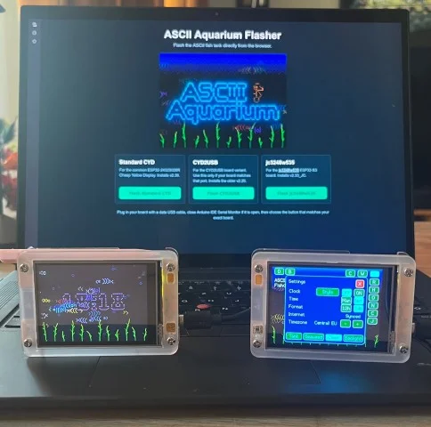
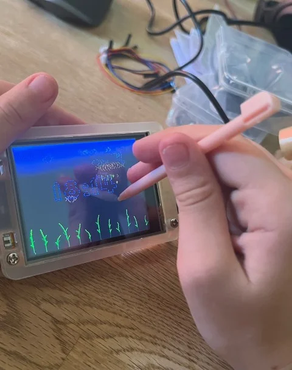
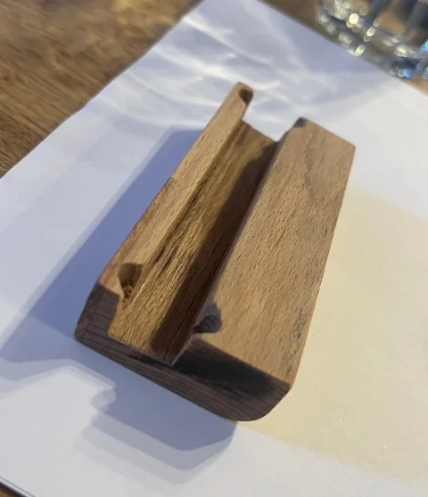
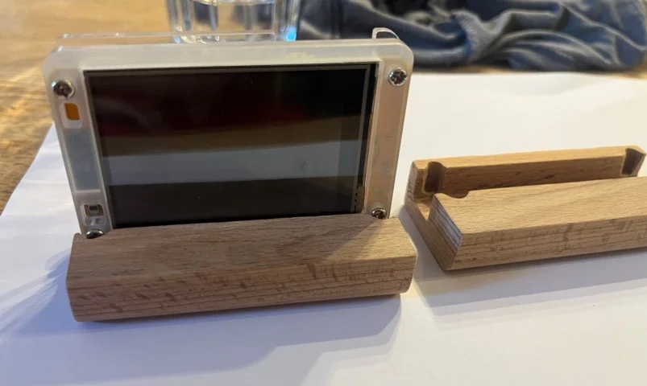
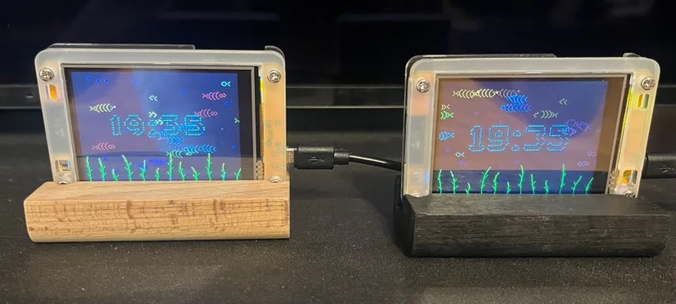

# ASCII-Aquarium

ASCII Aquarium turns your Cheap Yellow Display (ESP32-2432S028R) into an tiny animated ASCII fish tank. It renders a live aquarium scene with animated fish, bubbles, swaying seaweed, tap-to-feed food flakes, occasional octopus & seahorse visitors, selectable backgrounds, preferences, optional Wi-Fi clock sync,...

This was a very nice and simple project to build.

Flashing the ESP32-2432S028R was very easy with the web tool: https://power-pill.github.io/ASCII-Aquarium/

The touch display works well and WiFi setup was no problem.

I built a small wooden frame so the disply has a stable stand.

I kept one with the wood optic and painted one stand black.

