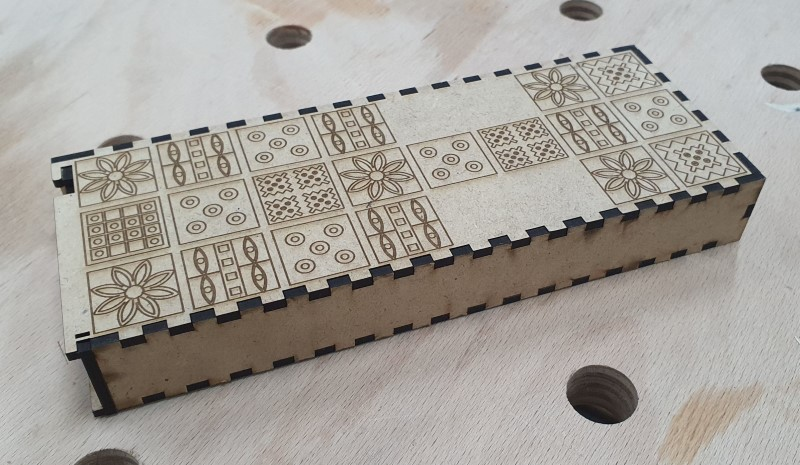
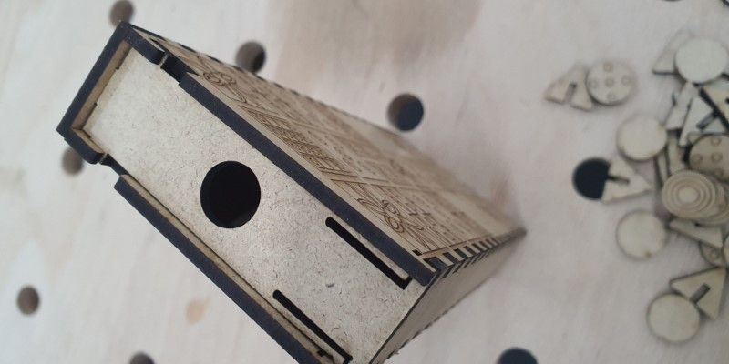
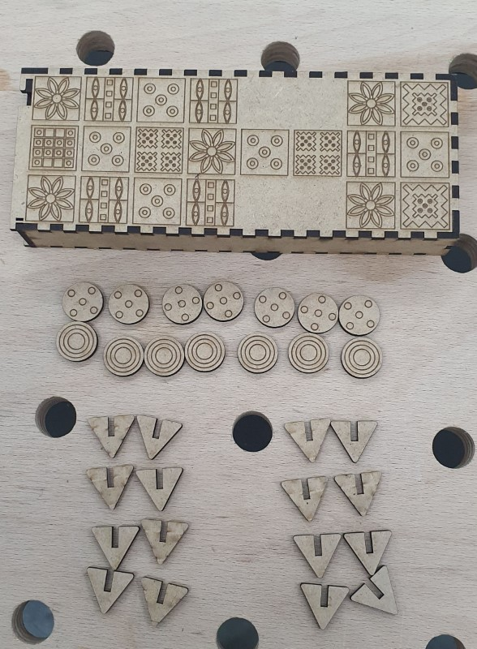
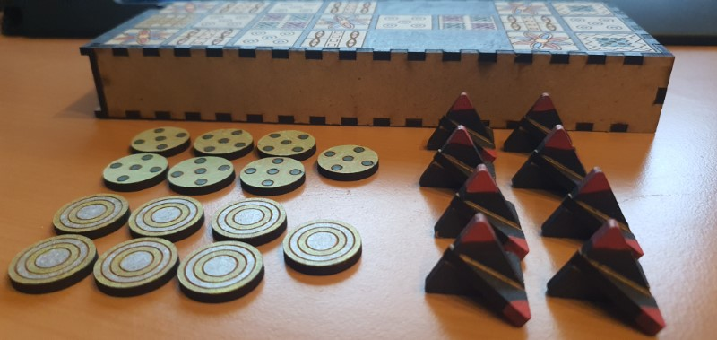
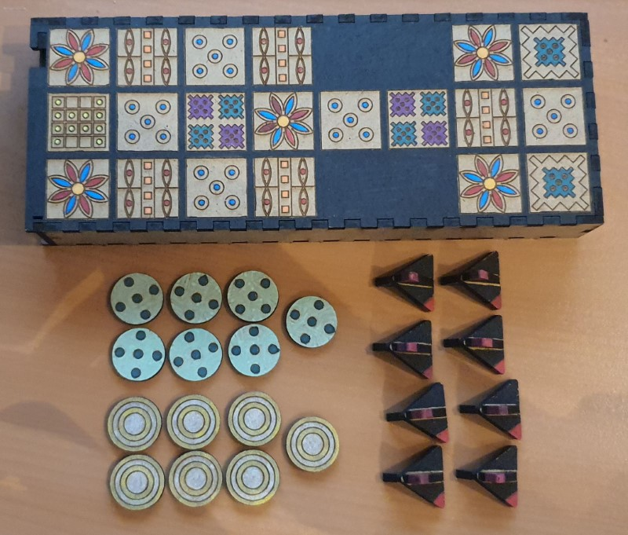
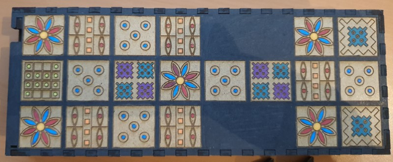

# Royal Game of Ur

There is a full cut out template available at [boxes.py](https://festi.info/boxes.py/RoyalGame?language=en)

I used the [default settings](https://festi.info/boxes.py/RoyalGame?FingerJoint_angle=90.0&FingerJoint_style=rectangular&FingerJoint_surroundingspaces=2.0&FingerJoint_edge_width=1.0&FingerJoint_finger=2.0&FingerJoint_play=0.0&FingerJoint_space=2.0&FingerJoint_width=1.0&x=200&thickness=3.0&format=svg&tabs=0.0&debug=0&labels=0&labels=1&reference=100&burn=0.1&render=0).

You can download the [svg](_royal-game.svg) as well as the [CDR-Cut](_royal-game-cut.cdr) and [CDR-Engraving](_royal-game-raster.cdr) specialty.

Here are some pictures of the first print without paint:

And after painting using acrylic paint:

## Play the game

Rules

- Play online: <https://royalur.net/game/> and https://tabletopia.com/games/trgo-ur
- Rules: <https://royalur.net/rules/> and <https://www.mastersgames.com/rules/royal-ur-rules.htm>
- Wikipedia: <https://en.wikipedia.org/wiki/Royal_Game_of_Ur>
- Ben's Royal Game of Ur <https://www.dvgc.com/gk/Bens_ur.html>

Dice probability

| Result | Chance      |
|--------|-------------|
| 4      | 1/16 = 6%   |
| 3      | 4/16 = 25 % |
| 2      | 6/16 = 38%  |
| 1      | 4/16 =25%   |
| 0      | 1/16 = 6%   |
