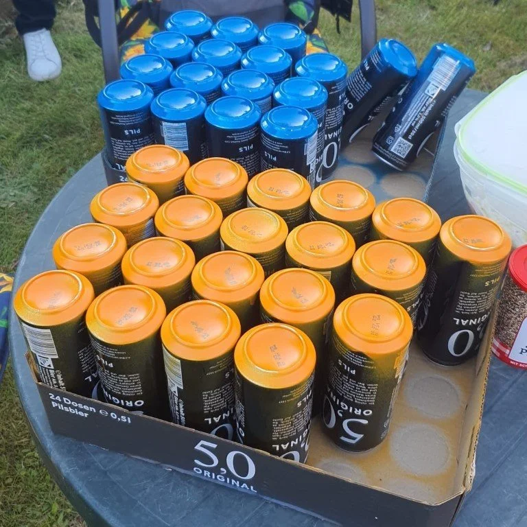
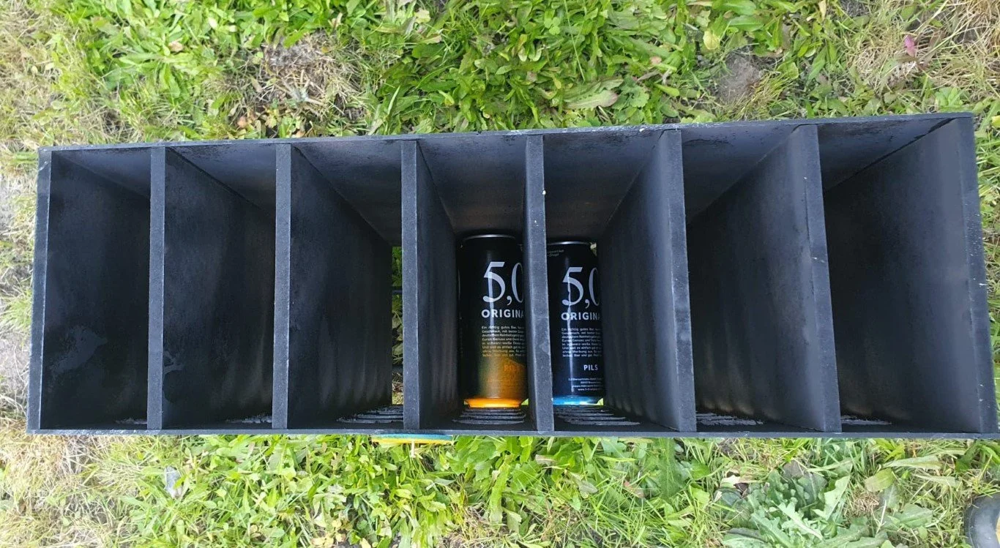
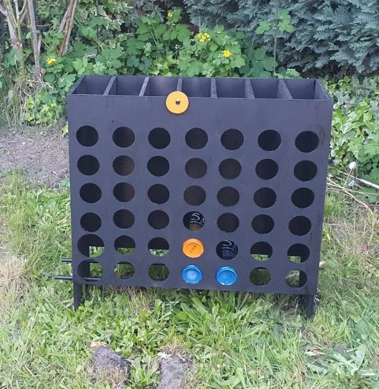

# Rules

This is an adaption of the game connect 4 (in german known as "vier gewinnt").

This version is played with 0,5 Liter cans.

The game is ideally played turn based with emptied cans as a team coop drinking game.

Winner gets the "Pfand" - looser gets to buy more beer.

