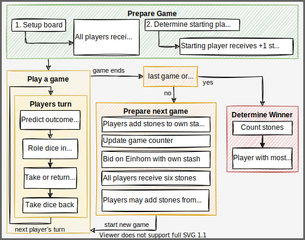
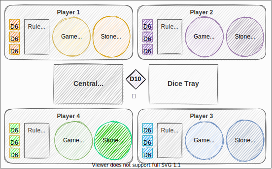

# Rules

Players: 3-5, Time: 20-30 min, Age: 4+

Download the [rule book](_einhorn-en.pdf) and the [prediction outcome hand cards](_einhorn_prediction_card.pdf).

| Einhorn                      | is a simple, fast paced dice rolling game in which luck is the main factor to win the game.                                                                                                                                                                                                                                                                                                                                                                                                                                                                                                     |
|------------------------------|-------------------------------------------------------------------------------------------------------------------------------------------------------------------------------------------------------------------------------------------------------------------------------------------------------------------------------------------------------------------------------------------------------------------------------------------------------------------------------------------------------------------------------------------------------------------------------------------------|
|  | Each player starts with six stones. Bet on your roll outcome and receive or pay stones. Roll an `Einhorn` and receive the unicorn figure to take stones from your opponents. Once a player loses all stones the current game ends. All other players keep their stones. Bet on the unicorn figure for an advantage in the next game. Be better at predicting your roll outcome than the other players. After ten games, the player with the most stones wins. Enjoy the drama of the unexpected integer, master predicting randomness and dominate your opponents in the only game that matters. |

Below is an overview of main steps in the game:



## Prepare the game

**Setup the game**

- Put 25 stones per participating player in a bowl; also referred to as "central stash"
- Place the dice tray centrally.
- Place the game counter dice (D10) in the center and set it to 1.
- Place the unicorn figure centrally between dice tray and central stash.
- Each player receives 3x six-sided dice (D6), a card with the roll result overview and 6 stones from the central stash.

**Agree on the win condition**

- Agree on how many games shall be played to determine the winner (default is 10)

**Determine who starts**

- All players roll their three dice and the player with highest sum starts the game.
- If there is a draw, those players roll again until a starting player is determined.
- The player that starts the game receives an additional stone from the central stash.

This is an example setup for 4 players:



### Differences between the stone stashes

The table explains the differences between the central stone stash, the game stones and the players stone stash:

| Term          | Explanation                                                                                                                                                                                                                                                                                                                        |
|---------------|------------------------------------------------------------------------------------------------------------------------------------------------------------------------------------------------------------------------------------------------------------------------------------------------------------------------------------|
| Central stash | All stones remaining in the game. [Take stones or return stones](#take-or-give-stones) depending on your roll prediction outcome. If there are no stones left in this stash the game ends immediately and [a winner is determined](#determine-the-winner)                                                                          |
| Game stones   | Stones a player has for the [current game](#play). If a player has no more game stones the [current game ends](#game-ends). If this is not the last game, [prepare a new game](#prepare-next-game)                                                                                                                                 |
| Player stash  | Stones a player has won in previous games. These stones can only be used when [betting on the unicorn](#bid-on-the-einhorn) or [adding stones](#receive-6-game-stones) to the initial 6 game stones received at the beginning of a new game. The player with the most stones in this stash [wins the game](#determine-the-winner). |

## Play

This section explains the actions in a players turn and how one game is played. One game may be as fast as 1min but can also take 10min depending on how fast one player loses all stones. Play 10 games for a standard match.

### Predict outcome or remain silent

There are 4 predictable roll results. Below is a list explaining the different outcomes and their probability:

| Roll Result           | Rule                                                                     | Formula                                            | Example    | Combinations | Probability |
|-----------------------|--------------------------------------------------------------------------|----------------------------------------------------|------------|--------------|-------------|
| ⚰️ Das Unvermeidliche | A number & that number +1 and something else which is not one of the two | ```n & n+1 & (!n / !n+1)```                        | ⚀⚁⚃ or ⚂⚃⚀ | 96 of 216    | 44,4%       |
| 🎁 Wunsch             | Two of a kind & something else and which is not that number              | ```2x n & !n```                                    | ⚀⚀⚁ or ⚁⚃⚁ | 90 of 216    | 41,7%       |
| 🦄 Einhorn            | All numbers must be at least 2 apart                                     | ```n & n+2 & (n+4 / n+5)``` and```n & n+3 & n+5``` | ⚀⚂⚄ or ⚀⚃⚅ | 24 of 216    | 11,1%       |
| ☢️ Dreifaltigkeit     | Three of a kind.                                                         | ```3x n```                                         | ⚁⚁⚁ or ⚅⚅⚅ | 6 of 216     | 2,8%        |

The current player decides to either predict the upcoming roll attempt **or** remain silent (passive roll / no prediction).

Once done, the player proceeds to roll all three dice in the dice tray.

Depending on the rolled outcome the player then [takes or gives stones](#take-or-give-stones).

### Take or give stones

Based on the players roll attempt and the prediction made, **there is one possible result** that leads to adding or removing stones from the players game stash. Read the table below as follows:

1. Check your roll result and go to that line
2. Then, in that line check what applies to your prediction (correct, wrong, no prediction)
3. Now add or remove stones based on what applies to your roll outcome & prediction.

It doesn't matter what prediction was made specifically. What matters, is if the prediction was correct, wrong or if no prediction was made. In other words: The stones added or removed are determined by the result rolled, not by what was predicted. E.g., if a `Wunsch` is rolled, it doesn't matter if `Das Unvermeidliche`, `Einhorn` or `Dreifaltigkeit` were predicted, all three are wrong and the player must return 2 stones to the central stash.

| Roll Result           | Correct Prediction          | Wrong Prediction | No Prediction |
|-----------------------|-----------------------------|------------------|---------------|
| ⚰️ Das Unvermeidliche | +2                          | -2               | -1            |
| 🎁 Wunsch             | +2                          | -2               | -1            |
| 🦄 Einhorn            | +5                          | -5               | +1            |
| ☢️ Dreifaltigkeit     | [WIN](#roll-dreifaltigkeit) | +1               | +5            |

As you can see from the table above, the most common roll results are `Das Unvermeidliche` and `Wunsch`. The improbable results `Einhorn` and `Dreifaltigkeit` reward taking higher risks with higher rewards.

If a player forgets to make a prediction or mentions the prediction too late (dice already rolled), this is dealt as a passive roll (no prediction).

Remember to first take or give stones, then put your dice back from the dice tray. With this action your turn ends and it's the next players turn.

#### Roll Einhorn

When rolling an `Einhorn`, this player additionally receives the unicorn figure. The unicorn figure has the following effects:

- When rolling an `Einhorn` no stones are earned/paid = nothing happens. Therefore, as the owner of the unicorn figure, avoid predicting an `Einhorn`.
- The player can give or take stones not only from the central stash, but also from any other player. However, whether the player can take stones still depends on the roll attempt outcome! You can only take stones from one player. If the player doesn't have enough stones you only get what the player can offer and the [current game ends](#game-ends).
- The unicorn figure is passed once another player rolls an `Einhorn`.

#### Roll Dreifaltigkeit

If you roll `Dreifaltigkeit` [you will always receive stones](#take-or-give-stones). However, if you predict `Dreifaltigkeit` correctly, which is a 2,8% chance, you receive all game stones from all players and therewith instantly [end the current game](#game-ends). In this event the player's stash is of course excluded!

### Game ends

Once a player has no stones left, the game ends. In case a player needs to pay more stones than they have, only the available game stones are given.

Example: `Einhorn` was rolled and predicted wrong, and the player has 3 stones left, only those 3 stones return to the central stash.

If this was the last game or if all stones from the central stash are gone, proceed to [determine the winner](#determine-the-winner), else proceed with the steps to [prepare the next game](#prepare-next-game).

## Prepare next game

To prepare for the next game, follow these steps:

- All players take their current stones and add them to their stash.
- The unicorn figure is returned to the center of the dice tray.
- The game counter is updated and laid next to the unicorn figure.
- All players [bid on the unicorn](#bid-on-the-unicorn).
- All stones used for bidding are returned to the central stash.
- Everyone [receives 6 stones](#receive-6-game-stones) from the central stash as their game stones for the next game.
- Every player may add more stones from their stash to the game stones for the next game.
- A [new game](#play) begins, and the owner of the unicorn figure starts.

### Bid on the unicorn

All players can now bet on the unicorn figure with their stones available from their own stash. Bidding on the unicorn works as follows:

- Place the unicorn figure in the middle of the dice tray.
- All players bet with their personal stone stash (if available) to receive the unicorn figure in the next game. You may bid zero stones if you want but you must bid! E.g., if you have no stones in your stash you must close your hand and hold it over the table until all are ready.
- Secretly place stones in your hand to be on the unicorn figure. Don't show how much you are bidding until all reveal their bet by opening their hands at the same time.
- All players put their stones used for the bid in the central stash. This means, if you do not win the unicorn figure you still lose the stones you used for your bet!
- The unicorn figure goes to the highest bidder. In case there is a tie, all highest bidders roll their 3 dice and the player with the highest total sum receives the unicorn figure. E.g., if all bid zero stones, all must roll their dice. In case there is another tie, the remaining players now tied re-roll the dice until a winner can be determined.

### Receive 6 game stones

- All players receive 6 stones from the central stash.
- Players with a personal stone stash may choose to add stones to their game stones at this time only.

Please note: You can only lose your game stones. If you add stones from your stone stash to your current game stones, you can lose them but have a higher chance of not losing the game.

## Determine the winner

All players count the stones they have in their own stone stash.

Winner of this game of Einhorn is the player with most stones.

In case of a tie, these players roll their three dice successively until one player rolls an `Einhorn` and is determined the winner.
