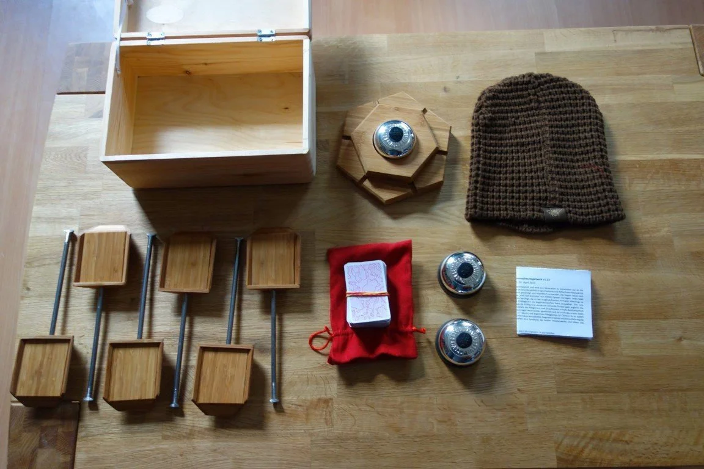
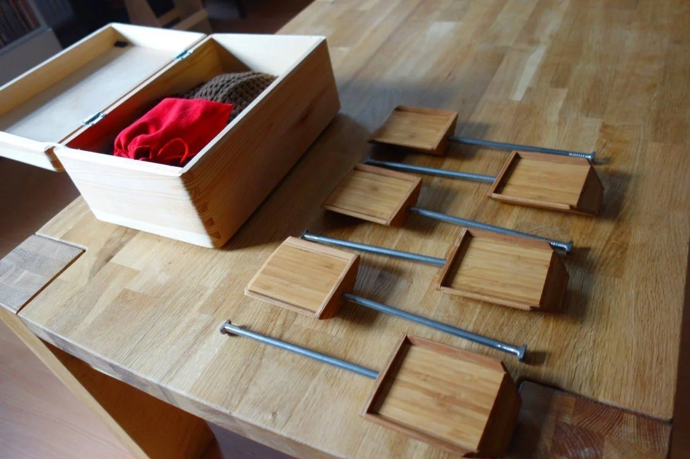
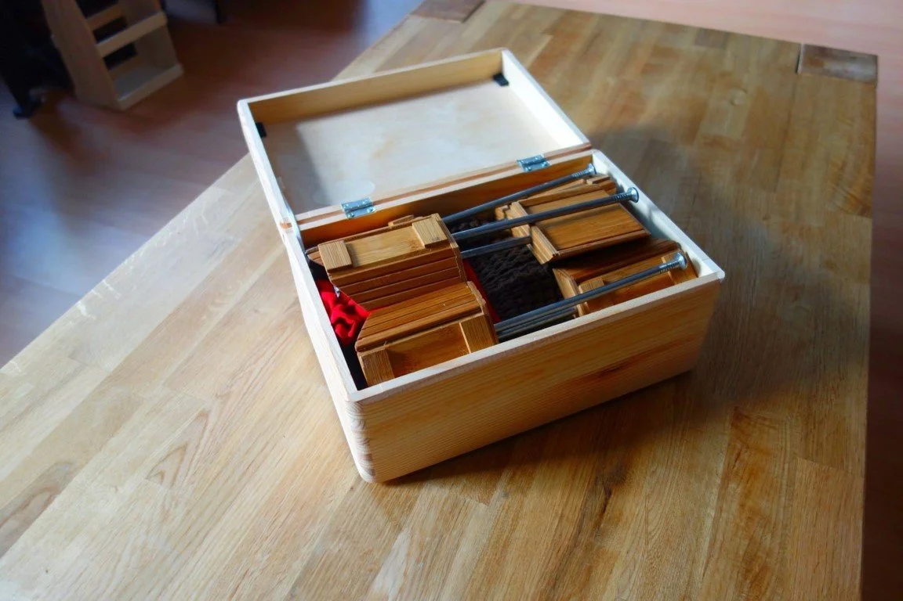
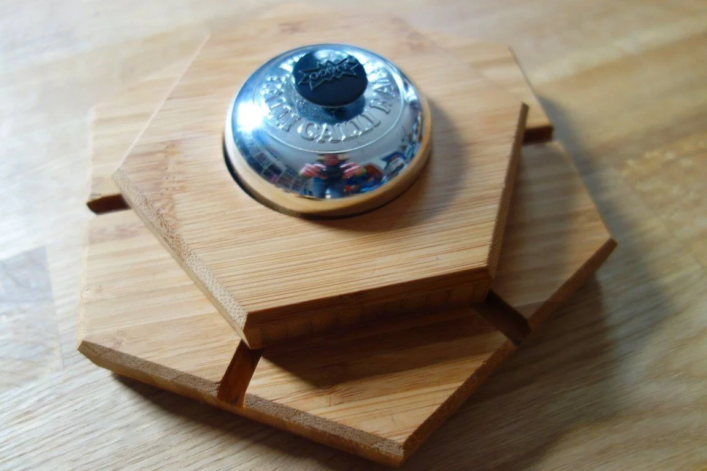
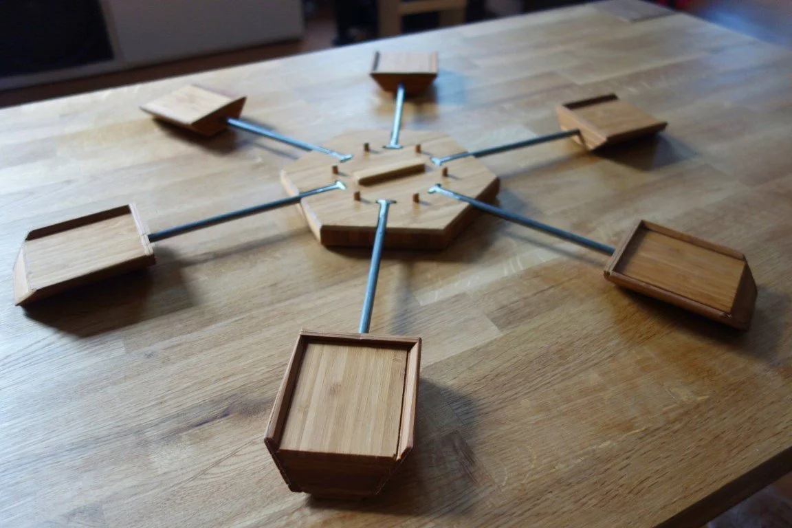
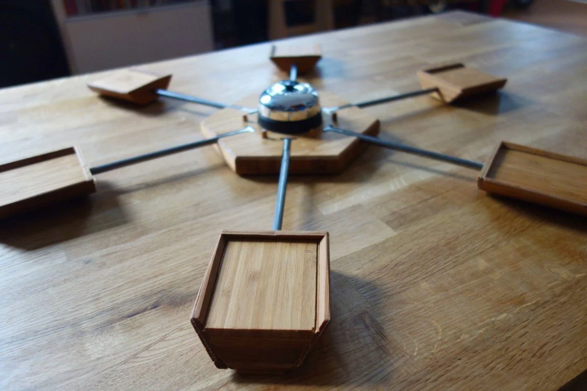
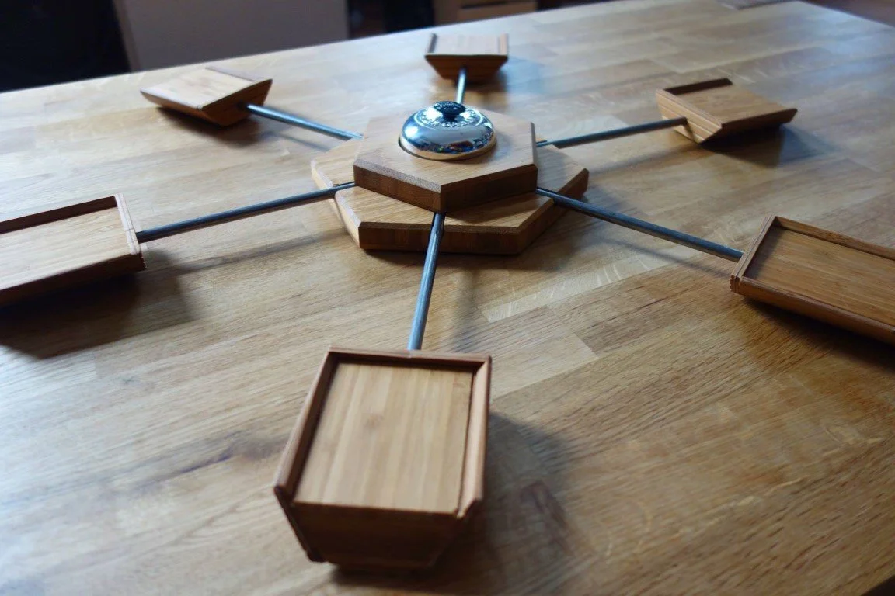
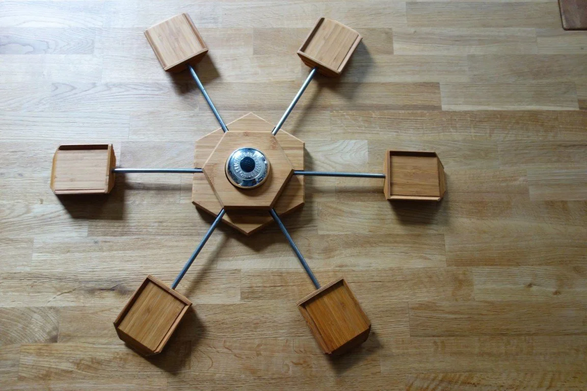
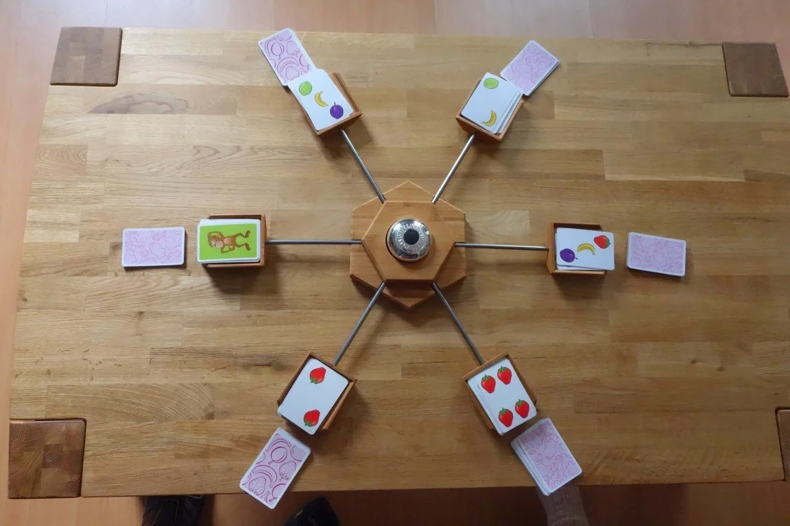

# Build

Building the game

## Box

These are all components created for the game. They fit nicely in the box.

## Bell

The bell is exactly in the middle and holds everything together. This is the main part and most complicated to create of all the components. Here are few detailed shots.

### Close Up

### Mount

These pictures show how to mount the bell.

## Game Play

This is how the game looks like when played:

