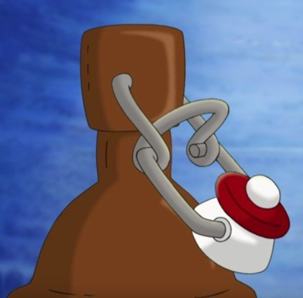
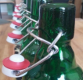
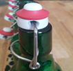
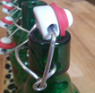
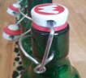

# Rules

## Intro

=== "DE"

    Spieler: 2-7, Dauer: 20-30 min, Alter: 4+

    | Prömpeln  | wurde im Film "Werner - Gekotzt wird später" eingeführt und ist ein Spiel, bei dem es darum geht, Bügelflaschenverschlüsse geschickt so zu platzieren, dass die meisten Punkte gesammelt werden.|
    |------------------------------|------------------------------------|
    |  | Prömpeln wird mit 0,33 Liter Bügelverschlussflaschen gespielt. Ursprünglich diente das Spiel zur Ermittlung des nächsten Regenten und Königs über die gegenwärtige Gesellschaft. Prömpeln kann allerdings auch als Zeitvertreib und frei von politisch motivierten Hintergründen gespielt werden. Gespielt wird mit 7 Flaschen, wobei pro Flasche in einem regulären Durchlauf maximal 3 Punkte pro Flasche erzielt, werden können. Über 7 Runden müssen gewisse Spezialzüge gespielt werden welche zusätzlichen Punkte einbringen können.|

    Lade das [Regelwerk](_proempeln-de.pdf) hier herunter.

=== "EN"

    Players: 2-7, Time: 20-30 min, Age: 4+

    | Prömpeln  | was introduced in the movie "Werner - Gekotzt wird später" and is about placing swing top bottle caps so that the most points are earned.|
    |------------------------------|------------------------------------|
    |  | Prömpeln is played with 0.33-liter  swing top bottles. Originally, the game was used to determine the next regent and king over the current society. However, Prömpeln can also be played as a pastime and free from politically motivated backgrounds. The game is played with 7 bottles, whereby a maximum of 3 points per bottle can be scored in a regular round. Over 7 rounds, certain special moves must be played which can earn additional points. |

    Download the [rule book](_proempeln-en.pdf) here.

## Grundregeln / Rules

=== "DE"

    Die sieben Bügelverschlussflaschen werden so aufgereiht, dass alle Prömpel zu einer Seite zeigen.
    Die flache Seite des Prömpels wird gegen die Flasche gelegt und der Nippel zeigt Richtung Spieler.

    Gespielt werden sieben Runden. In jeder Runde prömpelt der Spieler alle Flaschen der Reihe nach durch.
    Dabei berührt der Spieler den Prömpel von unten mit nur einem Finger und bewegt diesem mit einer zugartigen Bewegung nach oben.
    Das Schieben des Prömpels führt zu einem ungültigen Versuch. Die Flaschen selbst dürfen während des Spielzuges nicht berührt werden.

    Vor den Runden 1-6 darf ein Spieler einen seiner drei einmalig ausführbaren Spezialzüge ankündigen.
    Nur wenn dieser Korrekt angekündigt wurde gelten die entsprechenden Spezialregeln.
    Bei Anspruch auf eventuell erfüllte Passivbedingungen muss der Spieler diese nach seinem Durchlauf direkt erwähnen.
    Anschließend werden die Punkte aus dieser Runde notiert.

    Mit dem Abschluss von Runde 6 müssen alle Spezialzüge gespielt worden sein.
    In der siebten Runde spielen alle Spieler zum Abschluss des Spiels einen Doppellörer.

    Gewinner und König ist der Spieler mit der höchsten Punktzahl.
    Kommt es zu einem Stechen, wird gleichzeitig ein Pröpel geprömpelt.
    Dies wird so oft wiederholt bis ein Spieler mehr Punkte als der andere erlangt.

=== "EN"

    The seven swing-top bottles are lined up so that all the bungs face one side.
    The flat side of the bottle is placed against the bottle and the nipple points towards the player.

    Seven rounds are played. In each round, the player plunges all the bottles in turn.
    The player touches the bottle cap from below with only one finger and moves it upwards in a pulling motion.
    Pushing the bottle cap results in an invalid attempt. The bottles themselves may not be touched during the move.

    Before rounds 1-6, a player may announce one of his three one-time special moves.
    Only if this was announced correctly, the corresponding special rules apply.
    If a player claims to have fulfilled any passive conditions, he must mention them directly after his turn.
    Afterwards, the points from this round are noted.

    By the end of round 6, all special moves must have been played.
    In the seventh round, all players play a double listener to conclude the game.

    The winner and king is the player with the highest score.
    If a playoff occurs, a pawn is played at the same time.
    This is repeated until one player gains more points than the other.

## Punkte / Points

=== "DE"

    Für jede Endposition eines gespielten Prömpels ist eine Punktzahl definiert:

    | Punkte | Prömpel                         | Beschreibung                                              |
    |--------|---------------------------------|-----------------------------------------------------------|
    | 0      |  | Prömpel liegt nicht auf                                   |
    | 1      |  | Prömpel liegt mit der flachen Seite nach unten auf        |
    | 2      |  | Prömpel liegt schräg bzw. seitlich auf                    |
    | 3      |  | Prömpel liegt mit der großen, flachen Seite nach oben auf |

    Prömpel, die nicht wie abgebildet, korrekt liegen, zählen nicht.
    Unklare Positionen zählen ebenfalls immer null Punkte.
    Die Punkte werden erst ermittelt, nachdem alle Prömpel einer Runde gespielt wurden.
    Gleitet beispielsweise ein grenzwertiger 1-Punkt Prömpel unglücklicherweise vor Ende des Spielzugs ab, wird dieser als null Punkte vermerkt.
    Im Fall vom Spezialzug "Kniffel" muss direkt darauf hingewiesen werden welche Prömpel nicht zählen.
    Die Punkte werden direkt nach dem Spielzug eines Spielers durch Addition der vorangegangenen Punkte notiert.

=== "EN"

    A score is defined for each end position of a played bottle cap:

    | Points | Prömpel                         | Description                                |
    |--------|---------------------------------|--------------------------------------------|
    | 0      |  | Bottle cap is not on                       |
    | 1      |  | Bottle cap lies flat side down             |
    | 2      |  | Bottle cap lies diagonally or sideways on  |
    | 3      |  | Bottle cap lies with the big, flat side up |

    Bottle caps that do not lie correctly as shown above do not count.
    Unclear positions always count as zero points.
    The points are determined after all the bottle caps in a round have been played.
    If, for example, a borderline 1-point bottle cap slips before the end of the turn, it is recorded as zero points.
    In the case of the special move "Kniffel" it must be pointed out directly which bottle caps do not count.
    Points are noted immediately after a player's turn by adding up the previous points.

## Spezialzüge / Special moves

=== "DE"

    **Aktive Spezialzüge** müssen vor Rundenbeginn vom Spieler angekündigt und anschließend ausgeführt werden.
    Abgesehen vom Doppellörer in Runde 7 ist kein Spieler verpflichtet Spezialzüge zu spielen.
    Pro Spiel kann jeder Spezialzug nur ein Mal pro Spieler gespielt werden.

    - **Lampenlörer** (L) ist einmal in Runde 1-6 spielbar und wird mit „Ich mach jetzt nen Lampenlörer" angekündigt, wobei die Spielhand in die Luft gehoben wird. Bei einem Lampenlörer zählen null-Punkte Prömpel -3 und drei Punkte Prömpel +6 Punkte.
    - **Kniffel** (K) ist einmal in Runde 1-6 spielbar und wird mit „Ich Kniffel jetzt!" angekündigt, gefolgt von breitem Grinsen. Beim Kniffeln darf der Spieler nach der Runde zwei Mal beliebig viele Prömpel erneut spielen. Kommt es zu sieben 3ern gilt in diesem Fall nicht der Königszug.
    - **Pash-7** (P) ist einmal in Runde 1-6 spielbar und wird mit „Jo, denn … Pash-7 Spezial" in gleichgültiger Stimmlage angekündigt. Bei Pash-7 werden Pärchen belohnt. Pro Pärchen gibt es 10 Punkte. Bei 7 Flaschen können so bis zu 30 Punkte erzielt werden. 4x 1 Punkt ergibt zwei Pärchen und würde mit 20 Punkten bewertet werden.
    - **Doppellörer** (D) wird verpflichtend in Runde 7 gespielt. Gespielt wird mit beiden Händen parallel von außen nach innen. Der letzte, siebte und in der Mitte befindliche Prömpel bestimmt den Punktemultiplikator. Es muss zu Beginn angesagt werden, ob die mittige Flasche mit links oder rechts gespielt wird: „Doppellorer links" oder „Doppellörer rechts". Der Punktemultiplikator selbst zählt nicht in die Punktzahl ein. Die anderen Prömpel-Punkte werden addiert und mit den Punkten des mittigen Prömpels multipliziert (0-3). Ein Mulitplikator von Null macht diese Runde Punktelos.

    **Passive Spezialzüge** müssen vor der Punktenotierung erwähnt und nachvollzogen werden können.

    - **Meier** (M) gilt in den Runden 1-7. Mit der Aussprache des Satzes „Es gibt immer noch Meier" wird der Anspruch auf diese Kombination geltend gemacht. Meier ist gültig, wenn eine Mischung aus 1ern und 2ern (keine null Punkte und keine drei Punkte) gespielt wurden. Es können beispielsweise auch nur eine 1 und sechs 2er sein. Ein ist ein Meier wird mit 21 Punkten gewertet. Meier gilt auch bei einem Kniffel. Bei einem Doppellörer muss auch der Punktemultiplikator eine 1 oder 2 sein. In diesem Fall werden 21 Punkte mal 1 oder 2 genommen, je nach Muliplikator.
    - **Königszug** (König) gilt in den Runden 1-7 und gilt bei einem perfekten Spiel bei dem alle sieben Prömpel geben jeweils drei Punkte ergeben.  Mit der Aussprache von „Ich bin König" wird dieser zum Gewinner des Spiels deklariert und das Spiel ist beendet. Der Königszug gilt nicht beim Kniffeln. Selbst in Runde 7, bei einem Doppellörer, kann der Königszug noch vorzeitig das Spiel entscheiden.

=== "EN"

    **Active special moves** must be announced by the player before the start of the round and then executed.
    Except for the double listener in round 7, no player is obliged to play special moves.
    Each special move can only be played once per player per game.

    - **Lampenlörer** (L) is playable once in rounds 1-6 and is announced with "Guys, I'm doing a lamplörer", with the playing hand raised in the air. In a Lamplörer, zero points of Prömpel count -3 and three points of Prömpel count +6 points.
    - **Kniffel** (K) is playable once in rounds 1-6 and is announced with "Time to Kniffel!" followed by broad grins. When playing Kniffel, the player may replay any number of Prömpel twice after the round. If there are seven 3s, the king's move does not apply in this case.
    - **Pash-7** (P) is playable once in rounds 1-6 and is announced with "Yeah... so then this is a Pash-7 special" in indifferent voice pitch. In Pash-7, pairs are rewarded. There are 10 points per pair. With 7 bottles, up to 30 points can be scored. 4x 1 point makes two couples and would be valued at 20 points.
    - **Doppellörer** (D) is obligatory in round 7. It is played with both hands parallel from outside to inside. The last, seventh, and centered jumper determines the point multiplier. It must be announced at the beginning whether the centered bottle is played with the left or the right hand: "Doppellorer links" or "Doppellörer rechts". The point multiplier itself does not count in the score. The other bottle cap points are added and multiplied by the points of the center bottle cap (0-3). E.g. a multiplicator of zero would make this round count zero points.

    **Passive special moves** must be mentioned and able to be traced before points are scored.

    - **Meier** (M) is valid in rounds 1-7. The pronunciation of the phrase "There is still Meier" asserts the claim to this combination. Meier is valid when a mixture of 1s and 2s (no zero points and no three points) have been played. For example, there can be only one 1 and six 2s. A is a Meier is valid with 21 points. Meier is also valid for a Kniffel. In the case of a double Meier, the point multiplier must also be a 1 or 2. In this case, 21 points are taken times 1 or 2, depending on the multiplier.
    - **King move** (King) applies in rounds 1-7 and applies in a perfect game where all seven bottle caps give three points each.  With the pronunciation of "I am king" this is declared the winner of the game and the game is over. The king move does not apply in Kniffel. Even in round 7, with a double player, the king move can still decide the game early.
