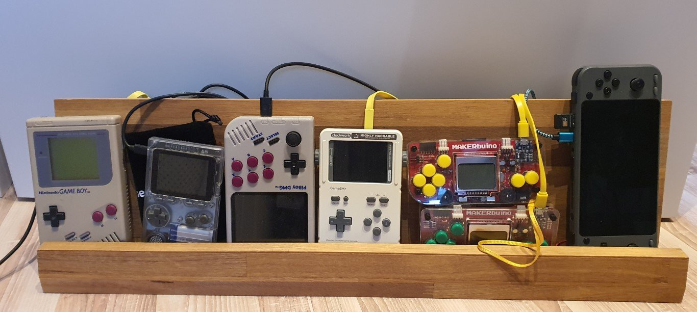
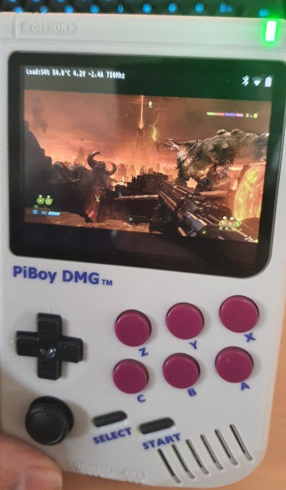
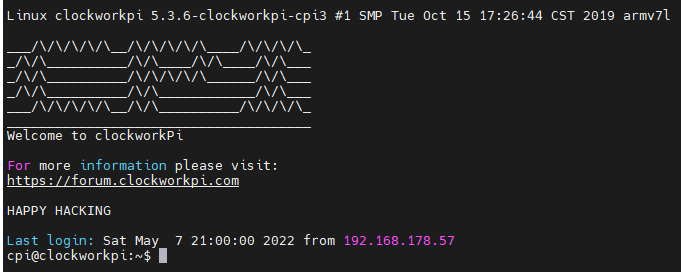
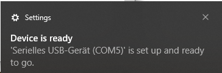
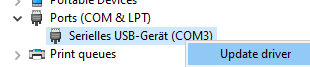

# Handhelds



## PiBoy

Here is a picture of my [PiBoy](https://www.experimentalpi.com/PiBoy-DMG--Kit_p_18.html) with a [Raspberry Pi 4, Model B](https://www.raspberrypi.org/products/raspberry-pi-4-model-b/) running [Doom Eternal](https://bethesda.net/de/game/doom) over [Steam Link](https://store.steampowered.com/app/353380/Steam_Link/):



## ODROID-GO

WIP

## Clockwork Gameshell

I am using ClockworkOS version 0.5 on my [clockworkpi](https://www.clockworkpi.com/).

- Default user: cpi
- Default password: cpi

### ClockworkOS

#### Connect via WiFi

- Make sure you are connected to a 2.5Ghz WiFi. On the Gameshell you can use "Tiny Cloud" for the Gameshell IP, user and password information.
- On your PC run e.g.: `ssh cpi@192.168.178.22`



Alternativly connect using FTP.

#### Connect via USB

##### Windows

In order to Connect via USB do the following:

- Connect your Gameshell to your PC via USB cable
- On your Gameshell, go to **Settings** -> **Network gateway switch** -> Choose USB Ethernet. You should see an IP address on the screen (e.g. 192.168.10.2).
- The PC should recognize a new COM Device:



- In the Windows Device Manager, go to the correct COM Device and click update driver. Use this [RNDIS driver for WIN drivers](https://github.com/clockworkpi/USB-Ethernet/blob/master/RNDIS%20driver%20for%20WIN.zip) to install a new network device.



- Now it is possible to connect to the the Gameshell via SSH or FTP using the IP provided on the Gameshell screen.

##### Linux

Setup Gameshell USB connection using linux ([orignal guide here](https://forum.clockworkpi.com/t/usb-eth-connect-gameshell-to-linux-pc/1643)).

Check `/etc/network/interfaces` on your CLOCKWORKPI partition, if it matches with this information:

``` txt
allow-hotplug usb0
auto usb0
iface usb0 inet static
address 10.0.0.2
netmask 255.255.255.0
gateway 10.0.0.1
dns-nameservers ${ip_of_your_router}
```

Replace `if is_wifi_connected_now():` of `/home/cpi/apps/launcher/Menu/GameShell/10_Settings/Update/__init__.py` with `if True:` to use ‘Update’ from the GameShell menu using USB.

Check with `lsusb` if you can find a device e.g. `Bus 001 Device 007: ID 0000:aaaa Netchip Technology, Inc. Linux-USB Ethernet/RNDIS Gadget`

Create new network rules using your internet_interface and gameshell_interface:

``` sh
sudo iptables -t nat -A POSTROUTING -o ${internet_interface} -j MASQUERADE
sudo iptables -A FORWARD -m conntrack --ctstate RELATED,ESTABLISHED -j ACCEPT
sudo iptables -A FORWARD -i ${gameshell_interface} -o ${internet_interface} -j ACCEPT
```

Assign a static IP address to your gameshell_interface. The ip 10.0.0.1 should match gateway of step 4!

``` sh
sudo ip link set up dev ${gameshell_interface}
sudo ip addr add 10.0.0.1/24 dev ${gameshell_interface}
```

Enable internet forwarding:

``` sh
sudo sysctl net.ipv4.ip_forward=1
```

Login to your GameShell `ssh cpi@10.0.0.2`, copy files and e.g. check if the GameShell can reach the internet: `ping clockworkpi.com`.

### Update

To get updates using ClockworkOS version 0.5. run this one time:

``` sh
sudo apt install dirmngr
sudo apt-key adv --keyserver keyserver.ubuntu.com --recv-keys 40976EAF437D05B5
sudo apt-key adv --keyserver keyserver.ubuntu.com --recv-keys 3B4FE6ACC0B21F32
sudo apt-get update
```

Now `sudo apt-get update` should work fine.

### Settings

### WiFi power saving

Disable the WiFi power saving mode for a stable SSH connection

``` sh
sudo iw wlan0 set power_save off
sudo iw wlan0 get power_save
```

To set this on every boot, add a script named `powersave_off` to `/etc/network/if-up.d/` and set the exec permission:

``` sh
chmod +x /etc/network/if-up.d/powersave_off
```

Here is the script:

``` sh
set -e

# Don't bother for loopback
if [ "$IFACE" = lo ]; then
        exit 0
fi

# Only run from ifup.
if [ "$MODE" != start ]; then
        exit 0
fi

# Only do it once (skip for inet6).
if [ "$ADDRFAM" != inet ]; then
        exit 0
fi

/sbin/iw dev wlan0 set power_save off

exit 0
```

### Pico-8

Copy latest pico fine (in my case `pico-8_0.2.4c_raspi.zip`) to `~/games/PICO-8/` on my Clockwork Gameshell using SSH/SCP (in my case `10.0.1.69`)

``` sh
scp pico-8_0.2.4c_raspi.zip cpi@10.0.1.69:~/games/PICO-8/
```

### Copy Games

Navigate to `\\192.168.178.22\games` and copy+paste any games you want to play in the correct folder.

Or use scp to copy this snes `game.rom` e.g. :

``` sh
scp game.rom cpi@10.0.1.69:~/games/snes/
```
