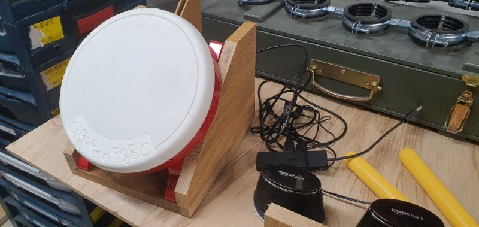
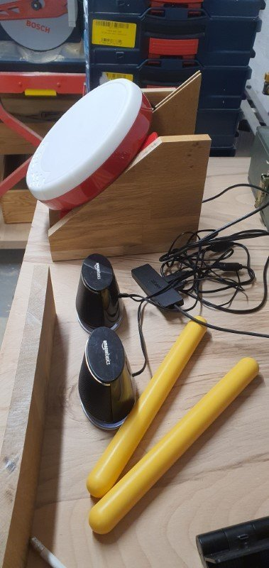
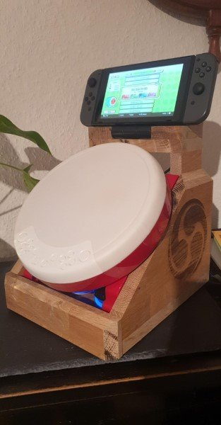
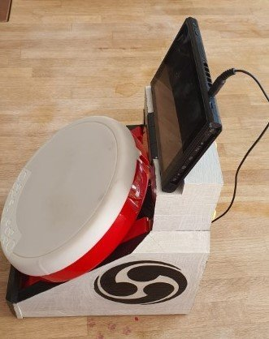
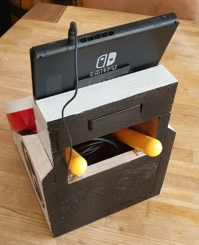

# Switch Taiko

I built a hardware case for the original [hori taiko drum controller](https://hori.jp/products/nsw/taiko_tb/) for [Nintendo Switch](https://www.nintendo.com/switch/) which is a great addition to play the game [Taiko no Tatsujin: Drum 'n' Fun!](https://www.nintendo.com/games/detail/taiko-no-tatsujin-drum-n-fun-switch/).

## Components

- [Hori taiko drum controller](https://hori.jp/products/nsw/taiko_tb/)
- [Amazon basic speakers](https://www.amazon.de/AmazonBasics-USB-Powered-Computer-Speakers-Dynamic/dp/B07DDK3W5D)
- [Anker Ultra Slim 4 Port USB 3.0 Hub](https://us.anker.com/products/a7516)
- [Switch Docking station](https://www.amazon.de/gp/product/B08CKFYPHF)

## In Progress

## Finshed but without paint

## Final build

## Links

- <https://taikotime.blogspot.com/>
- <https://en.wikipedia.org/wiki/Taiko_no_Tatsujin>
- <https://hori.jp/products/nsw/taiko_tb/>
