# Einhorn

| Einhorn  |  is a simple, fast paced dice rolling game in which luck is the main factor to win the game. |
|------------------------------------------------------|--|
|  | Each player starts with six stones. Bet on your roll outcome and receive or pay stones. Roll an `Einhorn` and receive the unicorn figure to take stones from your opponents. Once a player looses all stones the current game ends. All other players keep their stones. Bet on the unicorn figure for an advantage in the next game. Be better at predicting your role outcome than the other players. After ten games, the player with the most stones wins.|

This is how a self-made version of the game looks like:

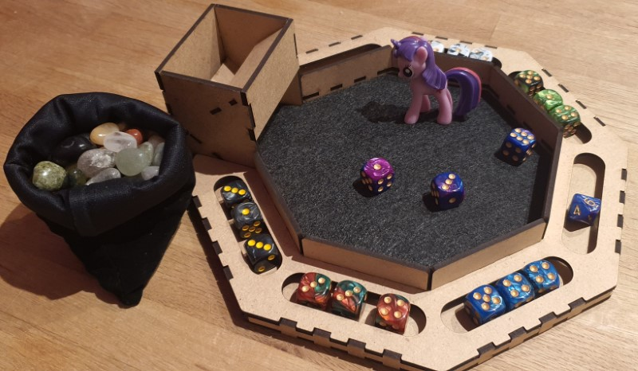

Below is an overview of main steps in the game:

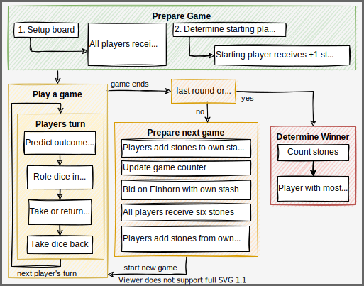

## Prepare the game

|||
|--|--|
|Players: |2-6 (best 3-5)|
|Time: |30 min|
|Age: |6+|

**Setup the game**

- Put all stones in a bowl. (also called "central stash")
- Place the dice tray centrally.
- Place the game counter dice (D10) in the center and set it to 1.
- Place the unicorn figure centrally between dice tray and central stash.
- Each player receives 3x six sided dice (D6), a card with the roll-result overview and 6 stones.

**Agree on the win condition**

- Agree on how many games shall be played to determine the winner (default is 10)

**Determine who starts**

- All players roll their three dice and the player with highest sum starts the game.
- If there is a draw, those players roll again until a starting player is determined.
- The player that starts the game receives an additional stone.

This is an example setup for 4 players:


### Differences between the stone stashes

The table explains the differences between the central stone stash, the game stones and the players stone stash:

| Term          | Explanation                                                                                                                                                                                                                                                                                   |
|---------------|-----------------------------------------------------------------------------------------------------------------------------------------------------------------------------------------------------------------------------------------------------------------------------------------------|
| Central stash | All stones remaining in the game. [Take stones or return stones](#take-or-give-stones) depending on your roll prediction outcome. If there are no stones left in this stash the [game ends](#game-ends).|
| Game stones   | Stones a player has for the [current game](#play). If a player has no more stones the [game ends](#game-ends).|
| Player stash  | Stones a player has won in previous games. Only usable when [betting on the unicorn](#bid-on-the-einhorn) or [adding stones](#receive-6-game-stones) to the initial 6 game stones received at the beginning of a new game. The player with the most stones in this stash [wins the game](#determine-the-winner).|

## Play

This section explains the actions in a players turn and how one game is played. One game may be as fast as 1min but can also take 10min depending on how fast one player looses all stones. Play 10 games for a standard match.

### Predict outcome or remain silent

There are 4 predictable outcomes. Below is a list of all possible results and their probability:

| Roll Result           | Rule                                                                     | Formula                                             | Example    | Combinations | Probability |
|-----------------------|--------------------------------------------------------------------------|-----------------------------------------------------|------------|--------------|-------------|
| ⚰️ Das Unvermeidliche | A number & that number +1 and something else which is not one of the two | ```n & n+1 & (!n / !n+1)```                         | ⚀⚁⚃ or ⚂⚃⚀ | 96 of 216    | 44,4%       |
| 🎁 Wunsch             | Two of a kind & something else and which is not that number              | ```2x n & !n```                                     | ⚀⚀⚁ or ⚁⚃⚁ | 90 of 216    | 41,7%       |
| 🦄 Einhorn            | All numbers must be at least 2 apart                                     | ```n & n+2 & (n+4 / n+5)``` and ```n & n+3 & n+5``` | ⚀⚂⚄ or ⚀⚃⚅ | 24 of 216    | 11,1%       |
| ☢️ Dreifaltigkeit     | Three of a kind.                                                         | ```3x n```                                          | ⚁⚁⚁ or ⚅⚅⚅ | 6 of 216     | 2,8%        |

The current player decides to either:

- predict the upcoming roll attempt
- **or** remain silent (passive roll / no prediction)

Once done, the player proceeds to roll all three dice in the dice tray.

Depending on the rolled outcome the player then [takes or gives stones](#take-or-give-stones).

### Take or give stones

Based on the players roll attempt and the prediction made, there is one possible result that leads to adding or removing stones from the players game stash. E.g., in case the roll result was a `Wunsch`, read that line in your roll-result overview card, then check if the prediction was correct, wrong or no prediction was made (passive). Then add or remove stones accordingly.

| Roll Result           | Correct Prediction             | Wrong Prediction | No Prediction |
|-----------------------|--------------------------------|------------------|---------------|
| ⚰️ Das Unvermeidliche | +2                             | -2               | -1            |
| 🎁 Wunsch             | +2                             | -2               | -1            |
| 🦄 Einhorn            | +5                             | -5               | +1            |
| ☢️ Dreifaltigkeit     | [WIN](#roll-dreifaltigkeit) | +1               | +5            |

As you can see from the table above, the most common roll results are `Das Unvermeidliche` and `Wunsch`. The improbable results `Einhorn` and `Dreifaltigkeit` reward taking higher risks with higher rewards.

Please note:

- It doesn't matter what prediction was made specifically. What matters, is if the prediction was correct, wrong or if no prediction was made. In other words: The stones added or removed are determined by the result rolled, not by what was predicted. E.g., if a `Wunsch` is rolled, it doesn't matter if `Das Unvermeidliche`, `Einhorn` or `Dreifaltigkeit` were predicted, all three are wrong and the player must return 2 stones to the central stash.
- If a player forgets to make a prediction or mentions the prediction too late and rolls the dice, this is dealt as a passive roll (no prediction).

Remember to first take or give stones, then put your dice back from the dice tray. With this action your turn ends and it's the next players turn.

#### Roll Einhorn

When rolling an `Einhorn`, this player additionally receives the unicorn figure.

The unicorn figure has the following effects:

- When rolling an `Einhorn` no stones are earned/paid = nothing happens. Therefore, as the owner of the unicorn figure, avoid predicting an `Einhorn`.
- The player can give or take stones not only from the central stash, but also from any other player. However, whether the player can take stones still depends on the roll attempt outcome! You can only take stones from one player. If the player doesn't have enough stones you only get what the player can offer (and the [current game ends](#game-ends)).
- The unicorn figure is passed once another player rolls an `Einhorn`.

#### Roll Dreifaltigkeit

If you roll `Dreifaltigkeit` you will always receive stones (see [overview)](#take-or-give-stones). However, if you predict `Dreifaltigkeit` correctly (2,8% chance), you receive all game stones from all players (player stash excluded!) and therewith instantly [end the current game](#game-ends).

### Game ends

Once a player has no stones left, the game ends. In case a player needs to pay more stones than they have, only the available game stones are given. (Example: `Einhorn` was rolled and predicted wrong and the player has 3 stones left, only those 3 stones return to the central stash.)

- If this was the last game (e.g. game #10) or if all stones from the central stash are gone, proceed to [determine the winner](#determine-the-winner).
- Else, proceed with the steps to [prepare the next game](#prepare-next-game).

## Prepare next game

To prepare for the next game, follow these steps:

- All players take their current stones and add them to their stash.
- The unicorn figure is returned to the center of the dice tray.
- The game counter is updated and layed next to the unicorn figure.
- All players [bid on the unicorn](#bid-on-the-unicorn).
- All stones used for bidding are returned to the central stash.
- Everyone [receives 6 stones](#receive-6-game-stones) from the central stash as their game stones for the next game.
- Every players may add more stones from their stash to the game stones for the next game.
- A [new game](#play) begins and the owner of the unicorn figure starts.

### Bid on the unicorn

All players can now bet on the unicorn figure with their stones available from their own stash. Bidding on the unicorn works as follows:

- Place the unicorn figure in the middle of the dice tray.
- All players bet with their personal stone stash (if available) to receive the unicorn figure in the next game. You may bid zero stones if you want but you have to bid! E.g. if you have no stones in your stash you must close your hand and hold it over the table until all are ready.
- Secretly place stones in your hand to be on the unicorn figure. Don't show how much you are bidding until all reveal their bet by opening their hands at the same time.
- All players put their stones used for the bid in the central stash. This means, if you do not win the unicorn figure you still loose the stones you used for your bet!
- The unicorn figure goes to the highest bidder. In case there is a tie, all highest bidders roll their 3 dice and the player with the highest total sum receives the unicorn figure. E.g., if all bid zero stones, all must roll their dice. In case there is another tie, the remaining players now tied re-roll the dice until a winner can be determined.

### Receive 6 game stones

- All players receive 6 stones from the central stash.
- Players with a personal stone stash may choose to add stones to their game stones at this time only.

Please note: You can only loose your game stones. If you add stones from your stone stash to your current game stones you can loose them but have a higher chance of not loosing the game.

## Determine the winner

All players count the stones they have in their own stone stash.

Winner of this game of Einhorn is the player with most stones.

In case of a tie, these players roll their three dice successively until one player rolls an `Einhorn` and is determined the winner.

## Extras

This is not needed to understand or play the game.

??? check "Example game"
    The following is an example game play with three players:

    Preparing the game:

    - All players agree to play the default of 10 games.
    - All players take 3 dice and 6 stones.
    - Player 1 rolls the highest total number with 3 dice (1+4+5=10) and may start the game. Player 1 receives an extra stone.

    First game:

    - Player 1 starts the game and bets on rolling a `Wunsch`. Player 1 then proceeds to roll 1,2,5 which is `das Unvermeidliche` and therefore loses 2 stones. Player 1 started with 7 stones and now has 5. Now it is the next players turn.
    - The 2nd player predicts an `Einhorn` and rolls a 1,3,6 and therefore gains 5 stones as well as the unicorn figure.
    - The 3rd player choses to not predict anything and rolls 2,2,2 which is `Dreifaltigkeit`. In this case the player gains one stone.
    - It is player 1 turn again and predicts `das Unvermeidliche`, then rolls 3,1,4 which is `das Unvermeidliche`. Player 2 takes one stone from the central stash.
    - Player 2 now has the `Einhorn` and predicts `das Unvermeidliche` as well and rolls 4,5,6 which is `das Unvermeidliche`. Player 2 takes the 2 stones from player 1 instead of the central stash.

    The game goes on like this until, in our example, player 2 loses the first game. At this point player 1 has 8 stones and player 3 has 4 stones.

    The `Einhorn` is now returned (player 3 had it last) and placed on the dice tray. The `Einhorn` is now open for auction. Since this is the first game and player 2 lost the game there are no stones to bet with for this player. Player 1 bets 3 stones and player 3 bets 1 stone. Both players put the stones they bet in the central stash and player 1 receives the unicorn figure. Player 1 now has 8-3=5 stones in their own stone stash and player 3 has 4-1 stones in their stash.

    All players now receive 6 new stones. Player 1 decides to add 2 stones from the own stash to the current play stash. Player 1 now has 4 stones remaining in their own stash and 6+2=8 stones to play with in this game as well as the unicorn figure. Both other players do not add stones and start with 6 stones.

    Player 1 with the unicorn figure starts the new game and the game continues.

    At the end of game 10, player 1 has 20 stones, player 2 has 15 stones and player 3 has 30 stones. Player 3 therefore wins the game.

<script src="https://polyfill.io/v3/polyfill.min.js?features=es6"></script>
<script src="https://cdn.jsdelivr.net/npm/mathjax@3/es5/tex-chtml.js"></script>

??? warning "Warning: Math"
    With 3x D6 we get a total of 216 (6x6x6 or 6^3) possible outcomes.

    Let us now look at unique rolls. To get all possible combinations we can use this formula for combination with repetition:

    \begin{align}
        \frac{(n+k-1)!}{k!*(n-1)!}
    \end{align}

    To learn more read about [Binomial coefficient](https://en.wikipedia.org/wiki/Binomial_coefficient) and [combinatorics](https://en.wikipedia.org/wiki/Combinatorics).

    With 3x D6 we get n = 6, k = 3 resulting in 56 combinations.

    \begin{align}
        \frac{(6+3-1)!}{3!*(6-1)!} = 56
    \end{align}

    You can copy ```(6+3-1)!/(3!*(6-1)!)``` to WolframAlpha to calculate it or use [this link](https://www.wolframalpha.com/input/?i=%286%2B3-1%29%21%2F%283%21*%286-1%29%21%29).

    These 56 combinations distribute as follows:

    | Result                |                                                                                                                                                                     | Amount | Percent |
    |-----------------------|---------------------------------------------------------------------------------------------------------------------------------------------------------------------|--------|---------|
    | ⚰️ Das Unvermeidliche | ⚀⚁⚃, ⚀⚁⚄, ⚀⚁⚅, ⚁⚂⚀ </br> ⚁⚂⚄, ⚁⚂⚅, ⚂⚃⚀, ⚂⚃⚁</br>⚂⚃⚅, ⚃⚄⚀, ⚃⚄⚁, ⚃⚄⚂, </br> ⚄⚅⚀, ⚄⚅⚁, ⚄⚅⚂, ⚄⚅⚃                                                                        | 16     | 29 %    |
    | 🎁 Wunsch             | ⚀⚀⚁, ⚀⚀⚂, ⚀⚀⚃, ⚀⚀⚄, ⚀⚀⚅</br>⚁⚁⚀, ⚁⚁⚂, ⚁⚁⚃, ⚁⚁⚄, ⚁⚁⚅</br>⚂⚂⚀, ⚂⚂⚁, ⚂⚂⚃, ⚂⚂⚄, ⚂⚂⚅</br>⚃⚃⚀, ⚃⚃⚁, ⚃⚃⚂, ⚃⚃⚄, ⚃⚃⚅</br>⚄⚄⚀, ⚄⚄⚁, ⚄⚄⚂, ⚄⚄⚃, ⚄⚄⚅</br>⚅⚅⚀, ⚅⚅⚁, ⚅⚅⚂, ⚅⚅⚃, ⚅⚅⚄ | 30     | 54 %    |
    | 🦄 Einhorn            | ⚀⚂⚄, ⚀⚂⚅, ⚀⚃⚅, ⚁⚃⚅                                                                                                                                                  | 4      | 7 %     |
    | ☢️ Dreifaltigkeit     | ⚀⚀⚀, ⚁⚁⚁, ⚂⚂⚂</br>⚃⚃⚃, ⚄⚄⚄, ⚅⚅⚅                                                                                                                                     | 6      | 11 %    |

    However, this is not the probability of each combination since the distinct combinations are not evenly distributed over the 216 possible outcomes.

    I do not know how to calculate this, so I created a python script and analyzed of all possible outcomes. To view the full list, expand "Full list of possible dice combinations". The outcome is as follows:

    | Result                | total      | distinct |
    |-----------------------|------------|----------|
    | ⚰️ Das Unvermeidliche | 96 (44,4%) | 16 (29%) |
    | 🎁 Wunsch             | 90 (41,7%) | 30 (54%) |
    | 🦄 Einhorn            | 24 (11,1%) | 4 (7%)   |
    | ☢️ Dreifaltigkeit     | 6 (2,8%)   | 6 (11%)  |

    The result shows that Das Unvermeidliche has less distinct variations than Wunsch but more possible combinations.

??? note "Script to analyze all possible roll attempts"
    This python script calculates all possible dice results of the game Einhorn, counts the combinations and prints the probability of each of the four roll outcomes.

    ```py
    from itertools import product # pip install itertools
    from collections import OrderedDict
    import math

    # Dice settings
    diceFaces = 6
    diceSmallestNumber = 1
    diceHighestNumber = 6
    diceAmount = 3

    # Counter
    Dreifaltigkeit = 0
    Wunsch = 0
    Unvermeidlich = 0
    Einhorn = 0

    # Create a list of all possible roll attempts
    rolls = list(product(range(diceSmallestNumber,diceHighestNumber+1), repeat=diceAmount))

    # Iterate roll attempts and check result
    for roll in rolls:
        # Prepare list
        removedDoubleRoll = tuple(OrderedDict.fromkeys(roll).keys())
        sortedRoll = list(removedDoubleRoll)
        sortedRoll.sort() 

        # Count and print result
        if (len(sortedRoll)==2):
            print(roll, " Wunsch")
            Wunsch += 1
        elif (len(sortedRoll)==1):
            print(roll, " Dreifaltigkeit")
            Dreifaltigkeit += 1
        else:
            if ((sortedRoll[1]-sortedRoll[0]==1) or (sortedRoll[2]-sortedRoll[1]==1)):
                print(sortedRoll, " Das Unvermeidliche")
                Unvermeidlich += 1
            else:
                print(sortedRoll, " Einhorn")
                Einhorn += 1

    # Print stats
    print("\nTotal amount of possible rolls: ", len(rolls))
    print("Total amount of distint rolls: ", int((math.factorial(diceFaces+diceAmount-1))/(math.factorial(diceAmount)*(math.factorial(diceFaces-1)))))
    print("\nDreifaltigkeit: ", Dreifaltigkeit, "({:.1f}".format(Dreifaltigkeit / len(rolls) * 100), "%)")
    print("Wunsch: ", Wunsch, "({:.1f}".format(Wunsch / len(rolls) * 100), "%)")
    print("Das Unvermeidliche: ", Unvermeidlich, "({:.1f}".format(Unvermeidlich / len(rolls) * 100), "%)")
    print("Einhorn: ", Einhorn, "({:.1f}".format(Einhorn / len(rolls) * 100), "%)")
    ```

??? tip "Creating the game"
    **Self-made version**

    Required: 3D Printer, Laser Cutter, spray paint, acrylic paint

    - **Dice tray**: Laser cut from thingiverse: I found a great design on [thingiverse](https://www.thingiverse.com) called [Octagonal Dice Tray, Laser Cut](https://www.thingiverse.com/thing:3694820) by [Patrik Grip-Jansson (kap42)](https://www.thingiverse.com/kap42/designs).
    - **Dice**: 3D print [these dice](https://www.thingiverse.com/thing:2627417) by [Udo](https://www.thingiverse.com/physudo/designs) from [thingiverse](https://www.thingiverse.com). Use different colored PLA for each player. You only need to print the D6 (3x 6 colors) and D10 (1x).
    - **Stones**: Go outside and collect stones. Choose a size that works with the size of your dice tray. Stones should all roughly have the same size and form. Paint them with acrylic paint if you like.
    - **Unicorn figure**: 3D print this [unicorn](https://www.thingiverse.com/thing:182335) by [Yahoo! JAPAN](https://www.thingiverse.com/yahoojapan/designs) from [thingiverse](https://www.thingiverse.com) and color it with spray paint and acrylic paint.

    You can [download all required files here](_einhorn-game.7z).

    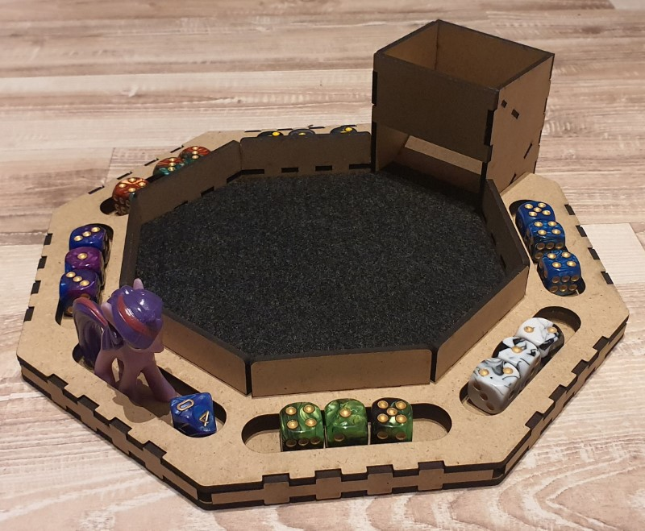 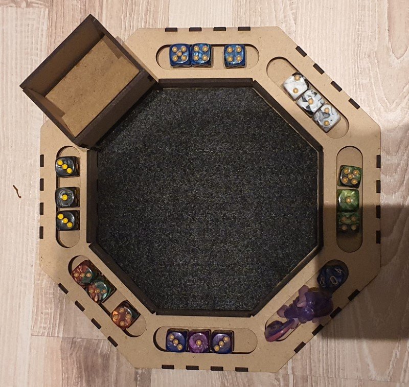

    Additionally you can create boxes to hold the game stones as well as boxes for each player for their stones stash. I thought about how to divide the octagon best to use up the space and also be able to easily create the required boxes.

    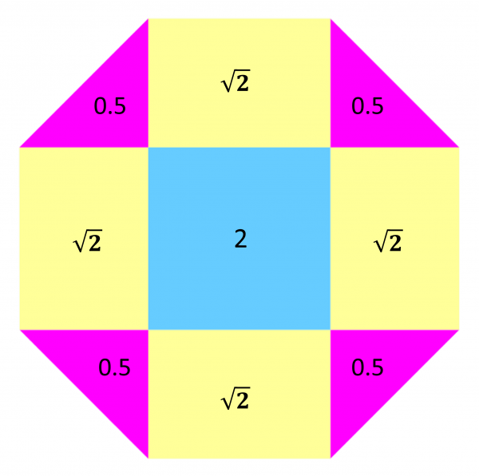 

    I am using the [boxes.py TwoPiece](https://festi.info/boxes.py/TwoPiece) template to create all 4 boxes. The 3 stone stash boxes are all identical. The larger box for the game stones is reaches below the dice tray for better fixation.

    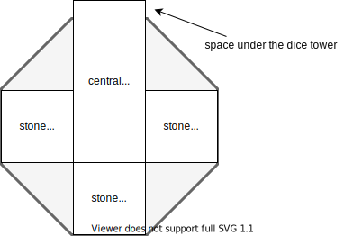

    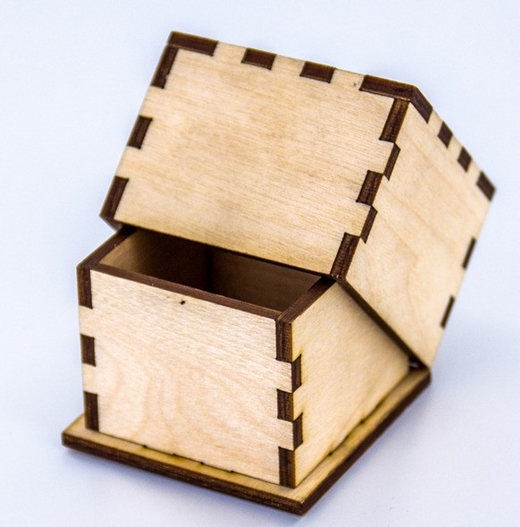

    This is the print process creating dice and unicorn figure using [PA 12 Smooth (SLS)](https://www.sinterit.com/pa12-smooth/) with a [Sinterit Lisa Rev.B printer](https://www.sinterit.com/sinterit-lisa/lisa-de/#):

    [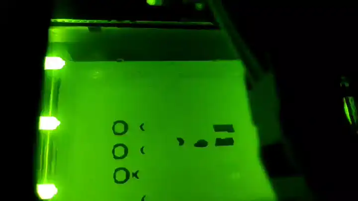](_einhorn-print.mp4)

    And this is the result:

    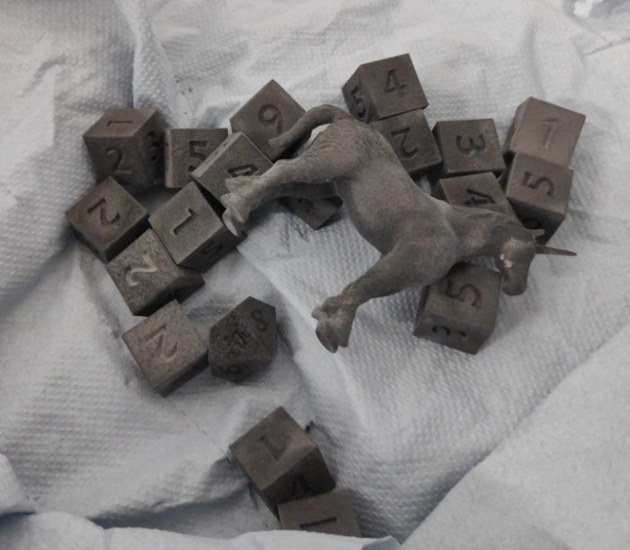

    Next, I will paint the dice and figure.

    **Buy version**

    Required: 30-100 Euro

    - **Dice tray**: Try to find a dice tray with a top/lid. There are some nice but expensive octagonal shaped dice trays available. I even found one with a unicorn artwork :)
    - Dice: You need 3 dice of the same color and 6 different colors so a total of 18x D6. 12mm is a good size for a dice. I prefer the numbers written on the sides instead of the dots but both is perfectly fine. Additionally, you need a D10 to count the games played. As always, it is cheaper to buy in bulk and dice packs are available in a 36x dice box as well as mixed color option for 50x dice and 100x dice. This way you should spend about 7 Euro for all dice.
    - **Stones**: Drum stones feel and look great and this what i went with. You can save a lot of money when buying in bulk (e.g. 5kg), mixed stones and avoid terms like esoteric, etc. However, anything can be used as long as enough fit in the dice tray and are more or less the same size. I tried different stone sizes and 1-2cm work best in my opinion (depends on the size of your dice tray holding the stones). The stone costs vary a lot but I spent about 6 Euro for the stones needed for one game. Other options that could work are marbles (but round things may be annoying during play) or any small glass objects, coins, poker chips, ...    
    - **Unicorn figure**: I found a set of 10 unicorns used to decorate cakes for 10 Euro. Search for "Unicorn Mini Figures Set" or "Unicorn Cake Decoration". Since I will be creating a few games I think I can use the extra unicorns (and they make a good small present as well) so I spent about 1 Euro on the unicorn.

    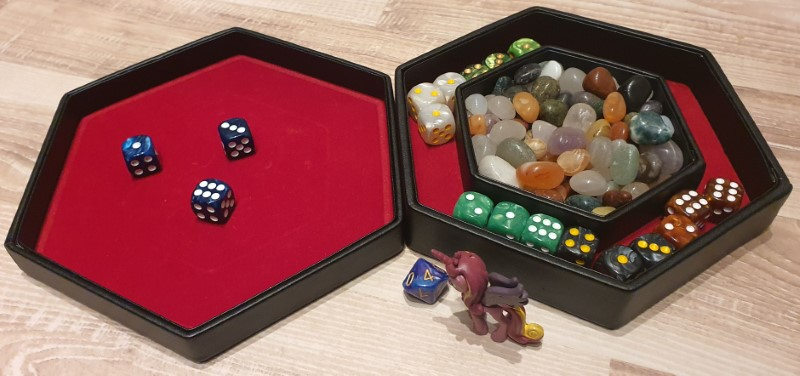

    **Lego version**
    
    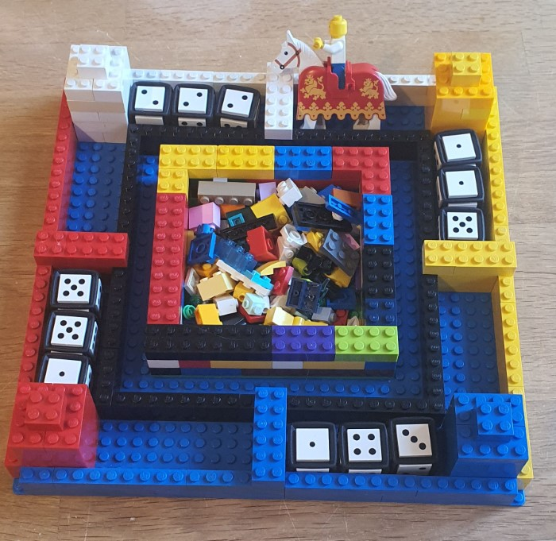

    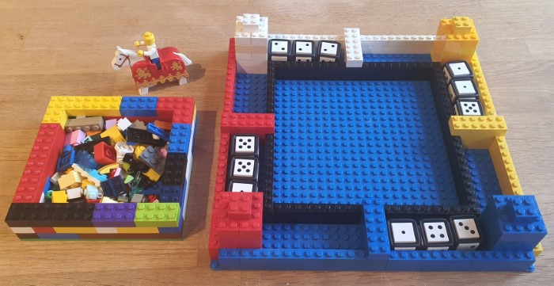

??? info "Full list of possible dice combinations"
    This is a full list of all possible roll combinations in this game and the result based on the described rules above.
    
    | D1 | D2 | D3 | Result             |
    |----|----|----|--------------------|
    | 1  | 1  | 1  | Dreifaltigkeit     |
    | 1  | 1  | 2  | Wunsch             |
    | 1  | 1  | 3  | Wunsch             |
    | 1  | 1  | 4  | Wunsch             |
    | 1  | 1  | 5  | Wunsch             |
    | 1  | 1  | 6  | Wunsch             |
    | 1  | 2  | 1  | Wunsch             |
    | 1  | 2  | 2  | Wunsch             |
    | 1  | 2  | 3  | Das Unvermeidliche |
    | 1  | 2  | 4  | Das Unvermeidliche |
    | 1  | 2  | 5  | Das Unvermeidliche |
    | 1  | 2  | 6  | Das Unvermeidliche |
    | 1  | 3  | 1  | Wunsch             |
    | 1  | 2  | 3  | Das Unvermeidliche |
    | 1  | 3  | 3  | Wunsch             |
    | 1  | 3  | 4  | Das Unvermeidliche |
    | 1  | 3  | 5  | Einhorn            |
    | 1  | 3  | 6  | Einhorn            |
    | 1  | 4  | 1  | Wunsch             |
    | 1  | 2  | 4  | Das Unvermeidliche |
    | 1  | 3  | 4  | Das Unvermeidliche |
    | 1  | 4  | 4  | Wunsch             |
    | 1  | 4  | 5  | Das Unvermeidliche |
    | 1  | 4  | 6  | Einhorn            |
    | 1  | 5  | 1  | Wunsch             |
    | 1  | 2  | 5  | Das Unvermeidliche |
    | 1  | 3  | 5  | Einhorn            |
    | 1  | 4  | 5  | Das Unvermeidliche |
    | 1  | 5  | 5  | Wunsch             |
    | 1  | 5  | 6  | Das Unvermeidliche |
    | 1  | 6  | 1  | Wunsch             |
    | 1  | 2  | 6  | Das Unvermeidliche |
    | 1  | 3  | 6  | Einhorn            |
    | 1  | 4  | 6  | Einhorn            |
    | 1  | 5  | 6  | Das Unvermeidliche |
    | 1  | 6  | 6  | Wunsch             |
    | 2  | 1  | 1  | Wunsch             |
    | 2  | 1  | 2  | Wunsch             |
    | 1  | 2  | 3  | Das Unvermeidliche |
    | 1  | 2  | 4  | Das Unvermeidliche |
    | 1  | 2  | 5  | Das Unvermeidliche |
    | 1  | 2  | 6  | Das Unvermeidliche |
    | 2  | 2  | 1  | Wunsch             |
    | 2  | 2  | 2  | Dreifaltigkeit     |
    | 2  | 2  | 3  | Wunsch             |
    | 2  | 2  | 4  | Wunsch             |
    | 2  | 2  | 5  | Wunsch             |
    | 2  | 2  | 6  | Wunsch             |
    | 1  | 2  | 3  | Das Unvermeidliche |
    | 2  | 3  | 2  | Wunsch             |
    | 2  | 3  | 3  | Wunsch             |
    | 2  | 3  | 4  | Das Unvermeidliche |
    | 2  | 3  | 5  | Das Unvermeidliche |
    | 2  | 3  | 6  | Das Unvermeidliche |
    | 1  | 2  | 4  | Das Unvermeidliche |
    | 2  | 4  | 2  | Wunsch             |
    | 2  | 3  | 4  | Das Unvermeidliche |
    | 2  | 4  | 4  | Wunsch             |
    | 2  | 4  | 5  | Das Unvermeidliche |
    | 2  | 4  | 6  | Einhorn            |
    | 1  | 2  | 5  | Das Unvermeidliche |
    | 2  | 5  | 2  | Wunsch             |
    | 2  | 3  | 5  | Das Unvermeidliche |
    | 2  | 4  | 5  | Das Unvermeidliche |
    | 2  | 5  | 5  | Wunsch             |
    | 2  | 5  | 6  | Das Unvermeidliche |
    | 1  | 2  | 6  | Das Unvermeidliche |
    | 2  | 6  | 2  | Wunsch             |
    | 2  | 3  | 6  | Das Unvermeidliche |
    | 2  | 4  | 6  | Einhorn            |
    | 2  | 5  | 6  | Das Unvermeidliche |
    | 2  | 6  | 6  | Wunsch             |
    | 3  | 1  | 1  | Wunsch             |
    | 1  | 2  | 3  | Das Unvermeidliche |
    | 3  | 1  | 3  | Wunsch             |
    | 1  | 3  | 4  | Das Unvermeidliche |
    | 1  | 3  | 5  | Einhorn            |
    | 1  | 3  | 6  | Einhorn            |
    | 1  | 2  | 3  | Das Unvermeidliche |
    | 3  | 2  | 2  | Wunsch             |
    | 3  | 2  | 3  | Wunsch             |
    | 2  | 3  | 4  | Das Unvermeidliche |
    | 2  | 3  | 5  | Das Unvermeidliche |
    | 2  | 3  | 6  | Das Unvermeidliche |
    | 3  | 3  | 1  | Wunsch             |
    | 3  | 3  | 2  | Wunsch             |
    | 3  | 3  | 3  | Dreifaltigkeit     |
    | 3  | 3  | 4  | Wunsch             |
    | 3  | 3  | 5  | Wunsch             |
    | 3  | 3  | 6  | Wunsch             |
    | 1  | 3  | 4  | Das Unvermeidliche |
    | 2  | 3  | 4  | Das Unvermeidliche |
    | 3  | 4  | 3  | Wunsch             |
    | 3  | 4  | 4  | Wunsch             |
    | 3  | 4  | 5  | Das Unvermeidliche |
    | 3  | 4  | 6  | Das Unvermeidliche |
    | 1  | 3  | 5  | Einhorn            |
    | 2  | 3  | 5  | Das Unvermeidliche |
    | 3  | 5  | 3  | Wunsch             |
    | 3  | 4  | 5  | Das Unvermeidliche |
    | 3  | 5  | 5  | Wunsch             |
    | 3  | 5  | 6  | Das Unvermeidliche |
    | 1  | 3  | 6  | Einhorn            |
    | 2  | 3  | 6  | Das Unvermeidliche |
    | 3  | 6  | 3  | Wunsch             |
    | 3  | 4  | 6  | Das Unvermeidliche |
    | 3  | 5  | 6  | Das Unvermeidliche |
    | 3  | 6  | 6  | Wunsch             |
    | 4  | 1  | 1  | Wunsch             |
    | 1  | 2  | 4  | Das Unvermeidliche |
    | 1  | 3  | 4  | Das Unvermeidliche |
    | 4  | 1  | 4  | Wunsch             |
    | 1  | 4  | 5  | Das Unvermeidliche |
    | 1  | 4  | 6  | Einhorn            |
    | 1  | 2  | 4  | Das Unvermeidliche |
    | 4  | 2  | 2  | Wunsch             |
    | 2  | 3  | 4  | Das Unvermeidliche |
    | 4  | 2  | 4  | Wunsch             |
    | 2  | 4  | 5  | Das Unvermeidliche |
    | 2  | 4  | 6  | Einhorn            |
    | 1  | 3  | 4  | Das Unvermeidliche |
    | 2  | 3  | 4  | Das Unvermeidliche |
    | 4  | 3  | 3  | Wunsch             |
    | 4  | 3  | 4  | Wunsch             |
    | 3  | 4  | 5  | Das Unvermeidliche |
    | 3  | 4  | 6  | Das Unvermeidliche |
    | 4  | 4  | 1  | Wunsch             |
    | 4  | 4  | 2  | Wunsch             |
    | 4  | 4  | 3  | Wunsch             |
    | 4  | 4  | 4  | Dreifaltigkeit     |
    | 4  | 4  | 5  | Wunsch             |
    | 4  | 4  | 6  | Wunsch             |
    | 1  | 4  | 5  | Das Unvermeidliche |
    | 2  | 4  | 5  | Das Unvermeidliche |
    | 3  | 4  | 5  | Das Unvermeidliche |
    | 4  | 5  | 4  | Wunsch             |
    | 4  | 5  | 5  | Wunsch             |
    | 4  | 5  | 6  | Das Unvermeidliche |
    | 1  | 4  | 6  | Einhorn            |
    | 2  | 4  | 6  | Einhorn            |
    | 3  | 4  | 6  | Das Unvermeidliche |
    | 4  | 6  | 4  | Wunsch             |
    | 4  | 5  | 6  | Das Unvermeidliche |
    | 4  | 6  | 6  | Wunsch             |
    | 5  | 1  | 1  | Wunsch             |
    | 1  | 2  | 5  | Das Unvermeidliche |
    | 1  | 3  | 5  | Einhorn            |
    | 1  | 4  | 5  | Das Unvermeidliche |
    | 5  | 1  | 5  | Wunsch             |
    | 1  | 5  | 6  | Das Unvermeidliche |
    | 1  | 2  | 5  | Das Unvermeidliche |
    | 5  | 2  | 2  | Wunsch             |
    | 2  | 3  | 5  | Das Unvermeidliche |
    | 2  | 4  | 5  | Das Unvermeidliche |
    | 5  | 2  | 5  | Wunsch             |
    | 2  | 5  | 6  | Das Unvermeidliche |
    | 1  | 3  | 5  | Einhorn            |
    | 2  | 3  | 5  | Das Unvermeidliche |
    | 5  | 3  | 3  | Wunsch             |
    | 3  | 4  | 5  | Das Unvermeidliche |
    | 5  | 3  | 5  | Wunsch             |
    | 3  | 5  | 6  | Das Unvermeidliche |
    | 1  | 4  | 5  | Das Unvermeidliche |
    | 2  | 4  | 5  | Das Unvermeidliche |
    | 3  | 4  | 5  | Das Unvermeidliche |
    | 5  | 4  | 4  | Wunsch             |
    | 5  | 4  | 5  | Wunsch             |
    | 4  | 5  | 6  | Das Unvermeidliche |
    | 5  | 5  | 1  | Wunsch             |
    | 5  | 5  | 2  | Wunsch             |
    | 5  | 5  | 3  | Wunsch             |
    | 5  | 5  | 4  | Wunsch             |
    | 5  | 5  | 5  | Dreifaltigkeit     |
    | 5  | 5  | 6  | Wunsch             |
    | 1  | 5  | 6  | Das Unvermeidliche |
    | 2  | 5  | 6  | Das Unvermeidliche |
    | 3  | 5  | 6  | Das Unvermeidliche |
    | 4  | 5  | 6  | Das Unvermeidliche |
    | 5  | 6  | 5  | Wunsch             |
    | 5  | 6  | 6  | Wunsch             |
    | 6  | 1  | 1  | Wunsch             |
    | 1  | 2  | 6  | Das Unvermeidliche |
    | 1  | 3  | 6  | Einhorn            |
    | 1  | 4  | 6  | Einhorn            |
    | 1  | 5  | 6  | Das Unvermeidliche |
    | 6  | 1  | 6  | Wunsch             |
    | 1  | 2  | 6  | Das Unvermeidliche |
    | 6  | 2  | 2  | Wunsch             |
    | 2  | 3  | 6  | Das Unvermeidliche |
    | 2  | 4  | 6  | Einhorn            |
    | 2  | 5  | 6  | Das Unvermeidliche |
    | 6  | 2  | 6  | Wunsch             |
    | 1  | 3  | 6  | Einhorn            |
    | 2  | 3  | 6  | Das Unvermeidliche |
    | 6  | 3  | 3  | Wunsch             |
    | 3  | 4  | 6  | Das Unvermeidliche |
    | 3  | 5  | 6  | Das Unvermeidliche |
    | 6  | 3  | 6  | Wunsch             |
    | 1  | 4  | 6  | Einhorn            |
    | 2  | 4  | 6  | Einhorn            |
    | 3  | 4  | 6  | Das Unvermeidliche |
    | 6  | 4  | 4  | Wunsch             |
    | 4  | 5  | 6  | Das Unvermeidliche |
    | 6  | 4  | 6  | Wunsch             |
    | 1  | 5  | 6  | Das Unvermeidliche |
    | 2  | 5  | 6  | Das Unvermeidliche |
    | 3  | 5  | 6  | Das Unvermeidliche |
    | 4  | 5  | 6  | Das Unvermeidliche |
    | 6  | 5  | 5  | Wunsch             |
    | 6  | 5  | 6  | Wunsch             |
    | 6  | 6  | 1  | Wunsch             |
    | 6  | 6  | 2  | Wunsch             |
    | 6  | 6  | 3  | Wunsch             |
    | 6  | 6  | 4  | Wunsch             |
    | 6  | 6  | 5  | Wunsch             |
    | 6  | 6  | 6  | Dreifaltigkeit     |
