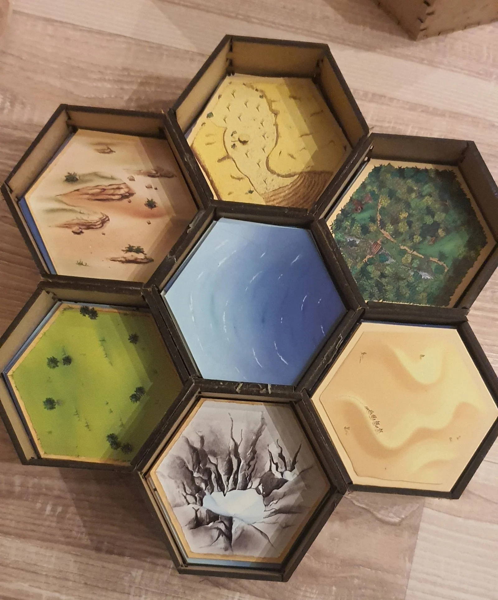
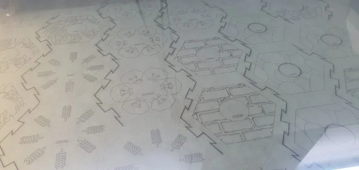
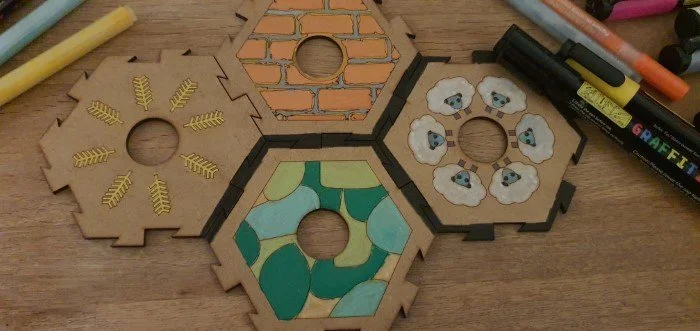

# Catan

## Organizer

I used the [regular box template](https://festi.info/boxes.py/RegularBox) to create seven equal hexagon boxes.

Here are the files as [cdr](_catan_box.cdr), [dxf](_catan_box.dxf) and [svg](_catan_box.svg) file.

And this is how the result looks like if you glue it all together:

## My own version of Catan

WIP...

