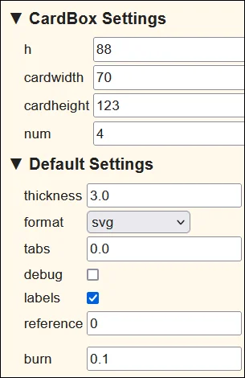

# Dixit

These are the settings I used in [boxes.py](https://www.festi.info/boxes.py/CardBox?FingerJoint_angle=90.0&FingerJoint_style=rectangular&FingerJoint_surroundingspaces=2.0&FingerJoint_edge_width=1.0&FingerJoint_finger=2.0&FingerJoint_play=0.0&FingerJoint_space=2.0&FingerJoint_width=1.0&h=95&cardwidth=125&cardheight=85&num=3&thickness=3.0&format=svg&tabs=0.0&debug=0&labels=0&labels=1&reference=100&burn=0.1&render=1).

I changed the original design to be less prune to break during assembly and also removed the lid as I require 2 of these boxes and will but them in a bigger box with a lid.

Download the [SVG](_dixit.svg), [afdesign](_dixit.afdesign) and [CDR](_dixit.cdr) file.

